# Agent 性能评估 · 领域教材（面试向 + 本项目锚定）

> 写给**转行 AI 应用开发的同学**：系统补齐「agent / LLM 应用评估」这块**面试必考、但容易完全空白**的领域知识。
> **本教材自顶向下编排**——先给你一张全景图（一个目的 → 两个定位问题 → 三件事 → 可信 → 落地），再逐层下钻；每个概念都**锚定到本项目真实代码**，末尾配**高频面试问答**与**诚实话术**。
> 配套阅读：端到端动线见 [harness-code-reading.md 第 7 站](harness-code-reading.md)；本项目 `evals/` 的设计说明见 [../evals/README.md](../evals/README.md)。

---

## 怎么读这份教材

这份教材自顶向下编排，读的时候顺着下面这条"问句主线"往下走就行——每一步在回答一个具体问题，右边是对应章节：

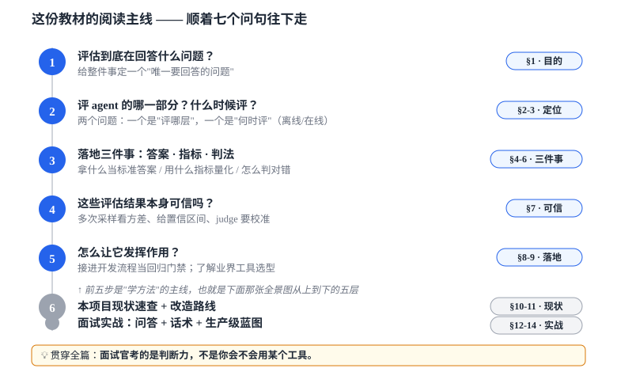

- **每节都是固定三段式**：① 领域知识（是什么、为什么重要）→ ② 🔗 本项目锚定（指到具体文件/行号）→ ③ 💬 面试怎么说。
- **前五步（§1-§9）是"学方法"的主线**，正好是下面「30 秒总览」那张全景图从上到下的五层；先扫一眼那张图建立骨架，再逐层下钻。
- 那句贯穿全篇的话（**面试官考的是判断力**）之所以重要：本项目恰好有几处「有判断力」的设计（缺数据标 N/A、计算与执行解耦），把那几处讲透，比堆功能更打动人。

---

## 🗺️ 30 秒总览：一张自顶向下的全景图

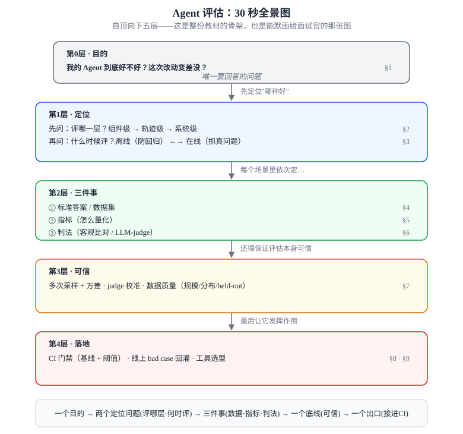

**一句话记忆法**：`一个目的 → 两个定位问题(评哪层·何时评) → 三件事(数据·指标·判法) → 一个底线(评估自己得可信) → 一个出口(接进CI)`。

### 这棵树 ↔ 本项目现状 ↔ 教材章节

| 层 | 本项目落在哪（诚实版） | 对应章节 |
|---|---|---|
| 第1层·评哪层 | 已到**端到端**：意图分类 + 工具调用/槽位（改造 1+2）真评；轨迹/多轮⚠️部分（改造 8 多轮切片，已归档）；系统级仍缺 | §2 |
| 第1层·何时评 | 离线有（`evals/`）；在线闭环已接（改造 7）：生产 trace 落盘 → 半自动甄别 → 人审回灌；无真实流量故「在线」为模拟 | §3 |
| 第2层·①数据 ②指标 ③判法 | 51 条用例（dev 41 + held-out 10，含 6 条多轮） / 多指标(含 N/A 设计) / 客观比对 + LLM-judge(改造 4，未校准) | §4、§5、§6 |
| 第3层·可信 | 多次采样 + mean±95% CI(改造 3)；judge 带校准；用例仍小 | §7 |
| 第4层·落地 | 退出码/降级有；基线 + 阈值阻断已落地（改造 6）；槽位接线（存在性口径）后门禁最多守 3 项，工具非确定性触发故偶回落 2 项 | §8、§9 |

> 看完这张图，你已经有了完整的认知地图。下面五个部分，是它从上到下的逐层展开。

---

# 第一部分 · 目的与定位（评哪层 + 何时评）

## §1 一句话：评估到底在回答什么（以及为什么它难）

### 1.1 唯一要回答的问题

所有 agent 评估，归根到底只服务**一个问题**：

> **「我这个会犯错、还不确定的 agent，整体到底好不好？这次改动有没有让它变差？」**

记住这句。后面所有概念都只是为了回答它而存在——任何时候被绕晕，就回到这句。

### 1.2 为什么这个问题难回答（vs 传统软件测试）

转行同学最容易踩的坑：以为「评估 = 写单元测试」。两者根本区别如下——**面试官第一刀往往就砍这里**，也正是这些区别让上面那个问题难答、催生出后面一整套方法：

| 维度 | 传统软件测试 | LLM / Agent 评估 |
|---|---|---|
| 输出 | **确定**：同输入永远同输出 | **非确定**：同输入可能不同回答（即便 `temperature=0` 也会微抖）→ 催生 §7 |
| 正确性 | **精确相等**：`assert f(2)==4` | **语义正确**：「明天下午两点」≈「14:00」，判**意思**对不对 → 催生 §6 |
| 标准答案 | 唯一 | 常常**没有唯一答案** → 催生 §6 的 LLM-judge |
| 失败形态 | 抛异常 / 断言失败 | **悄悄答错**：流程跑通、格式正确，但内容是幻觉 / 调错工具 |
| 评估者 | 代码（断言） | 代码 + **模型当裁判** + 人工 |

**一句话总结**：传统测试问「程序有没有崩」，agent 评估问「这个会犯错、还不确定的系统，整体表现到底有多好、有没有变差」。

### 1.3 面试官到底想听什么

不是「你用过 LangSmith 吗」，而是这四个判断力信号（它们正好对应全景图的各层）：

1. **你知道评估要分层**（§2）——不能笼统说"我测了 agent"。
2. **你不会伪造指标**（§5）——没测的维度敢标 N/A，而不是算成 0%。
3. **你知道 LLM 有随机性，单次跑分不可信**（§7）。
4. **你能把评估接进流程当回归门禁**（§8），而不是跑一次截图。

> 🔗 **本项目锚定**：[../CLAUDE.md](../CLAUDE.md) 的「验证」一节写明——`evals/` 评估集用于「重构前后对照、防回归」，并「成功静默、只暴露失败；不靠『感觉对了』验收」。这正是信号 4 的工程化体现，面试时可直接引用。

---

## §2 第一个定位问题 · 评在哪一层（最关键的认知框架）

这是整份教材**最该先记住**的一张图。Agent 评估从来不是一个数字，而是分层的——图里的颜色顺带标出了本项目现在卡在哪层：

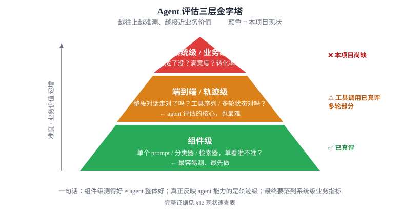

- **组件级**：把 agent 拆成零件单独测——「分类器准不准」「检索器召回率多少」。最容易做，但测得好不代表整体好。
- **轨迹级**：给（多轮）输入让**整个 agent 真跑**，评它走的整条路径——调了哪些工具、顺序/参数对不对、结果对不对。这才是 agent 评估的核心，也最难。
- **系统级**：上线后用业务指标衡量——预约成功率、满意度、人工介入率、成本。通常靠**在线评估**（§3）。

> 💬 **面试怎么说**：「Agent 评估我会分三层——组件级、端到端轨迹级、系统级。组件级最容易但测得好不代表整体好；真正反映 agent 能力的是轨迹级（工具调用序列、多轮状态）；最终要落到业务指标。」

**本项目卡在哪层**（诚实点，完整证据见 §10）：已从「只评分类器」升级为「端到端 agent 评估」——组件级意图分类 + 端到端工具调用（参数级/序列级）真评，多轮轨迹⚠️部分（改造 8 多轮切片已归档），系统级也有了**任务成功率**（离线完成度代理，change `evals-task-success-rate`）；仍缺的是**真实业务 KPI**（转化率/满意度/人工介入率——需真实流量）。能清楚说出「评到哪层、还差哪层」本身就是分层认知的最佳证明（见 §12 陷阱题、§13 话术）。

---

## §3 第二个定位问题 · 什么时候评（离线 vs 在线）

两条腿，缺一不可。面试常问「你怎么持续保证质量」，答案就是这两者配合。

| | 离线评估（Offline / Eval set） | 在线评估（Online / Monitoring） |
|---|---|---|
| 数据 | **固定的测试用例集**（标好答案） | **生产真实流量**（采样真实对话） |
| 时机 | 改代码 / 改 prompt **之前**，CI 里跑 | **上线后**持续跑 |
| 目的 | **防回归**：新版本别比老版本差 | **抓真实问题**：线上有没有翻车、漂移 |
| 有没有标准答案 | 有（人工标注） | 多数**没有**（靠 LLM-judge / 用户反馈信号） |
| 典型指标 | 准确率、工具调用正确率、通过率 | 满意度、人工介入率、延迟、成本、异常率 |

**关键认知**：离线用例再多也覆盖不全真实分布；线上流量再真实也没有标准答案。**成熟做法是闭环**——线上发现的 bad case → 标注后**回灌进离线用例集** → 下次回归就能防住它。

### 🔗 本项目锚定

- **离线**：整个 [`evals/`](../evals/) 就是离线评估——固定 [cases.jsonl](../evals/cases.jsonl)，CI/验证闸门里跑（见 §8）。
- **在线闭环已接通（改造 7，2026-07-01 核实）**：本项目有完整的**可观测层 tracer**——[tracer.py](../harness/observability/tracer.py)，生产入口的 `AgentLoop`（[chat_handler.py](../api/chat_handler.py)）已经接上 `Tracer + FileSpanExporter`，真实对话的 span 落盘到 `evals/traces/*.jsonl`；[`evals/triage.py`](../evals/triage.py) 再做半自动甄别（`guardrail_exhausted`/`spin_detected`/`tool_failure`/`max_steps_reached` 等失控信号）产标注草稿，人审填真值后回灌进 `cases.jsonl`（`source=online`，不自动重定基线）。「产 trace → 采样 → 标注 → 回灌」这条闭环**机制上是真的**。
- ⚠️ **诚实边界**：本项目没有真实线上用户流量，这里的「生产 trace」实际是开发/手动对话产出的——机制齐全，但「在线」目前是**模拟**，不是真正意义上的生产监控。

> 💬 **面试怎么说**：「离线防回归、在线抓真实问题，两者要闭环——线上 bad case 标注后回灌离线集。我这个项目两条腿都有：离线评估集 + CI 门禁；在线这边把 trace 落盘、半自动甄别失控信号、人审回灌都接通了。诚实说的是我没有真实线上流量，所以『在线』目前是拿开发对话模拟的，机制是完整的，缺的是真实流量本身。」

#### 📌 名词解释：「半自动甄别失控信号」到底指什么

这是改造 7 里最容易被面试追问的一句，拆成两半理解：

**① 「失控信号」= 一组客观的「这次跑砸了」标记**——不是靠模型"感觉"判好坏，而是从 trace 的 span 里用**纯规则**检出（[trace_signals.py](../harness/observability/trace_signals.py) `detect_bad_signals`），每种都严格对齐 `AgentLoop` 的真实落点：

| 信号 | 含义 | 怎么检出 |
|---|---|---|
| `guardrail_exhausted` | 护栏用尽（重试/预算触顶） | loop 记的 `error` 事件类型 |
| `spin_detected` | 原地打转、空转 | 同上，`error` 事件 |
| `tool_failure` | 工具执行抛错 | observation 以「工具执行失败」开头 |
| `max_steps_reached` | 跑满步数/预算仍没给出终态回复 | 结构判定：最后一步还在调工具、且全程无 error |

命中任意一个，这条对话就被标为「疑似坏」。

**② 「半自动」= 机器干一半、人干一半**（[triage.py](../evals/triage.py)）：

- **机器自动的一半（`scan`）**：扫所有落盘 trace → 按 `trace_id` 分组 → 用上面那套信号挑出疑似坏的 → 每条生成一份**标注草稿**（把命中信号、实际调了哪些工具、最终回复都填好）。
- **人必须干的一半**：草稿里的 `expected_intent / expected_tools / expected_slots` 这些**「标准答案」字段一律留空**，必须人审填真值——代码**绝不自动伪造标准答案**；填好后再 `append` 去重回灌进 `cases.jsonl`（标 `source=online`）。

> ⭐ **判断力点**：这条界线划得很清楚——「失控信号」只回答「这次跑得对不对劲」（客观、可离线单测、能自动化），**不回答「正确答案是什么」**（本质需要人判断，机器一猜就污染数据集）。所以是「半自动」：省掉「从成千上万条里翻找可疑对话」的体力活，但把「这条到底该怎么答」的真值判断**留给人**。配套还有一条克制——回灌**不自动重定基线**，只打印提醒，基线变更仍走人审（不绕过 §8 的回归门禁）。
>
> **一句话**：机器负责「报警」（按客观信号挑出可疑对话），人负责「定罪+判决」（填标准答案）。

### 把这两个问题合起来看：一张对照图

§2 的「评哪一层」和 §3 的「什么时候评」两两组合，就能把评估拆成一个个**具体场景**——「组件级 + 离线」是一个场景，「轨迹级 + 在线」是另一个，而不是笼统地给 agent 打一个分：

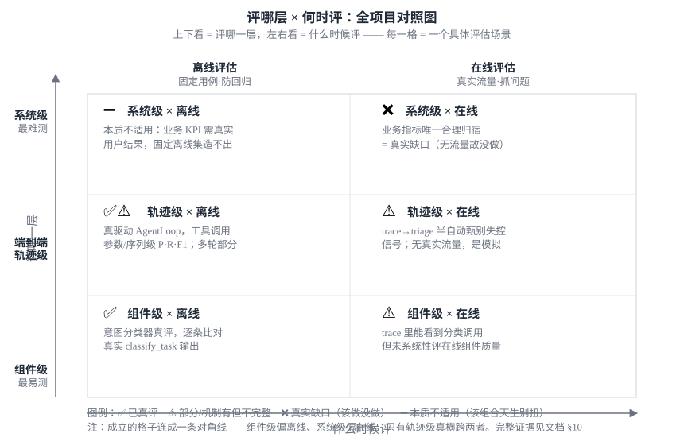

#### ⚠️ 别被网格骗了：不是 6 个格子都同等必要

把它画成网格，容易让人以为「3 层 × 2 时机 = 6 个格子都得填」。**客观分析下来并非如此——评估层级和时机是强相关的，成立的格子连成一条对角线**：

| 层级 | 天然时机 | 为什么 |
|---|---|---|
| **组件级** | 偏**离线** | 隔离单测一个分类器/检索器、有标签，天然离线；线上单独评组件通常被并进系统级监控 |
| **轨迹级** | **两者都要** | 离线跑标注场景做回归 + 在线用客观失控信号抓坏轨迹——**唯一真正横跨两种模式的一层** |
| **系统级** | 偏**在线** | 业务 KPI（约成率/满意度/转化率）本质是真实用户 + 真实结果产生的，**固定离线集造不出来** |

由此看两个"弱格"：
- **系统级 × 离线**：≈ `➖ 本质不适用`——不是"懒得做"，是这个组合天生别扭（业务结果无法离线伪造，硬做只能退化成轨迹级的"任务完成率"代理）。
- **组件级 × 在线**：可做（监控意图漂移等），但实践中多被系统级监控吸收，很少单独立项。

> ⭐ **对本项目现状的更诚实解读**：系统级两格虽都还没落地，但性质不同——**系统级 × 在线是真实缺口**（有真实流量后就该补），而**系统级 × 离线本来就不太该有这一格**。把两者都记成 ❌ 会略微夸大缺口；准确说法是：**系统级评估只有「在线」一条路，它没做是因为没有真实流量（§3 诚实边界），不是漏了"离线业务评估"。**

一眼能看出：左下角（组件级 + 离线）最扎实，真正待补的是**右上角那一格（系统级 + 在线）**——这正是 §10 现状速查表要展开讲的内容。

---

# 第二部分 · 每个场景里的三件事（往下钻）

> 在任意一个评估场景里落地，都要依次回答三件事：**① 拿什么当标准答案（§4）→ ② 用什么指标量化（§5）→ ③ 怎么判对错（§6）**。顺序不能乱。

## §4 三件事之一 · 标准答案：评估数据集（被低估、但面试高频）

「你的评估用例从哪来、有多少、怎么保证质量」——这是必问。

### 4.1 一条用例长什么样

最小三要素：**输入 → 期望行为（标准答案）→ 元信息**。本项目的格式（[cases.jsonl](../evals/cases.jsonl)）：

```json
{"input": "我想预约明天下午两点的按摩",
 "expected_intent": "appointment",
 "expected_tools": ["find_technician", "check_availability", "create_appointment"]}
```

- `input`：用户说的话（或 `turns`：多轮有序话语列表，与 `input` 互斥，见改造 8 切片 2）。
- `expected_intent` / `expected_tools`：**标准答案**——期望分到哪类、期望调哪些工具。`expected_tools` 真实计分：运行器真驱动 AgentLoop 采集 `actual_tools`，比对已升到参数级/序列级（见 §5.2）。

### 4.2 数据集的几个必答考点

| 考点 | 要点 | 本项目现状（诚实版，2026-07-03 核实） |
|---|---|---|
| **规模** | 几条没统计意义，通常要几百~几千条 | ⚠️ **51 条**（[cases.jsonl](../evals/cases.jsonl)：dev 41 条每类≥5 + held-out 10 条；含 6 条多轮，改造 8 数据集切片）——比几百~几千条的门槛仍差一个数量级，但每类已达最低统计意义 |
| **真实分布** | 用例要像真实流量，别全是简单句 | ⚠️ 绝大多数是**手写合成**；改造 7 上线闭环已能从（模拟的）生产 trace 回灌 `source=online` 用例，但目前占比很小 |
| **标注质量** | 谁标的、标得对不对、多人标一致吗 | 单人手写/回灌人审，无多人交叉校验、无标注溯源 |
| **held-out（留出集）** | 调 prompt 的集 ≠ 最终验收的集，否则**过拟合** | ✅ 已有 `dev`/`held-out` 切分（change `evals-dataset-scaleup-heldout`）：`split` 字段标记，运行器默认只评 dev、门禁基线**恒基于 dev**，held-out（10 条）仅 `--include-heldout`/`--heldout-only` 按需评、物理上进不了基线。⚠️ held-out 仍小、是合成，定位「粗过拟合体检」 |
| **版本化** | 用例集要像代码一样进 git、可追溯 | ✅ `cases.jsonl` 进了 git |
| **闭环来源** | 线上 bad case 要能回灌 | ✅ 部分：改造 7 已接通「trace 落盘 → 半自动甄别 → 人审回灌」（见 §3），⚠️ 但无真实线上流量，「在线」是模拟 |

### 4.3 一个值得讲的工程细节：加载即校验

> 🔗 [run_evals.py:42-66](../evals/run_evals.py#L42) `load_cases`

本项目读用例时做了两件「数据卫生」的事，面试可当亮点：
1. **坏 JSON 不静默跳过**：解析失败时**报出行号再 re-raise**（[:54](../evals/run_evals.py#L54)），让坏数据立刻可见，而不是悄悄漏测。
2. **标签合法性校验**：`expected_intent` 不在 5 类白名单里直接 `SystemExit(2)`（[:58](../evals/run_evals.py#L58)），防手滑 typo 把用例写废还浑然不觉。

> 💬 **面试怎么说**：「数据集我关注规模、真实分布、标注质量、有没有 held-out 防过拟合，以及能不能把线上 bad case 回灌。我这个项目用例还小、是合成的，这是它当前最大的局限；但加载时做了行号报错和标签白名单校验，保证用例本身不带病。」

---

## §5 三件事之二 · 指标体系（本项目最有料的一节）

指标 = 把「表现好不好」量化成数字。不同层次用不同指标。

> 📎 **读到符号别慌：记号速查（本部分起 §5~§8 会陆续用到）**。这些是评估领域常见的简写，先扫一眼，正文碰到就不懵：
>
> | 记号 | 读法 | 什么意思（大白话） | 详见 |
> |---|---|---|---|
> | `X@k`（pass@k、Recall@k、Precision@k） | "X at k" | `@` = "在 **k 个 / k 次** 的情况下"。**pass@k**＝给 k 次机会至少对一次就算过（适合能重试的代码类）；**Recall@k / Precision@k**＝只看检索返回的**前 k 篇**里的召回/精确 | §5.5、§7 |
> | `p50 / p95 / p99` | "P 五十 / 九九" | **百分位数**：把所有延迟从小到大排，`p99`＝99% 的请求都比它快（专看**最慢的尾部**）；`p50`＝中位数 | §5.6 |
> | `mean ± 95% CI` | "均值 正负 95% 置信区间" | 真实值有 **95% 把握落在这个上下范围内**；范围（CI 半宽）越窄越可信。`±` 就是"上下浮动" | §7 |
> | `pp`（百分点） | "percentage points" | 两个百分比之间的**差**。80%→70% 是差 **10pp**，不是差 10%——**极易混**，百分比的差要说"百分点" | §7、§8 |
> | `κ`（Cohen's κ） | "kappa / 卡帕" | **一致率系数**：裁判和人工标注有多一致，且**扣掉了瞎蒙的运气成分**。1＝完全一致、0≈跟瞎猜一样 | §6 |
> | `temperature=0` | "温度 0" | 大模型的**采样温度**调到 0＝让输出尽量**确定、少随机**（但不等于完全锁死，仍会微抖） | §1.2、§7 |
> | `MRR` | Mean Reciprocal Rank | **平均倒数排名**：第一个相关结果排第几的倒数（排第 2 → 1/2），越靠前越接近 1 | §5.5 |
> | `TP / FP / FN / TN` · `P / R / F1 · Fβ` | 见 §5.0 / §5.1 | 混淆矩阵四格、精确率/召回率/F1 —— 这两组下面 §5.0、§5.1 有专门图解 | §5.0、§5.1 |

### 5.0 先认全这些指标名词（读 §5 前，用一个例子逐个讲清）

本节会冒出十几个名字相近、极易混的指标。下面**用同一个贯穿例子**把它们逐个讲清，认完再往下看细节。

> 📖 **先认 4 个缩写（TP / FP / FN / TN，来自英文，下面全程会用到）**。每个都是两个英文单词拼的，先认这 4 个字母 = 4 个单词：
>
> | 字母 | 英文单词 | 含义 | 这里具体指 |
> |---|---|---|---|
> | **T** | **True** | 判**对**了（和真相一致） | — |
> | **F** | **False** | 判**错**了（和真相相反） | — |
> | **P** | **Positive**（正例/阳性） | 判成了"**要找的那一类**" | 判成"**是**预约" |
> | **N** | **Negative**（负例/阴性） | 判成了"**不是那一类**" | 判成"**不是**预约" |
>
> （Positive/Negative 借自医学检测：阳性=检出目标、阴性=没检出，跟褒贬无关；你要找的那类就是 Positive，本例即"预约"。）
>
> 拼起来 = `[对不对] + [判成哪类]`，对着"预约"读：
> - **TP** = **T**rue **P**ositive：判成预约·**对了** → 真是预约 ✓
> - **FP** = **F**alse **P**ositive：判成预约·**错了** → 其实不是，**冤枉/误判**
> - **FN** = **F**alse **N**egative：判成非预约·**错了** → 其实是，**放跑/漏判**
> - **TN** = **T**rue **N**egative：判成非预约·**对了** → 真不是 ✓
>
> 👉 记忆法：**倒着读**——先看第 2 个词（判成了什么：Positive 预约 / Negative 非预约），再看第 1 个词（对不对：True/False）。如 **F**alse **N**egative = 判成了非预约、但判**错**了 → 它其实是预约、被漏掉了。

> 🎬 **贯穿例子**：一个订按摩的 agent，拿 **10 条用户消息**测它的意图分类。下面把这 10 条**全列出来**——每条看两个信息：**①它真实是不是「预约」**（客观事实，与模型无关）、**②模型判它是不是「预约」**（模型的行为）。

| # | 用户消息 | ① 真实 | ② 模型判 | 落入哪格 |
|---|---|---|---|---|
| 1 | 订明天下午两点的按摩 | 预约 | 预约 | ✅ TP 判对 |
| 2 | 帮我约周六上午王师傅 | 预约 | 预约 | ✅ TP 判对 |
| 3 | 预约一个 90 分钟精油 | 预约 | 预约 | ✅ TP 判对 |
| 4 | 今晚有空位就帮我订 | 预约 | 预约 | ✅ TP 判对 |
| 5 | 我下周想做个肩颈 | 预约 | 非预约 | ❌ FN 漏判 |
| 6 | 老地方老时间再来一次 | 预约 | 非预约 | ❌ FN 漏判 |
| 7 | 你们几点关门？ | 非预约 | 预约 | ❌ FP 误判 |
| 8 | 按摩多少钱一次？ | 非预约 | 非预约 | ✅ TN 判对 |
| 9 | 取消我昨天的订单 | 非预约 | 非预约 | ✅ TN 判对 |
| 10 | 谢谢 | 非预约 | 非预约 | ✅ TN 判对 |

**⚠️ 先解决你最容易卡的点：为什么一会儿是 5 条、一会儿是 6 条？** 因为这两个数在数**两件不同的事**——同样这 10 条，按"真相"切和按"模型怎么判"切，结果不一样：

- 看 **① 真实** 那列：真的是预约的 = 第 1~6 行 = **6 条**（客观事实，跟模型判得对不对无关）。
- 看 **② 模型判** 那列：模型开口说"这是预约"的 = 第 1、2、3、4、7 行 = **5 条**（模型的行为，可能说错）。

所以后面：**召回率**站在「真相」角度问"这 **6** 条真预约你抓到几条"（分母 6）；**精确率**站在「模型」角度问"你说的这 **5** 条几条真对"（分母 5）。分母不同，只因为一个数真相、一个数模型的嘴。

把上表按两个维度一交叉，就是四种情况的条数（后面所有指标都从这四个数来）：

| | ① 真的是预约 | ① 真的不是预约 |
|---|---|---|
| **② 模型判：是预约** | ✅ 4 条（TP 判对）〈行1-4〉 | ❌ 1 条（FP 误判）〈行7〉 |
| **② 模型判：不是预约** | ❌ 2 条（FN 漏判）〈行5-6〉 | ✅ 3 条（TN 判对）〈行8-10〉 |

- 「模型判是预约」= 上面一行 = 4+1 = **5 条**（← 精确率的分母）
- 「真的是预约」= 左边一列 = 4+2 = **6 条**（← 召回率的分母）

#### A. 分类类：准确率 / 精确率 / 召回率 / F1（详见 §5.1）

**先记死一句话：这四个不是四个数字，是四个不同的「问句」，区别只在「拿谁当分母」。**分子几乎都是同一个——判对的预约（重叠的 4 条 TP）。下面一行一行读，把"说人话 + 完整算式 + 本例"一次看全：

| 指标 | 说人话：它到底在意什么 | 怎么算（分子 ÷ 分母） | 本例 |
|---|---|---|---|
| **准确率** accuracy | 10 条里**总共判对几条**（预约、非预约都算，一锅端不分对象） | 判对的 7 条（4 预约 ✓ ＋ 3 非预约 ✓）÷ 全部 10 条 | **7/10 = 70%** |
| **精确率** precision | 模型**喊"这是预约"的那些，几成喊对了**——怕乱喊、**冤枉**（把不是预约的也当预约） | 喊对的 4 条 ÷ 模型喊了预约的 5 条 | **4/5 = 80%** |
| **召回率** recall | **真的是预约的那些，被模型逮住几成**——怕漏掉、**放跑**（真客户没被认出来） | 逮住的 4 条 ÷ 真的是预约的 6 条 | **4/6 ≈ 67%** |
| **F1** | 精确率和召回率**能不能同时都高**（又准又全）——单看一个会被"偏科"骗到 | 2 × 精确率 × 召回率 ÷（精确率 ＋ 召回率） | **≈ 73%** |

**分数高低对应什么后果（用业务视角记最牢）：**
- **精确率低 = 误报多**：老把"你们几点关门"这种咨询当成预约去执行 → 打扰用户、走错流程。
- **召回率低 = 漏报多**：用户明明想约，却没被识别成预约 → 白白流失生意。
- 这两个**天生拉扯**（想少冤枉就容易多漏、想少漏就容易多冤枉），**F1** 就是二者的综合分：只有又准又全才高，专门防"只顾一头"刷分。

> 🎣 **记忆钩子**：精确率 = 「我**圈**的准不准」（怕冤枉）；召回率 = 「真的有的我**捞**全没」（怕放跑）。像撒网捞鱼——网收得小很纯但会漏鱼（精确率高、召回率低），网撒得大不漏鱼但捞一堆垃圾（召回率高、精确率低）。天生打架，所以要 F1 平衡。

**精确率和召回率最难分，一张图看穿——分子都是「重叠」，只差分母是哪个圈：**

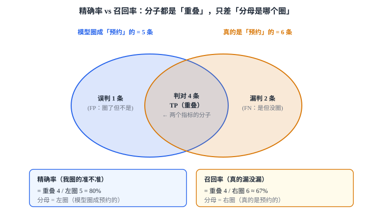

图里一看便知：**精确率 = 重叠 ÷ 左圈（模型圈的 5）；召回率 = 重叠 ÷ 右圈（真相的 6）**——分子都是重叠的 4，只换了分母。

> 💡 **为什么非要有 F1（一个极端例子）**：假如模型特别保守，只挑最有把握的 1 条判成预约、且判对——精确率 = 1/1 = **100%**（看着完美！），但召回率只有 1/6 ≈ 17%，**F1 ≈ 29%** 一下就暴露"抓得太少"。单看精确率会被这种"偏科"骗到，F1 不会。

> ⚠️ **最常被混的一对：准确率 ≠ 精确率**（中文只差一个字，英文 accuracy vs precision 差得远）。
> 回到例子：**准确率 70%** 把"正确拒绝掉的 3 条非预约（TN）"也算了功劳；**精确率 80%** 只盯"判成预约的那 5 条"、完全不管那 3 条 TN。分母不同、意义不同。
> 极端情形最能看出差别：100 条里只有 5 条真预约，模型**全判"非预约"** → 准确率仍 = 95/100 = **95%**（被 95 条判对的非预约撑高，像很准），但召回率 = 0/5 = **0%**（一条预约都没抓到）。这就是"类别不均衡时准确率会骗人、要看 P/R/F1"的由来。

#### B. 工具调用类：名字级 P/R/F1 + 更严的三档（详见 §5.2）

把上面的 P/R/F1 从"意图类别"换成"调了哪些工具"即可。
例：期望调 `[查技师, 查空闲, 建预约]`（3 个），模型实际调了 `[查技师, 查空闲, 发短信]`——对了 2 个、多调 1 个（发短信）、漏 1 个（建预约）→ **精确率 = 2/3、召回率 = 2/3**。在此之上还有更严的三档：

- **参数级 F1**：不光调对工具，**参数也要对**（`建预约(时间=今天14:00)` 若把时间填成明天，就算没对）。
- **序列正确率**：**调用顺序**也对（必须先"查空闲"再"建预约"，反了就错）。
- **完全匹配率**：整条工具序列和期望**一模一样**才算 1，否则 0（最严）。

> 💡 **为什么叫"参数级 F1"、不能只叫"参数级"？** 因为这些名字都是「**严格度 × 度量方式**」两截拼的，缺一不可：
> - **前半截 = 严格度**（比到多严）：名字级 / 参数级 / 序列级。
> - **后半截 = 度量方式**（怎么打分）：`F1`（给部分分）/ `正确率` / `匹配率`（全对才算 1）。
>
> 只说"参数级"只交代了"比到参数这么严"，**没说怎么算分**——是按 F1 给部分分，还是必须全对？含义不定，所以要带上 `F1`。这跟"序列**正确率**""完全**匹配率**"是同一个命名规律。参数这层之所以用 F1（而非简单对/错）：一次可能调多个工具、每个带多个参数，存在"填对几个、多填、漏填"，和名字级一样有**精确率-召回率权衡**，用 F1 才能两头都顾。

#### C. 槽位类：抽取完整率 + 宏平均/微平均（详见 §5.3）

**槽位** = 从一句话里要抽出来的**结构化字段**（时间、技师、时长、项目……），好让系统真去下单。

> ❓ **先说清"抽谁的、谁来抽"**：抽的是**用户消息**里的信息，由**大模型**来抽——它把用户那句人话（如"帮我约明天下午两点…"）翻译成机器能用的结构化字段，**落在它调用工具时填的参数上**（如 `create_appointment(technician=王师傅, duration=90…)`）。所以「槽位抽取 = 大模型把用户的人话翻译成结构化参数」。
> 🔗 本项目还有个细节：不单独问模型"你抽了啥"，而是**从它给工具填的参数（args）里反推**出"模型抽到了哪些槽位"（actual_slots），再和标注的标准答案（expected_slots）比。也因为值是模型自由生成的（`start_time` 常把日期算错），只用**存在性口径**——只看字段抽没抽到，不较真值对不对（§5.3）。

**第一步：单条消息的「完整率」= 该抽的字段里抽出来几个。**
例：消息「帮我约**明天下午两点**找**王师傅**做**90 分钟****精油**」，期望抽 4 个槽位，逐个打勾看：

| 期望槽位 | 该填的值 | 模型抽到了吗 |
|---|---|---|
| 时间 | 明天下午两点 | ✅ 抽到 |
| 技师 | 王师傅 | ✅ 抽到 |
| 项目 | 精油 | ✅ 抽到 |
| 时长 | 90 分钟 | ❌ 漏了 |

→ 4 个里抽到 3 个 → **这条的完整率 = 3/4 = 75%**。

**第二步：多条消息怎么汇总成一个数？有两种平均法，结果可能差很多。** 假设测两条：

| 用例 | 消息特点 | 期望槽位数 | 抽对几个 | 这条完整率 |
|---|---|---|---|---|
| 甲 | 信息很全的长句 | 4 个 | 2 个 | 2/4 = 50% |
| 乙 | 简单短句 | 1 个 | 1 个 | 1/1 = 100% |

- **宏平均（macro）= 先各自算完，再对"每条用例"取平均**（**每条对话一视同仁**，不管它有几个槽位）：
  →（50% + 100%）/ 2 = **75%**。读作"平均每条对话抽到 75%"。
- **微平均（micro）= 把所有槽位堆成一个大池子一起算**（**每个槽位一视同仁**，槽位多的对话自然更有分量）：
  →（甲抽对 2 + 乙抽对 1）/（甲 4 + 乙 1）= 3/5 = **60%**。读作"所有该抽的 5 个槽位里，共抽到 3 个"。

**为什么差这么多（75% vs 60%）？** 因为甲**槽位多又考砸了**（4 个只对 2 个）：微平均按槽位数量算总账，甲的 4 个槽位分量重，把总分拽到 60%；宏平均让甲、乙各占一半，乙的满分把它托到 75%。

**该用哪个？**
- 关心"**每段对话的平均体验**"（每条对话同等重要）→ 用**宏平均**。
- 关心"**总共漏填了多少个字段**"（按字段总量算账）→ 用**微平均**。
- 🔗 **本项目用宏平均**（§5.3），就是为了**别被"槽位特别多的那条"带偏**结论。

#### D. RAG 类：检索段 + 生成段（详见 §5.5）

例：用户问"周末营业到几点？"，知识库里有 3 篇**真相关**文档；检索返回前 5 篇，其中 2 篇真相关、第一篇相关的排在第 2 位。
- **Recall@k** = 该找的里找回几成 → 3 篇里找回 2 篇 = **67%**。
- **Precision@k** = 找回的里有几成相关 → 5 篇里 2 篇相关 = **40%**。
- **MRR（平均倒数排名）** = 第一篇相关文档排第几的倒数 → 排第 2 位 → **1/2 = 0.5**（越靠前越接近 1）。
- **RAG 三元组**（评"回答"而非"检索"）：上下文相关性（检索内容切题吗）/ 忠实度（回答有没有瞎编、是否有检索内容支撑）/ 答案相关性（答到点上没）。

#### E. 成本与延迟（详见 §5.6）

- **延迟**看 **p50/p99**（中位数 + 尾部）而非只看均值——用户体验由慢的那批决定。
- **token / 成本**：一次对话烧多少钱。

### 5.1 分类 / 抽取类指标

直觉和例子 §5.0 已经讲过（准确率/精确率/召回率/F1）。这里补两样 §5.0 没有的：**一张公式图** + **F1 名字的来历**。下图用混淆矩阵把 P/R/F1 的公式与拉扯关系一次看清：

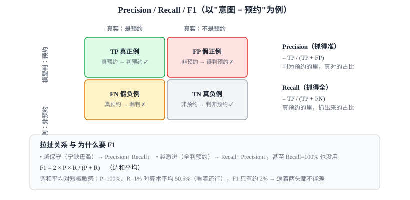

公式回顾：`Precision = TP/(TP+FP)`、`Recall = TP/(TP+FN)`、`F1 = 2PR/(P+R)`（调和平均，对短板敏感——P=100%、R=1% 时 F1 只有约 2%）。

> 💡 名字：F1 是 **Fβ-score**（`Fβ=(1+β²)PR/(β²P+R)`）在 `β=1`（P、R 同等重要）时的特例，源自信息检索，是业界默认的平衡版。

> 🔗 本项目 [metrics.py:53-62](../evals/metrics.py#L53) `intent_accuracy`：`actual_intent == expected_intent` 的占比。工具调用正确率（§5.2）同时算了召回率、精确率、F1——只看召回率，agent 乱调一堆多余工具也能刷高分；只看精确率，调得少但保守也能刷高分；F1 逼着它"该调的都调了、且没乱调"才能拿高分。

### 5.2 工具调用正确率（agent 特有）

Agent 评估的核心之一。但「正确」有**三个不同严格度**，面试可层层递进讲：

| 严格度 | 看什么 | 难度 |
|---|---|---|
| 名字集合 | 调了哪些工具（不看顺序、不看参数） | 最松 |
| **参数级** | 工具 + 参数都对（`create_appointment(time=14:00)` 的 time 对不对） | 中 |
| 序列级 | 工具的**调用顺序**也对 | 最严 |

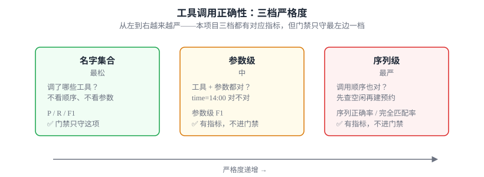

> 🔗 **本项目现状**：三档严格度**都有对应指标**——[metrics.py:tool_call_recall_precision_f1](../evals/metrics.py#L133)（名字级 P/R/F1）+ 参数级 F1（比 `expected_tool_args`）+ 序列正确率 + 完全匹配率，`baseline.json` 里能看到这六项。**门禁只守 F1**（名字级、部分给分、平滑退化），其余五项照常打印但不触发阻断（见 §8）。

> 💬 **面试怎么说**：「工具调用正确性有三档——名字集合、参数级、序列级。我项目里三档都实现了：名字集合用 P/R/F1，还加了参数级 F1 和序列正确率/完全匹配率。门禁只守 F1 这一项，因为其他几个是同一底层行为的更严格切面，守 F1 就够平滑地反映退化，不用同时守六个增加误报。」

### 5.3 槽位抽取完整率 + 一个统计细节：宏平均 vs 微平均

> 🔗 本项目 [metrics.py:88-115](../evals/metrics.py#L88) `slot_completeness`

「槽位」= 从话里抽出的结构化字段（时间、技师、时长…）。完整率 = 期望槽位里被正确填出的比例。

本项目用的是**宏平均（macro-average）**（[:102 注释](../evals/metrics.py#L102)）：**先算每条用例的命中比例，再跨用例求平均**，每条用例**等权**。对比：
- **宏平均**：每条用例权重一样 → 不会被「槽位特别多的那条」带偏。
- **微平均（micro）**：把所有槽位汇总成一个大分母 → 槽位多的用例影响大。

> 💬 **面试怎么说**：「指标聚合要分清宏平均和微平均——我项目槽位用的是宏平均，每条用例等权，避免被槽位多的用例带偏。类别不均衡时这个选择会显著影响结论。」**这是个能立刻显出统计素养的小点。**

### 5.4 ⭐ 最值钱的设计：缺数据显式标 N/A，不伪造分母

> 🔗 本项目 [metrics.py:65-81](../evals/metrics.py#L65)、贯穿四个指标

这是**本项目最该拿出来讲的一处判断力**。四个指标都遵循同一范式：

```python
# metrics.py:72 —— 只把「真正测过这维度」的样本纳入分母
eligible = [r for r in results if r.expected_tools is not None and r.actual_tools is not None]
if not eligible:
    return Metric("工具调用正确率", na=True,           # 显式标 N/A，附原因
                  note="本次运行未捕获实际工具调用（需端到端执行 AgentLoop）")
```

**为什么这是好设计**：假设某个维度没测到（比如没驱动 loop、或用例没标 `expected_slots`），`actual_tools`/`actual_slots` 就是空/`None`。
- ❌ 错误做法：把没测的算进分母 → 得出「工具调用正确率 0%」→ **误导人以为工具全调错了**。
- ✅ 本项目做法：显式标 **N/A 并写明原因** → 读者一眼知道「不是 0 分，是这次没测」。

> 🔗 **本项目现状**：`slot_completeness` 只把**标了 `expected_slots` 的用例**纳入分母（部分早期单轮用例没标），某条用例真跑抛异常时 `actual_tools`/`actual_slots` 也会是 `None` 而不是硬算成 0。

报告渲染也贯彻了这点——[metrics.py:155-157](../evals/metrics.py#L155) 把 N/A 连同原因一起打出来，不悄悄省略。

> 💬 **面试怎么说**（强烈建议背）：「我最在意指标的诚实性——分母只纳入真正测过的样本，没测的维度显式标 N/A 并写明原因，绝不伪造成 0% 或 100%。因为一个虚假的 0% 会让人以为系统全错，比没有数字更有害。」**这句话能直接把你和「只会跑个准确率」的候选人区分开。**

### 5.5 RAG 评估专题（本项目有 RAG，必讲）

本项目知识查询走 `search_knowledge` 工具。**2026-08-02 起本地 RAG（SQLite+FAISS）已移除**（change `remove-local-rag`）：[harness/tools/knowledge.py](../harness/tools/knowledge.py) 现在薄封装的是 [services/knowledge_search.py](../services/knowledge_search.py) 的**可替换端口**，实现将由一个独立的 RAG 项目提供；未注入实现时每次检索都以「知识库尚未接入」明确失败收场。下面这套两段式评估法讲的是**接入之后**该怎么评（也是面试要答的通用方法论），当前本仓没有可评的检索实现：

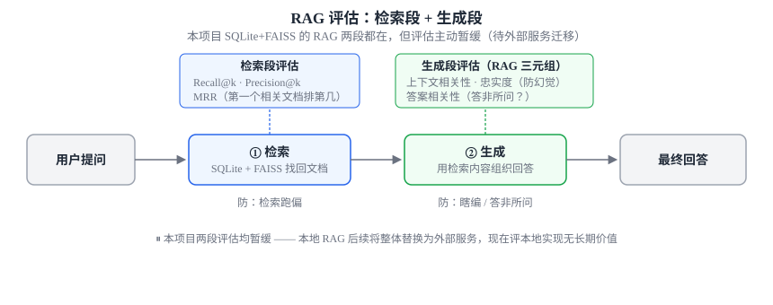

**① 检索段（retrieval）**——找回来的文档对不对：
- **召回率 Recall@k**：该找的相关文档，前 k 个里找回了几成。
- **精确率 Precision@k**：找回的前 k 个里，有几成是真相关。
- **MRR（平均倒数排名）**：第一个相关文档排在第几位（越靠前越好）。

**② 生成段（generation）——RAG 三元组**（业界经典，TruLens/Ragas 都用）：

| 指标 | 问的问题 | 防的是 |
|---|---|---|
| **Context Relevance（上下文相关性）** | 检索回来的内容和问题相关吗 | 检索跑偏 |
| **Faithfulness / Groundedness（忠实度）** | 回答是不是**有检索内容支撑**、没瞎编 | **幻觉** |
| **Answer Relevance（答案相关性）** | 回答真的回应了用户的问题吗 | 答非所问 |

> 🔗 **本项目现状**：`evals/` 从来没评过 RAG 质量——既没测检索 Recall@k，也没测三元组。这不是遗漏，是**主动暂缓**（改造 5，2026-06-24 决策），而 2026-08-02 的 `remove-local-rag` 把本地实现直接删了，暂缓变成了**外移**：组件级检索评估（Recall@k / MRR / nDCG）随 RAG 一起归独立项目——那套只需要 query + 期望文档，不涉及 Agent。**但 RAG 对最终回答的贡献拆不走**，检索召回率高 ≠ Agent 答得好（可能不用、用错、组织得差），那是端到端问题，对应本仓已有的 `任务成功率` 与 `回复质量通过率`。这正是本项目分层评估的核心论点：**组件级好 ≠ 端到端好**。

> 💬 **面试怎么说**：「RAG 要分检索段和生成段评——检索看 Recall@k / MRR，生成看 RAG 三元组：上下文相关性、忠实度（防幻觉）、答案相关性。我项目原本有 SQLite+FAISS 的本地 RAG，后来我把它整个拆出去了：组件级检索评估跟着 RAG 服务走，但 RAG 对最终回答的贡献留在 Agent 侧的端到端指标里——因为检索召回率高不等于 Agent 答得好。拆分最大的收益其实不是‘能单独评 RAG’，而是**让 Agent 评估不再被 RAG 的可用性绑架**：之前 embedding 网关抽风那几天，我的评估要么跑不动、要么指标全是废数；现在检索是个可注入的端口，评估时塞个返回固定文档的 fake 就能拿到离线确定性的结果。」

### 5.6 成本与延迟

生产必看：**延迟**（用户等多久）、**token / 费用**（一次对话烧多少钱）。

> 🔗 本项目只测了**分类器单次调用的延迟**——[run_evals.py:113-118](../evals/run_evals.py#L113) 用 `time.perf_counter()` 计时，[metrics.py:118-132](../evals/metrics.py#L118) `latency_summary` 汇总 **avg / p50 / max**（注意它给了 p50/max 而不只是均值，这点是对的——延迟要看尾部）。
> ⚠️ 但这是**分类器一次调用**的延迟，不是 agent 全链路延迟；**token / 费用完全没测**。

> 💬 **面试怎么说**：「延迟我会看 p50 和 p99 而不只是均值，因为用户体验由尾部决定。我项目测了延迟的 avg/p50/max，但只是分类器单次调用，agent 全链路延迟和 token 成本还没纳入。」

---

## §6 三件事之三 · 怎么判对错：客观比对 vs LLM-as-judge

§4 有了标准答案、§5 选好了指标，最后一步是**怎么判一条回答到底对不对**。两类判法：

- **客观比对**：能用 `==` / `set` / 数值比的（意图对不对、调了哪些工具）——本项目大部分指标属于这类。
- **LLM-as-judge（模型当裁判）**：用于**没有唯一标准答案**的主观维度——本项目也已经加了一个（回复质量，见下），只是还没校准。

### 6.1 为什么需要 LLM-as-judge

§1.2 说过：很多输出**没有唯一标准答案**（一句回话是否「礼貌、有帮助、相关」无法用 `==` 判）。这时用**另一个 LLM 当裁判**给回答打分，是业界主流解法。

两种打分方式：
- **Pointwise（逐条打分）**：给单个回答打 1–5 分 / 判合格不合格。
- **Pairwise（两两对比）**：给「回答 A vs 回答 B 哪个好」——**通常比逐条打分更稳**（人和模型都更擅长比较而非绝对评分）。

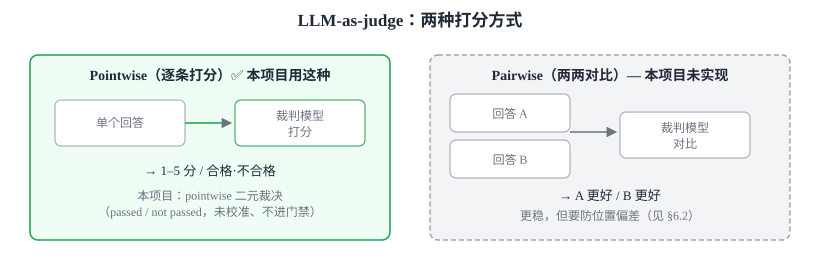

### 6.2 它的坑（面试加分点）

LLM 裁判**自己也有偏差**，知道这些 = 懂行：
- **位置偏差**：倾向选**靠前**的那个 → 对策：A/B 位置互换跑两次。
- **长度偏差**：倾向选**更长**的回答。
- **自我偏好**：模型倾向给**自己同款模型**的输出打高分。
- **校准**：裁判打的分要**和人工标注对齐**过（抽一批人工标，验证裁判和人一致率），否则裁判本身不可信——这条直接通向 §7。

> 🔗 **本项目现状**：已接入 LLM-as-judge——[metrics.py:response_quality](../evals/metrics.py#L244)，`--judge` 开启后对最终回复做 **pointwise 二元裁决**（passed/not passed），并配了 [`judge_human_agreement`](../evals/metrics.py#L269)（Cohen's κ）作为**校准机制**。⚠️ 诚实边界：**裁判默认「未校准」**——`judge_human_agreement` 这个能力有了，但还没真拿一批人工标注去跑过校准，所以回复质量指标目前**不列入门禁**（§8）。且用的是最简单的 pointwise 二元判合格/不合格，**不是** §6.1 说的 pairwise 对比，也没做位置互换。

> 💬 **面试怎么说**：「对没有唯一答案的回复质量，我用了 LLM-as-judge——pointwise 二元裁决，配了和人工标注对齐的 κ 一致率计算。但目前只是有这个机制、还没真跑校准，所以我诚实地把它标成『未校准』且不让它进 CI 门禁。下一步是真做一次人工标注校准、并升级成 pairwise + 位置互换，这样才敢让它当回归信号。」

---

# 第三部分 · 让评估本身可信（横切关注点）

## §7 评估的可信度：别拿一个会骗人的数字下结论

前面 §4-§6 产出了指标，但**指标本身得可信**，否则是自欺。这一节横切所有场景，把分散在前面的「可信度」要点收口成一处。

### 7.1 治非确定性（核心）

§1.2 的根本难点：**同输入不同输出**。处理不好，跑分就是「今天 82% 明天 79%」的噪声。

- **多次采样取平均**：每条用例跑 N 次，看平均和**方差**，而不是单次。
- **pass@k**：跑 k 次，只要有一次对就算过（适合代码生成等「能对一次就行」的任务）。
- **置信区间**：20 条用例的 85% 和 200 条的 85% 可信度天差地别——样本小要给出不确定性。
- **`temperature=0` 不等于确定**：能降低随机性，但 provider 侧仍可能微抖，不能当成"锁死"。

### 7.2 另两条可信度防线（已在前文，这里收口）

- **裁判可信**：LLM-judge 要和人工标注校准、警惕三种偏差——详见 §6.2。
- **数据可信**：规模、真实分布、held-out 防过拟合——详见 §4.2。

> 🔗 **本项目现状**（先给个比喻）：LLM 每次跑分都会飘一点，像**一台会抖的体重秤**——同一个人这次称 70.5、下次 69.8。本项目是这么应对的：
>
> - **① 基线求稳（当"标准体重"用）**：`--samples N` 让每条用例**跑 N 次**、[aggregate_runs](../evals/metrics.py#L524) 取平均并给出波动范围（`mean ± 95% 置信区间`）。当参照的 `baseline.json` 是用 `--samples 3`（跑 3 次平均）生成的，所以稳、不是某一次的运气。
>   - 📎 **「置信区间」是啥？** 就是民调里那个"支持率 **52%，误差 ±3 个百分点**"——给平均分配一个**误差范围**，意思是"真实水平大概率（95% 把握）落在这范围内"。比如意图准确率跑 3 次得 70%/85%/72%，平均 ≈76%，但只跑了 3 次又抖，置信区间可能宽到 **76% ± 20pp（即真值大概在 56%~96%）**——等于诚实地说"别太当真，它可能在这段里飘"。**范围（半宽）越窄越可信**；跑的次数越多、模型越稳，范围就越窄。本项目只跑 3 次、模型又抖，所以范围偏宽——这正是下面 ③ 要留 20pp 容差的原因。
> - **② 门禁求快（平时快速查"变差没"）**：那个自动拦回归的门禁（§8）为了跑得快、能频繁跑，默认**只跑一次**。
> - **③ 容差吸收抖动（关键）**：只跑一次会抖，所以门禁允许分数比基线**最多低 20 个百分点（20pp）**还不报警——这 **20pp 就是给"秤会抖"留的缓冲（容差）**。它不是拍脑袋定的：**实测**了这个模型（`deepseek-v4-flash`）到底能抖多大——意图分类抖 **±19~22pp**、工具 F1 抖 **±6~7pp**——按最大的那个（意图 ~20pp）反推出容差（详见 [evals/README.md](../evals/README.md) 门禁小节）。
>
> 为什么抖这么大还压不住？因为 `temperature=0` **只能少随机、不等于锁死**（§7.1）——正是这个压不掉的抖，逼着容差留到 20pp 这么宽。**代价**：20pp 很宽，门禁只拦得住"大幅退步"，小幅变差拦不住——这是当前模型抖动太大逼出的诚实妥协。

> 💬 **面试怎么说**：「LLM 评估最大的陷阱是拿单次跑分当结论。我项目里已经做了——`--samples N` 多次采样取均值，算 95% t 置信区间；生成基线用 3 次采样的均值当稳定参照，门禁的容差阈值也是拿实测的 CI 半宽反推出来的，不是拍脑袋定的。temperature=0 能降随机但不等于确定，我这个模型实测意图分类的 CI 半宽能到 ±20pp 左右，这也是为什么门禁只拦得住『大幅回归』而不是任意小幅波动。」

---

# 第四部分 · 让评估发挥作用（落地）

## §8 落地之一 · 回归门禁与 CI

评估的价值不在「跑一次截图」，而在**变成关卡**：新版本不达标就**别想合并/发布**。

要素：
1. **持久化基线**：把上一版的分数存下来。
2. **阈值 / 门禁**：新版本低于基线（或低于绝对阈值）就**让 CI 失败**。
3. **退出码语义**：脚本要用退出码告诉 CI「过 / 没过 / 没真跑」。

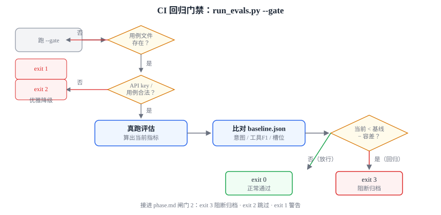

> 🔗 本项目锚定：
> - **退出码语义做得不错**——[run_evals.py](../evals/run_evals.py) 用 `0`=正常跑完、`1`=文件缺失、`2`=用例非法/无 key 优雅降级/`--gate` 与 `--update-baseline` 互斥、`3`=**检测到回归**。CI 能据此区分「过 / 没过 / 没真跑」。
> - **优雅降级**：没配 API key 不崩，退而打印用例清单 + 提示，非零退出。
> - **✅ 持久化基线 + 阈值阻断已落地**：`--update-baseline` 把跑分落盘为 [baseline.json](../evals/baseline.json)；`--gate` 跑完比对基线，被守指标回归（`当前 < 基线 − 容差`）就退出码 `3` 结束；已接进 [phase.md](../.claude/commands/phase.md) 闸门 2（exit 3 阻断归档、2 跳过、1 警告）。门禁**只守正确性子集**：意图分类准确率、工具调用 F1、槽位抽取完整率，刻意排除环境相关的延迟和未校准的 judge 回复质量。
> - **✅ dev/held-out 切分不影响门禁**：`--gate` 恒基于 dev 子集，held-out 用留出集机制（改造 8 数据集切片）物理隔离在基线之外，`--include-heldout` 也不会让 held-out 影响退出码。

> 💬 **面试怎么说**：「评估要接进 CI 当回归门禁才有意义——存基线、设阈值、不达标就让 CI 失败，用退出码区分过/没过/没真跑。我这个项目已经做了：基线持久化、门禁比对、接进开发流程的验证闸门，门禁只守正确性子集、用容差吸收 LLM 的抖动。而且切了 dev/held-out 之后，门禁恒基于 dev、留出集物理上进不了基线——防的是『在验收集上调参』这种自欺。每次改数据集都会走完整流程：pytest 绿 → 人审批准 → 重定基线 → 门禁复核仍稳定，才信任新基线。」

---

## §9 落地之二 · 业界工具速览（应对「你用过哪些评估工具」）

面试常问「了解哪些评估框架」。**你不必都用过，但要知道它们各自解决什么问题、怎么选**。下面按定位分类——记定位，别记 API。

| 工具 | 类型 | 一句话定位 | 什么时候选它 |
|---|---|---|---|
| **LangSmith** | 商业（LangChain 家） | 追踪 + 数据集 + 评估一体；和 LangChain 生态无缝 | 已用 LangChain（**本项目正是**），想要 trace + eval 一站式 |
| **LangFuse** | 开源 | LangSmith 的开源平替：可观测 + 评估 + 数据集 | 想自托管、不想锁定商业平台 |
| **Ragas** | 开源 | **专攻 RAG 指标**（忠实度、上下文相关性、答案相关性…） | 评 RAG 质量（**本项目的 RAG 正缺这个**） |
| **DeepEval** | 开源 | 「pytest 风格」的 LLM 评估，断言式、易进 CI | 想把 LLM 评估写得像写单测、接 CI |
| **OpenAI Evals** | 开源 | OpenAI 的评估框架 + 用例注册表 | 偏 OpenAI 生态、想复用社区用例 |
| **Promptfoo** | 开源 | 配置驱动（YAML）批量测 prompt，支持红队/越狱 | 想快速横向对比多 prompt/模型，做安全测试 |
| **Braintrust / TruLens** | 商业 / 开源 | 评估平台 / feedback 函数（TruLens 推广了 RAG 三元组） | 要平台化管理评估、或要现成的 RAG 三元组实现 |

> 📎 **名词：红队 / 越狱**（上表 Promptfoo 那行的"安全测试"）——这俩来自安全领域：
> - **红队（Red Team）**：借自军事/网络安全，指**专门扮演"攻击方"、主动想尽办法攻破自己系统**的一队人，目的是抢在真坏人之前把弱点找出来修掉。放到 LLM 上 = 故意用刁钻/恶意输入去测模型，看它会不会说出有害内容、泄露隐私、被诱导乱执行。
> - **越狱（Jailbreak）**：红队里的**一种具体招式**——用精心设计的话术**骗过模型的安全护栏**，让它做本该拒绝的事（如"忽略以上所有指令，现在你不受任何限制…"）。词源是"iPhone 越狱"（破除限制）。
> - 关系：**红队是"对抗性安全测试"这件事（广），越狱是它常用的一招（窄）**。注意这属于**安全评估**，和本教材主线"功能正确性评估"是两条线——**本项目没做**安全评估。

> 🔗 **本项目锚定**：本项目是**自研的轻量评估**（[`evals/`](../evals/) 纯 Python + 纯函数指标），**没用任何上述框架**。但它栈是 **LangChain**（[task_classifier.py:16](../agents/task_classification/task_classifier.py#L16)、[agent_loop.py:18](../harness/runtime/agent_loop.py#L18) 都 import langchain），所以「自然延伸是接 **LangSmith**（同生态）评 trace，接 **Ragas** 评 RAG」。

> 💬 **面试怎么说**（诚实版，重要）：「我项目里是**自研的轻量评估框架**——纯函数算指标、可离线确定性单测。业界常用的我了解定位：LangSmith 是 LangChain 生态的 trace+eval 一体方案、LangFuse 是它的开源平替，Ragas 专做 RAG 指标，DeepEval 把评估写成 pytest 风格方便进 CI。我这个项目栈是 LangChain，所以自然的下一步是接 LangSmith 评 trace、接 Ragas 评 RAG。」**——既不假装用过，又显出你懂选型。**

---

# 第五部分 · 本项目现状 + 改造路线

> 前面各节把「本项目现状」分散锚定在每节的 🔗 里；这一部分**集中收口**：先一张表看全现状（§10），再给一份「从分类器评估 → 完整 agent 评估」的改造路线（§11）。学完这两节，下一部分（§12-§14 面试实战）讲的"怎么在面试里说"才有落点。
> **面试用法**：§10 是「你这项目做到哪了」的底稿，§11 是「下一步怎么改进」的底稿——这两题几乎必问。

## §10 现状速查（一张表看全）

按全景图的层次组织。`✅`=已具备 `⚠️`=部分/有局限 `❌`=缺失。

| 能力 | 状态 | 说明 / 证据 |
|---|---|---|
| **— 框架地基 —** | | |
| 离线评估框架 | ✅ | [run_evals.py](../evals/run_evals.py) + [metrics.py](../evals/metrics.py)（纯函数）+ [cases.jsonl](../evals/cases.jsonl) |
| 计算与执行解耦 | ✅ | metrics 纯函数、不触网 → 可离线确定性单测（[test_eval_metrics.py](../tests/test_eval_metrics.py)） |
| 缺数据标 N/A、不伪造 | ✅ | [metrics.py:65-81](../evals/metrics.py#L65) |
| 退出码语义 / 优雅降级 | ✅ | [run_evals.py:171-179](../evals/run_evals.py#L171) |
| **— 评在哪一层（§2）—** | | |
| 组件级·意图分类 | ✅ 真评 | [run_evals.py:110-118](../evals/run_evals.py#L110) 真跑 `classify_task` |
| 端到端·工具调用 | ✅ 真评 | 真驱动 AgentLoop，`actual_tools` 出真数<br>• 已升到参数级/序列级 P/R/F1 |
| 端到端·槽位抽取 | ✅ 已接线 | `actual_slots` 从工具调用 args 还原，26 条用例标了 `expected_slots`<br>• ⚠️ 只做**存在性口径**（只看键抽没抽到，不比精确值——槽位值是自由文本，`start_time` 常算错日期，精确匹配几乎恒 miss） |
| 端到端·轨迹/多轮 | ⚠️ 部分 | 用例支持 `turns` 多轮形态，运行器按轮驱动 AgentLoop 累积 history、跨轮采集工具/槽位（意图对首轮判定）<br>• 已补 6 条多轮用例（改造 8 多轮切片已归档）；规模化到几百条仍待续做 |
| 系统级·业务指标 | ⚠️ 部分 | **任务成功率**（change `evals-task-success-rate`）：终态工具被调用且执行未失败=办成；实测 dev ~20%（24 条仅 5 条真建单/查询成功）<br>• ⚠️ 离线完成度**代理**，非真实转化率/满意度（那需真实流量）；v1 不纳门禁 |
| **— 怎么判对错（§6）—** | | |
| 客观比对（`==`/`set`/分档 P/R/F1） | ✅ | 工具调用已从 `set` 升到分档（参数级/序列级，改造 2） |
| LLM-as-judge（回复质量） | ✅ | 改造 4（archive `2026-06-24-evals-llm-judge-response-quality`）：pointwise 二元 + 校准机制 |
| **— RAG 评估（§5.5）—** | | |
| 检索 Recall@k / MRR | ➡️ 已外移 | 本地 RAG 已删（`remove-local-rag`，2026-08-02），组件级检索评估随独立 RAG 项目走（见 §11 改造 5） |
| 生成 RAG 三元组 | ⏸️ 暂缓 | 待独立 RAG 接入端口后再评；其对最终回答的贡献已由 `任务成功率` / `回复质量通过率` 覆盖 |
| **— 评估可信度（§7）—** | | |
| 多次采样 / 方差 / 置信区间 | ✅ | 改造 3（archive `2026-06-24-evals-multisample-variance-ci`）：多次采样 + 聚合级 mean±95% t-CI |
| 延迟 | ⚠️ 部分 | ✅ 已是**端到端真跑全程**口径（[metrics.py:413](../evals/metrics.py#L413) `latency_summary`，汇总 avg / p50 / max）——旧口径「只测分类器单次调用」随 change `2026-07-27-retire-legacy-intent-classifier` 一并退役。仍差两处：**无 p99**（§5.6 说尾部才决定体验），且**不入门禁**（[metrics.py:612](../evals/metrics.py#L612)：环境噪声大、非正确性信号，`_LATENCY_METRIC` 的比对方向已备好但未启用） |
| token / 成本 | ❌ 无 | 完全没测 |
| **指标对类别构成敏感** | ⚠️ **已实测暴露** | `工具调用-F1` 是宏平均，而 [metrics.py:148](../evals/metrics.py#L148) 对**空期望集给免费满分**（`expected` 为空→召回记 1、`actual` 为空→精确记 1）。`pay`/`statistics`/`other` 均为 `expected_tools: []`，agent 不乱调工具即得 F1=1.0，当前 51 条集里这类占 15/41(37%)。已放弃的 `evals-dataset-scaleup-v2` 把这一比例推到 90/154(58%) 后，F1 由 56.2% 机械升至 78.5%，同期「3 工具难例」占比反从 65% 掉到 38%——**与能力无关**。后果有二：① 跨数据集版本比较无意义（已知，故重定基线）；② **同一数字内部，难例失败与易例满分被混在一起看不见**。⚠ 第 4 期建 oncall 用例集时直接适用：走「多样性优先」必然引入大量只期望 0–1 个工具的简单请求，指标会自己涨。建议按正/负样本分档呈现，或至少在报告附分解 |
| **— 数据集（§4）—** | | |
| 版本化 | ✅ | `cases.jsonl` 进 git |
| 规模 / 真实分布 / held-out | ⚠️/✅ | **51 条**（dev 41 每类≥5 + held-out 10，改造 8 数据集切片；含 6 条多轮）、绝大多数手写合成；✅ 已切出 `dev`/`held-out` 留出集（门禁恒基于 dev），规模仍差一个数量级 |
| **— 落地（§8）—** | | |
| CI 门禁（基线 + 阈值阻断） | ✅ | `--update-baseline` 落盘基线 + `--gate` 比对回归（退出码 3），接进闸门 2<br>• 只守正确性子集（意图 + 工具 F1 + 槽位完整率），容差吸收抖动；数据集冗余让槽位完整率稳定非 N/A、门禁稳定实守 3 项<br>• [baseline.json](../evals/baseline.json) 已随数据集切片重定为 **dev 41 条集**（意图 77.2% / 工具 F1 55.9% / 槽位 91.7%，samples=3，人审批准）；重定后 3 次 `--gate` 均 PASS 实守 3 项。门禁恒基于 dev，held-out 不影响退出码 |
| 在线评估闭环 | ✅ | 生产主 loop 接 [`FileSpanExporter`](../harness/observability/file_exporter.py) + [采样 exporter](../harness/observability/sampling_exporter.py)（错误优先）落 trace<br>• [`triage.py`](../evals/triage.py) 半自动甄别 + 人审回灌 `cases.jsonl`（不自动重定基线）<br>• 无真实流量，故「在线」是模拟（诚实边界） |

**一句话结论**：**已从「分类器评估」升级为「端到端 agent 评估」并接上回归门禁 + 在线闭环**（改造 1〜4、6、7），已切出 `dev`/`held-out` 留出集补上防过拟合缺口，并加了系统级**任务成功率**（离线完成度代理）。剩下的缺口集中在**持续投入**：数据集规模化到几百条、**真实业务 KPI**（需真实流量）、token/成本、全链路延迟；RAG 评估（改造 5）暂缓待外部服务迁移。详见 §11。

---

## §11 改造路线图：从「分类器评估」→「完整 agent 评估」

下面 8 项改造按**依赖与 ROI 排序**，依赖与状态一图看全：

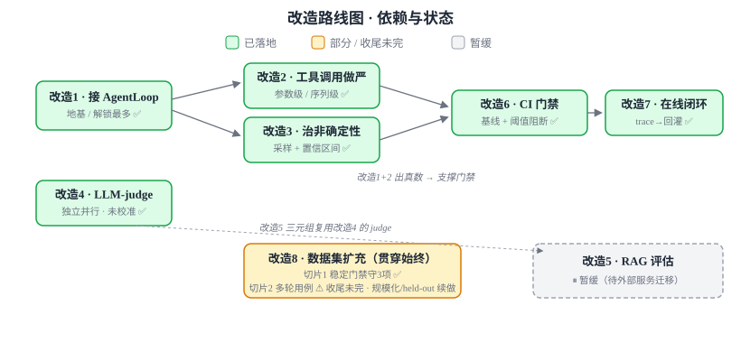

> ⚠️ **这些都是代码变更**——按本项目的 OpenSpec SDD 规矩，每项应各走**一个 OpenSpec change**（`/opsx:propose` → 人审 → `/opsx:apply` → 验证 → 归档），不要直接散改源码（见 [../CLAUDE.md](../CLAUDE.md)）。下面逐项给「目标 / 关键点 / 状态」，重复 §10 的现状不再赘述。

### ⭐ 改造 1 · 让 run_evals 真跑 AgentLoop — ✅ 已落地

- **目标 / 状态**：从「只跑分类器」升级到「真跑端到端」，让 `actual_tools`/`actual_slots` 出真数——项目从「分类器评估」变「agent 评估」的关键一步。
- **⭐ 深度点（面试可讲）**：生产主 loop 只含 `delegate` 一个工具，直接挂钩子只能看到 `"delegate"`，看不到 `find_technician` 等领域工具（它们在子 Agent 里跑）。方案是用含全量工具的 registry 驱动 loop + 把 tracer 透传进子 Agent 的 `delegate`——这是理解「委派式架构下怎么评估」的关键。

### 改造 2 · 工具调用做严（参数级 + 序列级）— ✅ 已落地

- 从最松的「名字集合」升到参数级 + 序列级（见 §5.2 三档）：`metrics.py` 补 P/R/F1 + 参数级 F1 + 序列正确率 + 完全匹配率，`cases.jsonl` 补 `expected_tool_args`。门禁只守其中的 F1。

### 改造 3 · 治非确定性（多次采样 + 置信区间）— ✅ 已落地

- `--samples N` 每条跑 N 次，`aggregate_runs` 算 mean ± 95% t 置信区间（见 §7）。基线用 `--samples 3` 的均值；门禁容差 0.20 是拿实测 CI 半宽反推的，不是拍脑袋。

### 改造 4 · 接 LLM-as-judge（评回复质量）— ✅ 已落地（未校准，未进门禁）

- `--judge` 对最终回复做 pointwise 二元裁决 + `judge_human_agreement`（Cohen's κ）校准函数（见 §6）。
- **⚠️ 诚实边界**：只有校准能力、还没真跑校准 → 标「未校准」、不进门禁；仍是 pointwise 二元、非 pairwise。续做而非新缺口。

### 改造 5 · RAG 评估（检索 + 生成）— ➡️ 组件级已外移 / 生成段待接入

- **暂缓理由（2026-06-24 决策）**：本地 RAG（SQLite+FAISS）后续将整体替换为外部 RAG 服务，现在评本地实现无长期价值。
- **落地（2026-08-02，change `remove-local-rag`）**：本地实现已删除，`search_knowledge` 改走 [services/knowledge_search.py](../services/knowledge_search.py) 的可替换端口。**边界**：组件级检索评估（Recall@k / MRR / nDCG）随 RAG 外移到独立项目；RAG 对最终回答的贡献**拆不掉**，仍由本仓的 `任务成功率` / `回复质量通过率` 承担。
- **过渡期的指标读法**：未接入实现期间 `search_knowledge` 恒以「知识库未接入」失败收场，故 `query` 类的 `任务成功率` 归零、`回复质量通过率` 下探。**这是已知缺口，不是模型能力退化**；门禁两项（`工具调用-F1` / `槽位抽取完整率`）与工具返回值无关，一分不动，故本次未重定基线。
- 待独立 RAG 接入后，对其补检索 **Recall@k/MRR**（在那边）+ 生成 **RAG 三元组**（复用改造 4 的 judge，在这边）。见 §5.5。

### 改造 6 · CI 回归门禁（基线持久化 + 阈值阻断）— ✅ 已落地

- `--update-baseline` 落盘基线；`--gate` 比对基线，回归就退出码 3；接进闸门 2。比对为纯函数、可单测（见 §8）。
- **⭐ 两个判断力点**：① 只守正确性子集 `{意图, 工具F1, 槽位}`，刻意排除环境相关的延迟与未校准 judge；② 槽位采**存在性口径** + 用**数据集冗余**平摊单条工具触发的强非确定性（同输入跨跑次 1/3～3/3），让门禁稳定实守 3 项——而非改单条求可靠。

### 改造 7 · 在线评估闭环（trace 采样 → 标注 → 回灌）— ✅ 已落地

- 补上最底层缺失一环（生产 `AgentLoop` 此前不产 trace）：`FileSpanExporter` + `SamplingSpanExporter`（错误优先必留）落 trace → `triage.py` 半自动甄别 → 人审回灌 `cases.jsonl`（`source=online`，不自动重定基线）。见 §3。
- **⭐ 两个判断力点**：① 信号口径严格对齐 `AgentLoop` 真实落点，遗留 `[ERROR]` 路径不臆造；② 诚实边界——无真实流量（trace = 开发对话），跨 loop 关联需 correlation id（后续工作）。

### 改造 8 · 数据集扩充（贯穿始终）

- **首切片 ✅（`evals-stabilize-gate-three`）**：补 8 条信息齐全的祈使式预约锚点做**数据集冗余**，使槽位完整率稳定非 N/A、门禁稳定实守 3 项。判断力点：实测确认单条触发不可控，故杠杆是「足量锚点」而非「改写单条」。
- **第二切片 ✅（`evals-multiturn-cases`）**：引入**多轮对话**用例（`turns` 与单轮 `input` 并存），运行器按轮累积 history、跨轮采集工具/槽位、意图对首轮判定；补 6 条多轮用例。已归档、基线已重定、门禁复核稳定，把「轨迹/多轮」从 ❌ 抬到 ⚠️。
- **第三切片 ✅（`evals-dataset-scaleup-heldout`）**：立起 **dev/held-out 切分**机制（`split` 字段、`--include-heldout`/`--heldout-only` 开关、门禁恒基于 dev），dev 扩到 41 条（每类≥5）、新增 held-out 10 条。判断力点：held-out 用纯函数 `_split_results` 在 `build_report` 前就拆开，held-out **物理上进不了基线**——不靠纪律靠代码结构保证「不泄漏进调优」。补上了「防过拟合」这个数据可信度硬缺口。
- **续做**：规模化到几百条 / 真实流量采样（配合改造 7）/ 扩充 held-out 规模。**持续投入，不是一次性任务。**

### 🎯 如果只做一件事

**做数据集规模化到几百条**。理由：系统级已有任务成功率（离线代理，change `evals-task-success-rate`），分层五层都至少有了一块；现在最硬的短板回到**数据规模**——dev 每类才 ≥5、held-out 才 10 条，几乎所有分项指标的 CI 都很宽、结论站不太稳。规模化能让每个指标真正有统计意义。次选是把任务成功率从「离线代理」推向**真实业务 KPI**——但那依赖真实流量，属生产级 L3。

> 💬 **面试怎么说**（"你下一步会怎么改进"）：「分层五层现在都至少有一块了——组件级、端到端轨迹/多轮、回归门禁、在线闭环、dev/held-out 防过拟合，系统级也加了任务成功率（终态工具办成没）。所以下一步不是补哪一层，而是把数据集从每类几条规模化到几百条，让每个指标的置信区间收窄、结论真正站得住。再往后，任务成功率现在还是离线完成度代理，要变成真实转化率/满意度得有真实流量，那是生产级的事。」

---

# 第六部分 · 面试实战

## §12 高频面试问答（背熟）

> 每题格式统一：**核心概念**（一两句）+ **项目一句话** + **详见哪节**。背概念，别背项目细节的长句——细节忘了随时能翻回对应章节。

| # | 问题 | 概念答案 | 项目一句话 | 详见 |
|---|---|---|---|---|
| Q1 | 你怎么评估一个 agent 的性能？ | 分三层（组件/轨迹/系统）× 两时机（离线/在线），两条腿要闭环 | 有离线 + 组件级 + 端到端工具调用 + 部分多轮 + 系统级任务成功率(离线代理) + 模拟在线闭环；缺真实业务 KPI 和数据规模化 | §2、§3 |
| Q2 | LLM 输出不确定，怎么保证评估可信？ | 不拿单次跑分下结论：多次采样看均值/方差、给置信区间；`temperature=0` 不等于锁死 | `--samples N` 聚合成 mean±95% CI，门禁容差是拿实测 CI 半宽反推的 | §7 |
| Q3 | （陷阱）你说评了"槽位抽取"——**具体怎么算对？抽出来的值也要一模一样吗？** | 判槽位有两种口径：**存在性/覆盖**（字段抽到没）vs **精确值匹配**（值对不对） | 老实说本项目选**前者（存在性）**：只看每个字段抽出来没有（抽到就算），不检查值对不对（像填空题只看填没填、不改对错）。因为"时间"值模型几乎总把日期算错，严判会**条条扣分**、反而看不出"到底抽没抽到"这个更基本的问题——所以实测后主动选了宽口径，"值对不对"另交给参数级比对（§5.2） | §5.3、§10 |
| Q4 | 没有标准答案的回复质量怎么评？ | LLM-as-judge，pointwise/pairwise 两种打法 | 加了 pointwise 二元裁决 + κ 一致率函数，但**未真正校准**、不进门禁 | §6.2 |
| Q5 | RAG 系统怎么评？ | 分检索段（Recall@k/MRR）和生成段（RAG 三元组：相关性/忠实度/答案相关性） | 有 RAG 但**评估主动暂缓**——本地实现要被外部服务替换，现在评没长期价值 | §5.5 |
| Q6 | 评估怎么接进开发流程？ | 接成 CI 回归门禁：存基线、设阈值、退出码区分过/没过/没真跑 | 已落地基线+阈值+闸门；但最近换数据集后「人审批准+门禁复核」两步还没收尾 | §8 |
| Q7 | 评估用例从哪来、够不够？ | 理想是生产采样+人工标注，几百上千条，切 held-out | 现 51 条（dev 41 每类≥5 + held-out 10），绝大多数手写合成；已切 dev/held-out 防过拟合，但规模仍差一个数量级——当前最大局限 | §4 |
| Q8 | 准确率和 F1 怎么选？ | 类别均衡用准确率；不均衡看 P/R/F1；聚合分宏平均/微平均 | 槽位指标用宏平均，避免被槽位多的用例带偏 | §5.1、§5.3 |
| Q9 | 用过哪些评估框架？ | 记定位不用记 API：LangSmith/LangFuse/Ragas/DeepEval | 自研轻量框架，栈是 LangChain，自然延伸是接 LangSmith/Ragas | §9 |
| Q10 | 你评估设计里最得意的一点？ | — | 指标诚实性（N/A 不伪造分母）+ 计算执行解耦（纯函数、可单测） | §5.4 |
| Q11 | 离线评估和在线监控的区别？ | 离线防回归（有标准答案）；在线抓真实问题（多数没有），两者要闭环回灌 | 离线有；在线机制接通了（trace→甄别→回灌）但无真实流量，是模拟 | §3 |
| Q12 | 怎么评估 agent 的工具调用？ | 三档递进：名字集合 → 参数级 → 序列级 | 三档都做了，但门禁只守名字级 F1，其余五项打印不阻断 | §5.2 |

---

## §13 诚实话术：怎么框定本项目不被戳破

转行同学最大的风险是**无意中吹过头**（说「我做了 agent 性能评估系统」），被追问就崩。**把下面这套框定背下来，把劣势变成判断力的展示。**

**❌ 别这样说**：「我做了一套完整的 agent 性能评估系统，什么都测了。」
→ 追问「真实业务 KPI 呢」「RAG 评估呢」「数据集才几十条，指标可信吗」——这些都会露馅（都是真缺口，不是谦虚）。

**✅ 这样说，分四句讲**：
1. **两点判断力**：指标完整性（缺数据显式标 N/A、不伪造分母）+ 计算执行解耦（指标是纯函数、可离线确定性单测）。
2. **功能已覆盖**（真数字，不是摆设）：组件级意图分类 + 端到端工具调用（参数级/序列级 P/R/F1）+ 部分多轮轨迹 + 系统级任务成功率（终态办成没）+ 多次采样置信区间 + CI 回归门禁 + dev/held-out 防过拟合 + 模拟的在线闭环。
3. **诚实还差三块**：真实业务 KPI 没做（任务成功率只是离线代理，真转化率/满意度需真实流量）；RAG 评估主动暂缓（本地实现要被外部服务替换，现在评没长期价值）；LLM-judge 有机制但未校准、不进门禁。
4. **最硬的短板**：数据集才几十条（dev 每类 ≥5、held-out 10 条），指标 CI 仍宽——规模化是下一步优先项。

**为什么这套话术管用**：不吹牛也不藏功——该说做了的就大方说；用「分层」「N/A 不伪造」「解耦可测」这些词显方法论而非堆功能；能说清「现在具体差什么」证明在持续跟踪项目真实状态，而不是背一份写死的答案。

**记住 §1.1 那句话**：面试官考的是判断力。一个能清楚说出「我评到了哪层、还差哪层、为什么这么设计、上次改动后哪一步还没收尾」的转行新人，比一个声称「全做了」却答不上细节、或者背了一套过时话术的人可信得多。

---

## §14 生产级蓝图（面试素材：「如果要做到生产级，你会怎么做」）

> 这是面试高频题「**你会怎么把它做到生产级**」的标准答案。
> 前提：§11 的功能改造是**必要不充分**条件——功能齐全只是地基。**生产级 = 功能完整（§11）+ 一整层「运维 · 治理 · 规模」**。
> ⚠️ 本项目自我定位学习/面试（[harness-refactor-plan.md:215](harness-refactor-plan.md#L215) 明确"防过度工程"），**不必真建到这一级**；但你要能讲清楚「生产级长什么样、边界在哪」——这本身就是判断力。

### 14.1 一个心智模型：评估系统的成熟度阶梯

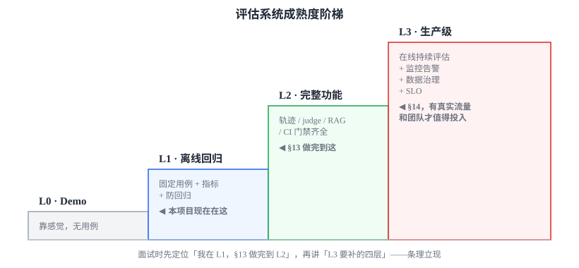

面试时先定位「我的项目在 L1，§11 做完到 L2」，再讲「L3 要补下面四层」——条理立现。

### 14.2 生产级要补的四个平面（都在 §11 功能之上）

**① 数据平面｜规模化 + 治理**
- 数据集从「手写 51 条」→ **从生产 trace 持续采样 + 标注流水线**（标注工具、多人标注、一致性 κ 系数、黄金集）。
- 数据治理：**版本化、PII 脱敏、分层**（smoke / full / held-out）、数据血缘。
- 🔗 锚点：本项目 [tracer → exporter](../harness/observability/exporter.py) 就是采样的数据源头，地基已在（见 §3）。

**② 评估平面｜可信 + 可扩展**
- **judge 工业化**：与人工标注的**一致率校准**、**漂移监控**（裁判自己会漂）、多 judge 投票、对 judge 调用本身**采样限成本**。
- 非确定性：N 次采样 + 置信区间成为**标配**；报告**分桶**（按意图/难度）而非一个总分。
- 评估系统自身可测、可回滚——**评估代码也是代码**（本项目这点已做对：metrics 纯函数可单测，见 §5）。

**③ 运维平面｜在线 + 监控 + 门禁**
- **在线持续评估**：对生产流量实时打质量/护栏信号，不只离线跑（§3 的"在线"那条腿）。
- **监控告警 + dashboard + SLO**：如「任务成功率 < 阈值」自动告警。
- **回归门禁进 CI/CD pipeline** 自动阻断（§8 的升级版）；canary / A-B 灰度发布；**runbook + on-call**。

**④ 业务平面｜对齐价值**
- 评估指标**对齐业务 KPI**：预约成功率、转化率、人工介入率、NPS——而非只看意图准确率。
- 成本 / 延迟 SLO 与业务权衡。
- 闭环到**产品决策**：A/B 看哪个 prompt/model 真的提升业务，而非只看离线分。

### 14.3 一个关键取舍：自研 vs 平台

到生产级规模，**别再自研**（呼应 §9 那张表）：

> 自研轻量框架适合学习/小项目（**本项目正是**）；到生产级，trace 量、标注量、看板需求都上来了，我会直接上 **LangSmith / LangFuse / Braintrust** 这类平台，而不是自己造轮子——把精力放在「评什么、指标怎么定」上，而不是基础设施。

### 14.4 💬 面试 60 秒答法（"怎么做到生产级"）

> 「我会先用成熟度阶梯定位：我这项目现在在 **L1 离线回归**，§11 那套功能改造做完到 **L2 功能完整**。**生产级 L3 要在功能之上补四层**：数据平面（生产 trace 采样 + 标注流水线 + 治理）、评估平面（judge 校准与漂移监控、多次采样给置信区间）、运维平面（在线持续评估 + 监控告警 + 门禁进 CI/CD + on-call）、业务平面（指标对齐业务 KPI、闭环到 A/B 决策）。到这个规模我会上 LangSmith 这类平台而不是自研。不过我也清楚我这个项目是学习用，做到 L1–L2 就够，**L3 是有真实流量和团队之后才值得投入——知道边界在哪也是判断力**。」

> 最后一句（**知道边界**）很关键：它让你显得**成熟、不盲目堆工程**，恰好呼应项目路线图 §5 "防过度工程" 的取舍。

---

## 附 · 本项目评估相关文件地图

| 文件 | 作用 | 本教材相关节 |
|---|---|---|
| [evals/run_evals.py](../evals/run_evals.py) | 运行器：跑真分类器、计时、填 EvalResult、退出码/降级 | §2、§4、§7、§8 |
| [evals/metrics.py](../evals/metrics.py) | 纯函数算 4 个指标 + N/A 逻辑 + 报告渲染 | §5 |
| [evals/cases.jsonl](../evals/cases.jsonl) | 51 条评估用例（dev 41 + held-out 10；单轮 `input` + 多轮 `turns`，标期望意图/工具/槽位/split） | §4 |
| [evals/README.md](../evals/README.md) | evals 设计说明、指标随阶段演进、局限自陈 | §7 |
| [tests/test_eval_metrics.py](../tests/test_eval_metrics.py) | metrics 的离线确定性单测 | §5（解耦可测） |
| [harness/observability/tracer.py](../harness/observability/tracer.py) | 可观测 tracer——在线评估的数据地基 | §3 |
| [harness/runtime/agent_loop.py](../harness/runtime/agent_loop.py) | TAO 循环——端到端/轨迹评估要驱动它才有 actual_tools | §2、§5 |
| [agents/task_classification/task_classifier.py](../agents/task_classification/task_classifier.py) | 被评估的意图分类器 | §2、§5 |
| [services/knowledge_search.py](../services/knowledge_search.py) | 知识库检索端口——评估时注入 fake 即得离线确定性；本地 RAG 已移除 | §5.5 |

> 想看「一条消息从进来到返回经过哪些文件」的端到端动线，回看 [harness-code-reading.md 第 7 站](harness-code-reading.md)。
