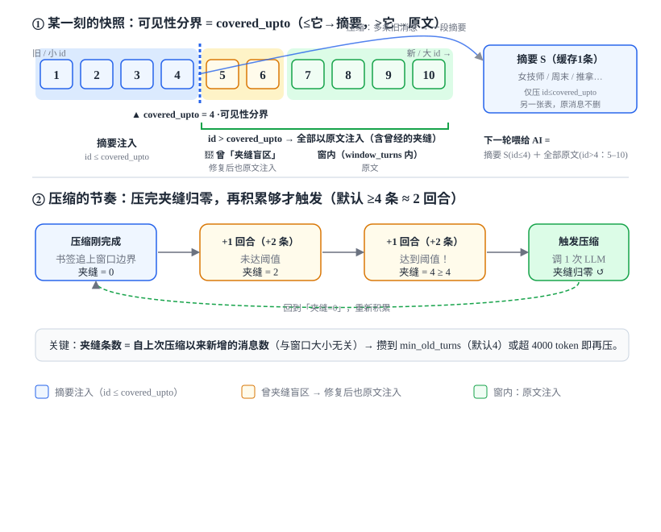
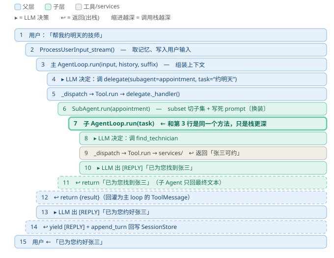

# 读懂 Harness 源码：按 7 站逐站精读（每站自包含）

> 📍 本文属于 harness 学习系列（**第 4 步 · 读源码**）。总览见 [harness-index.md](./harness-index.md)。
>
> 前三步学的是「harness 是什么 / 高手怎么做 / 本项目怎么规划」；这一步动手**读 `harness/` 的真实代码**。配套：[harness-refactor-plan.md](./harness-refactor-plan.md)（每站对应哪个 Phase）。
>
> **本文按「站」组织**：每一站把「解决什么 / 读哪些文件 / 关键代码 / 设计要点 / 断点调试 / 小实验」全放在一起，自包含、可逐站展开学习。读完一站勾掉它的 `[ ]` 再进下一站。

---

## 📖 怎么用这份导读

整个 `harness/` 才约 **2000 行**，每个文件基本 **<120 行**，而且**每个模块都有对应测试**——这是它最大的学习优势：**测试就是用法说明书**。

三条铁律：

1. **测试是入口**。每个 `harness/X.py` 都配了 `tests/test_X.py`。先读测试看「它被怎么调用、输入输出长什么样」，再回头读实现。
2. **顺数据流读，别按字母序**。一条用户消息进来 → loop → 工具 → 记忆 → 护栏 → trace → 子 Agent → 端到端，按这个顺序走一遍。
3. **对照 plan 读**。每站标注了对应 Phase，读代码时回看 plan 里那段「目标/验收」，理解**为什么这么设计**而不只是写了什么。

**每站的固定学习动作**：①读「关键代码」建立印象 → ②读「设计要点」理解为什么 → ③按「断点调试指引」单步跑一遍，把文字变成肌肉记忆。

---

## 🛠️ 调试环境准备（全站共用，先读一次）

读代码配合**单步调试**最快建立直觉。本项目对调试很友好——`tests/test_agent_loop.py` 用**离线 fake LLM**（`ScriptedChatModel`，按预设脚本返回 `AIMessage`），**不用配 API key、不触网、可重复**，是学循环的首选入口。

仓库已有 [.vscode/launch.json](../.vscode/launch.json)，含三个配置：

| 配置 | 用途 |
|------|------|
| **Pytest: 调试测试** | 离线确定性调试（学循环首选）。学单个测试时：测试资源管理器右键单个测试 → Debug Test，或把 `args` 临时改成 `["tests/test_agent_loop.py::test_single_tool_then_reply", "-s"]` |
| **FastAPI: 调试整个应用 (uvicorn)** | 调真服务。已正确**不加 `--reload`**（reload 会 fork 子进程导致断点不命中） |
| **Python: 调试当前文件** | 调某个独立模块 |

操作：打断点 → `F5` 选配置 → `F10` 跳过（不进函数）/ `F11` 进入（步入）/ `Shift+F11` 跳出 / `F5` 继续到下个断点。想单步进 LangChain 内部，确认 `justMyCode: false`（已默认）。

> ⚠️ 三个坑：① 调真服务别用 `--reload`；② Python 解释器必须选 `.venv`（uv 装的），否则 `ModuleNotFoundError`；③ 调真服务需 `.env` 里配好 `LLM_*` / `AZURE_OPENAI_*`。

> 🔑 **调试黄金法则**：先用最少的断点看懂主节奏，再逐步加点深入。学循环只需在 [agent_loop.py:164](../harness/runtime/agent_loop.py#L164) 和 [:178](../harness/runtime/agent_loop.py#L178) 打两个点，反复 F5，盯住三件事——**messages 变长 → 有没有 tool_calls → 最终出 [REPLY]**。看懂这个节奏，就懂了整个 harness。

---

## 🗺️ 一图看清调用关系

```
用户消息
  │
  ▼
[chat_handler]  ──按 session_id 取──▶  Session (runtime/session.py)
  │                                        │
  ▼                                        ├─ short_term / summary / long_term (memory/)
AgentLoop (runtime/agent_loop.py)  ◀───组装上下文 + system_prompt
  │   每轮：assemble → LLM(tools) → dispatch → observe
  │
  ├─▶ ToolRegistry (tools/registry.py) ──分发──▶ 各 tool ──薄封装──▶ services/
  │
  ├─▶ Guardrails (guardrails/)  retry / budget / permission  包在 loop 和工具外
  │
  ├─▶ Tracer (observability/)  on_tool_call / on_observation  埋点
  │
  └─▶ delegate 工具 (subagents/) ──派生──▶ 子 Agent（各自独立上下文）
```

---

# 第 1 站 · 心脏：Agent Loop（Phase 3）⭐ 最重要

整个 harness 的主循环，其它一切都被它调用。**最该花时间的一站。**

## 1.1 这站解决什么

取代「LLM 分类一次 + if/else 硬路由」的老做法，改成让**绑定了工具 schema 的 LLM 自主决定每一步**——这就是 TAO（Thought→Action→Observation）循环。

## 1.2 读哪些文件

- [ ] 实现 [agent_loop.py](../harness/runtime/agent_loop.py)（~267 行）
- [ ] 测试 [test_agent_loop.py](../tests/test_agent_loop.py)
- 对照 [plan 第 105–126 行](./harness-refactor-plan.md) 的 TAO 伪代码看。

## 1.3 关键代码：一轮循环的 6 块

`run()` 是个 **async generator**，把 TAO 伪代码变成真代码。看 [agent_loop.py:98-219](../harness/runtime/agent_loop.py#L98)：

```python
async def run(self, user_input, session_id=None, history=None, system_suffix=None):
    # ── ① 组装上下文 ───────────────────────────────────────────────
    # 一次请求的「初始上下文」= 系统提示 + 历史 + 本轮用户输入。
    system_content = self.system_prompt
    if system_suffix:                          # system_suffix 常是「长期偏好提示」，拼到系统提示末尾
        system_content = f"{system_content}\n\n{system_suffix}"
    messages = [SystemMessage(content=system_content)]    # messages = 喂给 LLM 的对话数组（会越滚越长）
    if history:
        messages.extend(history)               # history 由 chat_handler 传入 → loop 自身不存任何状态
    messages.append(HumanMessage(content=user_input))     # 末尾放本轮用户消息

    spin = SpinDetector(self.repeat_limit)     # 打转检测器：跨步累计「连续相同的工具调用」次数
    root = self._tracer.start_span("agent_loop.run", ...)  # 整次 run 开一个根 span（一条 trace）
    try:
        # ── ② 开循环 + 预算闸门 ─────────────────────────────────────
        for _step in range(self.max_steps):    # 用 range 而非 while True：天然有硬上限，绝不死循环
            # 发 LLM 前先估算上下文体量，超预算就不再花钱调用，直接优雅收尾
            if self.max_tokens is not None and estimate_tokens(messages) > self.max_tokens:
                yield f"[REPLY]{_FALLBACK_REPLY}"
                return
            step = self._tracer.start_span("step", parent=root)   # 每轮一个子 span，挂在 root 下
            try:
                # ── ③ LLM 调用（Thought）：带超时 + 重试护栏 ──────────
                try:
                    ai = await self._guarded_invoke(messages)     # 返回一条 AIMessage（模型这轮的输出）
                except GuardrailExhausted:      # 重试都失败 → 不让异常冒泡，给兜底回复后结束
                    yield f"[REPLY]{_FALLBACK_REPLY}"; return
                messages.append(ai)             # 把模型这轮输出也加回上下文（下一轮模型能看到自己说过啥）

                # ── ④ 分叉点（整个 harness 最重要的 if）──────────────
                tool_calls = ai.tool_calls or []        # 模型这轮想调的工具列表，可能为空
                if not tool_calls:              # 空 = 模型不再需要工具 → 这就是最终回复，结束循环
                    yield f"[REPLY]{_content_text(ai.content)}"
                    return
                if spin.check(tool_calls):      # 连续 N 轮调完全相同的工具+参数 → 判定卡死，提前逃生
                    yield f"[REPLY]{_FALLBACK_REPLY}"; return

                # ── ⑤ 执行工具（Action）+ 把结果喂回（Observation）──
                for call in tool_calls:         # 同一轮可能有多个调用，逐个执行、全部喂回
                    result = await self._dispatch(call)            # 调具体工具，拿到结果（或错误字符串）
                    messages.append(            # 结果包成 ToolMessage 加回上下文
                        ToolMessage(content=str(result),
                                    tool_call_id=call["id"])       # id 把「这条结果」对应回「哪次调用」
                    )
                # ☝️ 这里没有 return：for 跑完会回到 for _step 顶部，进入下一轮（带着新结果再问模型）
            finally:
                self._tracer.end_span(step)     # 无论这轮怎么结束，都关闭子 span
        # ── ⑥ 兜底：跑满 max_steps 仍没出最终回复 ──────────────────
        yield f"[REPLY]{_FALLBACK_REPLY}"
    finally:
        self._tracer.end_span(root)             # 关闭根 span（导出整条 trace）
```

`messages` 列表像**滚雪球**：每轮加上「模型输出 + 工具结果」越来越长，直到模型看够信息、吐出不带 tool_calls 的最终回复。

逐块对照表：

| 块 | 行 | 干什么 | 关键点 |
|---|---|---|---|
| ① 组装上下文 | 119–136 | `[System(+suffix)] + history + Human` | context engineering 落点；loop **自身无状态** |
| ② 开循环+护栏 | 150–157 | `range(max_steps)` + token 预算 + tracer span | 非 `while True`，有硬上限 |
| ③ LLM 调用 | 162–172 | `_guarded_invoke` → `messages.append(ai)` | 带超时+重试；耗尽降级 |
| ④ 分叉点 | 177–189 | 无 tool_calls → 出 `[REPLY]`；有 → 过打转检测 | **整个 harness 最重要的 if** |
| ⑤ 执行+喂回 | 195–208 | 逐个 `_dispatch` → 包 `ToolMessage` append | `tool_call_id` 把结果对应回调用 |
| ⑥ 兜底+收尾 | 214–219 | 撞 `max_steps` → 兜底；`finally` 关 span | 绝不无限循环 |

## 1.4 设计要点：两个可靠性内核（故意不对称）

```python
async def _guarded_invoke(self, messages):   # 守 LLM 调用（agent_loop.py:221）
    # LLM 调用是「只读、幂等」的——重发一次不产生副作用，所以可以安全重试。
    return await guarded_invoke(              # ↓ 包一层超时 + 指数退避重试（实现见第 4 站）
        lambda: self.llm.ainvoke(messages),
        timeout=..., max_attempts=...,
    )

async def _dispatch(self, call):              # 守工具调用（agent_loop.py:235）
    # 工具调用「可能有副作用」（如写库下单）——绝不重试，只做错误隔离。
    try:
        return await self.registry.dispatch(call["name"], call.get("args") or {})
    except Exception as exc:                  # 注意：捕获「全部」异常，不只瞬时异常
        # 把异常吞成一句错误字符串返回；它会被当成正常工具结果喂回模型，
        # 让模型下一轮「看到」失败并自行补救——而不是让整个循环崩掉。
        return f"工具执行失败（{call.get('name', '?')}）：{exc}"
```

| | `_guarded_invoke`（LLM） | `_dispatch`（工具） |
|---|---|---|
| 失败处理 | **重试**（指数退避） | **不重试**，捕获返回错误字符串 |
| 异常范围 | 只瞬时异常（超时/连接） | `except Exception`（全部） |
| 目的 | 扛网络抖动 | 错误隔离 + 回灌自愈 |

**为什么不对称**：LLM 调用只读幂等，可重试；工具调用有副作用——`create_appointment` 重试一次就重复下单。`_dispatch` 把异常吞成字符串当正常结果喂回，模型下一轮「看到」失败、自行换参/换工具/告知用户 → **单工具崩溃不崩循环**。

工具执行的三道防线（从外到内）：

```
_dispatch (agent_loop.py:235)            ← ① 错误隔离：任何异常 → 错误字符串回灌
  └─ registry.dispatch (registry.py:66)  ← ② 权限闸门：dangerous 工具先审批，拒则返回结构化拒绝
       └─ tool.run (base.py:47)          ← ③ 参数校验：Pydantic args_schema 不合法即拒
            └─ handler → services/        ← 真正业务（薄封装）
```

> 🔑 一句话记住整份代码的可靠性哲学：**幂等的可重试（LLM），有副作用的不可重试、只隔离（工具）**。`[REPLY]` 前缀则是与 chat_handler 的约定，后者据此择出回复文本回写历史。

**带着问题读的答案**：
- 什么时候结束？→ [:178](../harness/runtime/agent_loop.py#L178) 模型不再返回 `tool_calls`。
- 怎么防失控？→ 三道闸：`max_steps`（[:150](../harness/runtime/agent_loop.py#L150)）、token 预算（[:153](../harness/runtime/agent_loop.py#L153)）、打转检测（[:186](../harness/runtime/agent_loop.py#L186)）。

## 1.5 🐞 断点调试指引

**用「Pytest: 调试测试」跑 [`test_single_tool_then_reply`](../tests/test_agent_loop.py#L126)**（脚本化了「调一次工具 → 回复」两步，最适合看完整一轮）。

| 断点 | 位置 | F5 到达后看什么 |
|---|---|---|
| 1 | [agent_loop.py:164](../harness/runtime/agent_loop.py#L164) `ai = await self._guarded_invoke(messages)` | **第一次命中**：看 `messages`——此刻只有 `[SystemMessage, HumanMessage("查一下")]`。F10 越过本行，看 `ai.tool_calls` 是 `[echo(...)]` |
| 2 | [agent_loop.py:178](../harness/runtime/agent_loop.py#L178) `if not tool_calls:` | **分叉点**：第一轮 `tool_calls` 非空 → 不进 if，继续往下 |
| 3 | [agent_loop.py:201](../harness/runtime/agent_loop.py#L201) `result = await self._dispatch(call)` | 看 `call["name"]=="echo"`、`call["args"]`。**按 F11 步入** `_dispatch` → 再 F11 进 `registry.dispatch` → 再 F11 进 `tool.run` → 看 Pydantic 校验后调 handler |
| 4 | [agent_loop.py:206](../harness/runtime/agent_loop.py#L206) `messages.append(ToolMessage(...))` | **关键**：看工具结果 `echo<hi>` 被包成 `ToolMessage` 喂回。此刻 `messages` 已有 4 条 |
| 5 | 回到断点 1（第二次命中） | `messages` 变长到 4 条；F10 后 `ai.tool_calls` 为空 → 走 [:181](../harness/runtime/agent_loop.py#L181) 出 `[REPLY]已为您查询完成。` |

**推荐首次动线**：只在断点 1 和 2 打点 → F5 → 观察「messages 变长 → 是否有 tool_calls → 最终出 [REPLY]」反复两轮的节奏。

**破坏性小实验**（理解护栏最快的方式）：
- 跑 [`test_max_steps_fallback`](../tests/test_agent_loop.py#L196)（脚本永远返回工具调用），在 [:150](../harness/runtime/agent_loop.py#L150) 打点数 `_step` 到 3 次后走 [:217](../harness/runtime/agent_loop.py#L217) 兜底——看 `max_steps` 怎么救命。
- 把任意工具 handler 临时改成 `raise`，在 [:245](../harness/runtime/agent_loop.py#L245) 打点，看异常如何变成回灌字符串（参考 [`test_tool_failure_is_fed_back_not_crash`](../tests/test_agent_loop.py#L217)）。

---

# 第 2 站 · 手脚：工具层（Phase 1 + 2）

loop 调用的就是工具。看「能力如何被包装成模型可调用的东西」。

## 2.1 这站解决什么

把「能力」包装成 LLM 可调用的东西，且工具内部**只是 services/ 的薄封装**，不重写业务。

## 2.2 读哪些文件

- [ ] [tools/base.py](../harness/tools/base.py) — 工具基类（name / description / schema / handler）
- [ ] [tools/registry.py](../harness/tools/registry.py) — 注册 + 生成 LLM schema + 按名分发
- [ ] [tools/schemas.py](../harness/tools/schemas.py) — Pydantic 模型（Phase 1 结构化输出的成果）
- [ ] 任挑一个具体工具：[tools/knowledge.py](../harness/tools/knowledge.py) 或 [tools/appointment.py](../harness/tools/appointment.py)
- [ ] 测试 [test_tool_registry.py](../tests/test_tool_registry.py) + [test_harness_tools.py](../tests/test_harness_tools.py)

本站有三个文件，对应三层职责，按这个顺序读最顺：**`base.py`（单个工具长什么样）→ `registry.py`（一堆工具怎么管）→ 某个具体工具（薄封装到底多薄）**。`schemas.py` 贯穿其中，是「参数」的单一真相源。

## 2.3 关键代码 ①：单个工具的形状（`Tool` 四要素）

> 📄 源码出处：[harness/tools/base.py:21-55](../harness/tools/base.py#L21)

[`Tool`](../harness/tools/base.py#L21) 是个 frozen dataclass，把「一个能力」压成五个字段：

```python
# base.py:21
@dataclass(frozen=True)                       # frozen=True：工具一旦定义不可变，可安全共享/复用
class Tool:
    name: str                                 # 唯一名（snake_case）：模型用它指名调用、registry 用它分发
    description: str                          # 面向模型的「说明书」——模型靠它判断「何时该调用我」
    args_schema: type[BaseModel]              # 入参的 Pydantic 模型「类」（注意不是实例）
    handler: Callable[[BaseModel], Awaitable[Any]]   # 真正干活的 async 函数，收「已校验」的参数对象
    dangerous: bool = False                   # True=有副作用（如写库下单），分发前要先过权限闸门

    async def run(self, raw_args: dict) -> Any:           # base.py:47
        # raw_args 是模型给的「原始 dict」，可能缺字段 / 类型不对
        validated = self.args_schema(**raw_args)   # ① Pydantic 校验+转型；不合法直接抛 ValidationError（base.py:52）
        return await self.handler(validated)        # ② 把「干净的」参数对象交给 handler 执行
```

**为什么这么设计**：把「一个能调用的能力」固化成一份**声明式数据**（而非一个个零散的函数），换来三件事——① `frozen` 不可变，能在 `subset()` 切片时被多个 registry 安全共享同一实例；② 校验（`run` 里）和业务（`handler` 里）**强制分离**，handler 永远只拿到干净参数；③ 五个字段就是模型视角的「全部信息」，后面 registry 导出 schema 时无需额外配置。

## 2.4 关键代码 ②：一堆工具怎么管（`ToolRegistry` 本身）

> 📄 源码出处：[harness/tools/registry.py:17-88](../harness/tools/registry.py#L17)

> 🧭 **一句话先记住**：registry（`ToolRegistry`）= **「这个 Agent 手上有哪些工具」的花名册**。`register` 把工具登记进去、`get` 按名取出、`dispatch` 按名调用。后面各站只要看到 "registry"，脑子里换成「工具花名册」即可。（注意它和登记**子 Agent** 的 `SubAgentRegistry` 是两个不同的类——一个管工具、一个管子 Agent，别混。）

registry 是本站之前被一笔带过、其实最该讲的角色。它就是一个**以「工具名」为键的 dict + 三个动作（注册 / 取 / 分发）**：

```python
# registry.py:17
class ToolRegistry:
    def __init__(self, permission=None):
        self._tools: dict[str, Tool] = {}          # ☜ 核心就是这个 dict：name → Tool
        self._permission = permission or allow_all  # 权限策略，缺省全放行（向后兼容，见第 4 站）

    def register(self, tool: Tool) -> None:         # registry.py:33
        if tool.name in self._tools:                # 重名「报错」而非「覆盖」——
            raise ValueError(f"工具 '{tool.name}' 已注册，拒绝覆盖。")  # 防止后注册的悄悄顶掉同名工具
        self._tools[tool.name] = tool

    def get(self, name: str) -> Tool:               # registry.py:40
        if name not in self._tools:                 # 取不到就抛 KeyError（不返回 None）——
            raise KeyError(f"未注册的工具：'{name}'。")   # 让「调了不存在的工具」尽早炸成明确错误
        return self._tools[name]

    async def dispatch(self, name, raw_args):       # registry.py:66 ← loop 唯一的调用入口
        tool = self.get(name)                       # ① 按名取（未注册即抛）
        if tool.dangerous:                          # ② 仅危险工具过权限闸门（只读工具直接跳过）
            decision = self._permission(tool, raw_args)
            if not decision.allow:                  # 被拒：绝不执行 handler，回结构化拒绝结果
                return {"success": False, "denied": True, "reason": decision.reason}
        return await tool.run(raw_args)             # ③ 放行后才真正执行（registry.py:88）
```

**为什么用 dict 而不是 list**：模型调用时给的是工具**名**（字符串），dict 让「按名找工具」是 O(1)，且天然保证「一名一工具」。**为什么重名报错、取不到抛错**：工具集是启动时确定的静态配置，这两类问题都是「配置写错了」，越早炸出来越好——绝不静默吞掉。

**dispatch 的三步顺序是刻意的**：先取工具 → 再权限闸门 → 最后才校验+执行。权限判定放在 Pydantic 校验**之前**，意味着一个被禁的危险操作根本不会浪费力气去校验参数；而错误隔离（try/except）在更外层的 loop `_dispatch` 里（第 1 站 1.4）——registry 只管「该不该做、怎么分发」，不管「崩了怎么办」，职责干净。

另外两个方法第 6 站会用到：[`subset(names)`](../harness/tools/registry.py#L51) 复用「同一批 Tool 实例」切出一个子集 registry 给子 Agent（不拷贝、不重写）；[`build_default_registry()`](../harness/tools/registry.py#L123) 在模块底部把 5 个内置工具一次性注册好（用函数内 import 打破循环依赖）。

## 2.5 关键代码 ③：薄封装到底多薄

> 📄 源码出处：[harness/tools/knowledge.py:13-41](../harness/tools/knowledge.py#L13)

具体工具 [`search_knowledge`](../harness/tools/knowledge.py#L30) 的 handler——体会「工具不写业务，只做转接」：

```python
# knowledge.py:13
async def _handler(args: SearchKnowledgeArgs) -> list[dict]:   # args 已被校验，直接 .query 取用
    # 延迟 import：模块加载时不拉起重型 service/索引，等真正被调用才初始化（加快启动、省内存）
    from services.knowledge_service import KnowledgeService
    service = KnowledgeService()
    if not getattr(service, "initialized", False):   # 仅首次调用时初始化（懒加载）
        await service.initialize()
    # 直接把参数转交给既有 service——工具层不写任何检索/业务逻辑
    return await service.search(args.query, top_k=args.top_k, category=args.category)
    # ☝️「薄封装」的精髓：校验交给 Pydantic、业务交给 services/，工具只做「转接」

# knowledge.py:30 —— 模块级单例，被 build_default_registry 直接注册
search_knowledge = Tool(name="search_knowledge", description="...何时该用...",
                        args_schema=SearchKnowledgeArgs, handler=_handler)  # 未传 dangerous→默认 False
```

**为什么坚持只是薄封装**：业务、可靠性、领域逻辑（SQLite+FAISS 检索）全在既有的 `services/` 里，CLAUDE.md 明确「不要重写 services/」。工具层只做「参数校验 + 转交」，职责单一、易测、不与 service 重复维护——换检索实现时，工具层一行都不用动。

## 2.6 设计要点：单一真相源（一份 Pydantic 模型，两处使用）

> 📄 源码出处：[harness/tools/registry.py:92-104](../harness/tools/registry.py#L92) + [harness/tools/schemas.py](../harness/tools/schemas.py)

前面 `Tool.run` 用 `args_schema` 做**运行时校验**；同一个 `args_schema` 还被 registry 拿去**生成喂给 LLM 的 schema**：

```python
# registry.py:92
def to_openai_schema(self) -> list[dict]:     # 把所有已注册工具导出成 OpenAI function-calling 格式
    return [
        {"type": "function", "function": {
            "name": tool.name,                 # 复用工具的 name
            "description": tool.description,   # 复用工具的 description（同一份文字，喂给模型）
            "parameters": tool.args_schema.model_json_schema(),  # ☜ Pydantic 一行生成 JSON Schema（registry.py:104）
        }}
        for tool in self._tools.values()       # 遍历注册表里的每个工具
    ]
    # 结果会喂给 llm.bind_tools(...)，模型据此知道「有哪些工具、各要什么参数」
```

**为什么这是关键设计**：校验规则和「告诉模型的参数说明」如果是两份手写的东西，迟早漂移——改了校验忘了改 schema，模型就会按过时的说明填参、然后被校验拒掉。这里两者**同源于一份 Pydantic 模型**，永远一致。[`schemas.py`](../harness/tools/schemas.py) 里每个 `Field(description=...)`（如 [`top_k`](../harness/tools/schemas.py#L22) 的 `ge=1, le=20`）都会被 `model_json_schema()` 抽进 schema——**那段 description 就是写给模型的提示词，那些 `ge/le` 就是校验约束**，一处定义、两处生效。

> 🔑 **记住这条（后面反复用到）**：这份 schema 经 `llm.bind_tools(...)` 成为发给 LLM 的 API 请求里的 **`tools` 字段**（与 `messages` 平行的独立参数）。**它才是模型「能调用工具、知道参数怎么填」的唯一依据**——模型决定调用时，返回的不是文字而是结构化的 `tool_calls`（第 1 站 loop 据此 dispatch）。换句话说：**让模型「能调工具」的是这个 `tools` 字段，不是系统提示里的文字。** 在系统提示里再列一遍工具是**可选的、基本冗余的**（详见第 3 站 3.6 的客观澄清）。

**带着问题读的答案**：
- registry 凭什么 O(1) 分发、不会重名？→ 以工具名为键的 dict，`register` 重名直接报错（[registry.py:36](../harness/tools/registry.py#L36)）。
- 工具如何把 Pydantic 变 LLM schema？→ `args_schema.model_json_schema()`（[registry.py:104](../harness/tools/registry.py#L104)），与校验同源。
- 为什么只是薄封装？→ 业务/可靠性/领域逻辑都在 `services/`，工具只做「参数校验 + 转交」，职责单一、易测、不重复维护。

## 2.7 函数调用怎么工作：`tools` 字段 vs 系统提示（贯穿全 harness 的地基）

> 这一节回答一个最容易想偏、却决定你能否看懂整个 harness 的问题：**LLM 到底是怎么「调用工具」的？** 工具分发、`delegate`、子 Agent——全都骑在这套机制上。

### 先纠正方向：不是「LLM 告诉程序怎么调」

很多人(包括第一次读的我)会以为「LLM 指挥程序去调工具」。实际方向是这三步：

1. **我们(代码)** 告诉 LLM：有哪些工具、各收什么参数。 ← 第 2.6 节的 `to_openai_schema` + `bind_tools`
2. **LLM** 决定：这次调哪个工具、填什么参数，并把这个决定**以结构化形式输出**(不是吐文字)。
3. **Agent(第 1 站的 loop)** 读到这个决定，真正去执行工具、再把结果喂回。 ← 第 1 站的 dispatch + 回灌

所以不存在「LLM 告知程序如何调用」——是 **LLM 产出「我要调 X(参数…)」，loop 照着执行**。

### 关键：工具是 API 的「独立参数」，不在 prompt 文字里

现代 LLM(OpenAI / Anthropic)的**函数调用是 API 原生功能**。一次 API 请求里，`messages`(对话)和 `tools`(工具定义)是**两个平行字段**：

```jsonc
// 发给 LLM 的一次请求
{
  "messages": [
    {"role": "system", "content": "你是门店助手……"},   // ← 系统提示在这里
    {"role": "user",   "content": "查一下营业时间"}
  ],
  "tools": [                                            // ← 工具定义在「另一个字段」，不在 prompt 文字里！
    {"type": "function", "function": {
        "name": "search_knowledge",
        "description": "在门店知识库中检索……",            // 来自 Tool.description（2.6 单一真相源）
        "parameters": { /* JSON Schema：query、top_k… */ } // 来自 args_schema
    }}
  ]
}
```

模型读到 `tools` 字段后，若决定调用，**返回的不是文字，而是结构化的 `tool_calls`**：

```jsonc
// LLM 的回应
{
  "role": "assistant",
  "content": "",
  "tool_calls": [
    {"id": "call_1", "name": "search_knowledge", "arguments": {"query": "营业时间"}}
  ]
}
```

第 1 站的 loop 读的就是这个 `ai.tool_calls`，然后 `dispatch` 去执行（回看 [agent_loop.py 的分叉点](../harness/runtime/agent_loop.py#L117)）。

### `bind_tools` 就是「把 `tools` 字段挂上去」

[agent_loop.py:94](../harness/runtime/agent_loop.py#L94) 的 `self.llm = llm.bind_tools(registry.to_openai_schema())` 做的就是这件事：**把上面那个 `tools` 数组，绑定到之后每一次 API 调用上**。`to_openai_schema()`(2.6)生成的正是 `tools` 的内容。

### 各部件归位（一张表记住「谁负责哪段」）

| 阶段 | 谁干的 | 在哪 |
|---|---|---|
| 把 Pydantic 模型 → `tools` 字段内容 | `to_openai_schema()` | 2.6 / [registry.py:92](../harness/tools/registry.py#L92) |
| 把 `tools` 字段挂到每次调用 | `bind_tools(...)` | [agent_loop.py:94](../harness/runtime/agent_loop.py#L94) |
| 模型产出 `tool_calls` 结构化决定 | LLM 自己 | API 层 |
| 读 `tool_calls` → 执行 → 回灌 | loop 的 dispatch | 第 1 站 [agent_loop.py:117](../harness/runtime/agent_loop.py#L117) |

### 结论：`tools` 字段 vs 系统提示，到底谁让模型「能调」

- **让模型「能调工具、知道参数怎么填」的，是 `tools` 字段**（经 `bind_tools` 注入）——**不是系统提示里的文字**。哪怕系统提示一个字都不提工具，模型照样能调。
- 系统提示里再列一遍工具（第 3 站 3.6 的「可用工具：」）是**可选、基本冗余**的，留着只为「动态生成、零维护、人类可读」。
- 系统提示**真正不可替代**的价值在「**行为纲领**」：角色、TAO 编排、何时停、什么不归我管——这些 `tools` 字段表达不了。

打个比方：`tools` 字段 = 给厨师一套**带规格的厨具清单**(他才能动手用)；系统提示里的工具说明 = 在**工作手册里再叮嘱一句**「什么菜用什么锅」——没手册也能做菜，有了更得心应手；而手册里「你是中餐师傅、出餐要快、忌辛辣」这类话(行为纲领)才是手册真正的价值。

## 2.8 🐞 断点调试指引

本站全部用**离线、不触网**的单测做入口（无需 API key / DB，service 用 monkeypatch 假替身）。下面每条都给出**用哪个测试启动**——在 VS Code 测试资源管理器里右键该测试 → **Debug Test**，或把「Pytest: 调试测试」配置的 `args` 临时改成下表的 `nodeid`。

**动线 A：看一次正常分发的完整链路**（registry → tool.run → Pydantic 校验 → handler）

> 启动测试：[`test_dispatch_validates_and_runs`](../tests/test_tool_registry.py#L50)
> `args`: `["tests/test_tool_registry.py::test_dispatch_validates_and_runs", "-s"]`
> 这个测试干的事：`reg.dispatch("echo", {"value": "ab", "count": 3})` 期望得到 `"ababab"`，正好覆盖「取工具 → 校验 → 执行」三步。

| 断点 | 位置 | F5 到达后看什么 |
|---|---|---|
| 1 | [registry.py:88](../harness/tools/registry.py#L88) `return await tool.run(raw_args)` | 工具分发的统一出口。看 `name=="echo"`、`raw_args=={"value":"ab","count":3}`。**按 F11 步入** `tool.run` |
| 2 | [base.py:52](../harness/tools/base.py#L52) `validated = self.args_schema(**raw_args)` | 看 raw **dict** 如何变成校验后的 **Pydantic 实例**（`validated.count==3`）。F11 再步入可看 Pydantic 转型 |
| 3 | [base.py:55](../harness/tools/base.py#L55) `return await self.handler(validated)` | handler 拿到的已是强类型实例，可直接 `.value`/`.count`——校验与业务在此交接 |

**动线 B：故意喂非法参数，看校验拦截**（呼应第 1 站「错误回灌」）

> 启动测试：[`test_dispatch_invalid_args_raises`](../tests/test_tool_registry.py#L63)（`dispatch("echo", {})` 缺 `value`），或工具级的 [`test_search_knowledge_invalid_args_skips_service`](../tests/test_harness_tools.py#L47)（`{"query":"x","top_k":0}` 越界 `ge=1`，并断言 **service 根本没被调用**）。
> 在 [base.py:52](../harness/tools/base.py#L52) 打点：单步越过本行，看 Pydantic 当场抛 `ValidationError`、**handler 不会执行**。
> 想看「非法参数在真实循环里如何被吞成错误字符串回灌」，回第 1 站动线、在 [agent_loop.py:245](../harness/runtime/agent_loop.py#L245) `_dispatch` 的 `except` 处打点（参考 [`test_tool_failure_is_fed_back_not_crash`](../tests/test_agent_loop.py#L217)）。

**动线 C：看「单一真相源」——Pydantic 字段如何自动进 schema**

> 启动测试：[`test_schema_reflects_pydantic_fields`](../tests/test_tool_registry.py#L98)（给模型加一个 `extra_flag` 字段，断言它无需手写就出现在两种导出格式里），或 [`test_openai_schema_shape`](../tests/test_tool_registry.py#L72)。
> 在 [registry.py:104](../harness/tools/registry.py#L104) `tool.args_schema.model_json_schema()` 打点——看返回的 dict 里 `properties` 自动含全部字段（含 `Field(description=...)`），印证「改 schema 一处、校验与模型提示两处同步」。

**动线 D：两个静态配置的护栏**（都在 [`test_tool_registry.py`](../tests/test_tool_registry.py) 里）

> [`test_register_duplicate_raises`](../tests/test_tool_registry.py#L37)：在 [registry.py:36](../harness/tools/registry.py#L36) 打点，看重名注册当场抛 `ValueError`（拒绝覆盖）。
> [`test_get_unknown_raises`](../tests/test_tool_registry.py#L44)：在 [registry.py:43](../harness/tools/registry.py#L43) 打点，看取不存在的工具抛 `KeyError`（而非返回 None）。

---

# 第 3 站 · 上下文与记忆（Phase 4）

loop 每轮要「组装上下文」，这部分决定模型看到什么。

## 3.1 这站解决什么

决定模型看到什么；并取代 Phase 3 的「全局单例 + 全局 session_id」。

## 3.2 读哪些文件

- [ ] [runtime/session.py](../harness/runtime/session.py) — 按 session_id 隔离的状态
- [ ] [memory/short_term.py](../harness/memory/short_term.py) — 短期对话窗口
- [ ] [memory/summary.py](../harness/memory/summary.py) — 超窗压缩为摘要（`NoOpSummary` 桩 + 生产级 `LLMSummaryMemory`，见 change `add-context-compaction`）
- [ ] [memory/summary_schema.py](../harness/memory/summary_schema.py) — 摘要结构化 schema（`ConversationSummary`）
- [ ] [db/repositories/conversation_summary_repository.py](../db/repositories/conversation_summary_repository.py) — 摘要缓存持久化
- [ ] [memory/long_term.py](../harness/memory/long_term.py) — 跨会话用户偏好
- [ ] [runtime/system_prompt.py](../harness/runtime/system_prompt.py) — 角色 + 可用工具说明
- [ ] 测试 [test_memory.py](../tests/test_memory.py) + [test_session_store_restart.py](../tests/test_session_store_restart.py)

本站四个文件可按「状态容器 → 三层记忆 → 系统提示」读：`session.py`（谁存历史）→ `short_term`/`summary`/`long_term`（历史怎么变成上下文）→ `system_prompt.py`（角色 + 工具说明）。

## 3.3 会话隔离与重启恢复（先想清楚「为什么需要」，再看代码）

### 先回答：`SessionStore` 解决什么问题？

第 3.4 节说过，「助手能记住」靠的是每轮把历史拼回 prompt。但紧接着有个绕不开的问题：**「历史」存在哪、怎么保证 A 客人的对话不串到 B 客人那里？** 这就是 `SessionStore` 的职责——它是**所有对话历史的存放处**，前面三层记忆都从它这里取料。

它要同时满足三个现实需求，少一个都不行：

| 需求 | 不满足会怎样（你项目里的真实后果） | 怎么满足 |
|---|---|---|
| **会话隔离** | A、B 两个客人同时在聊，B 问「我刚说的时间」却看到 A 的预约——串号、隐私事故 | 按 `session_id` 分桶，各存各的历史 |
| **低延迟** | 每读一句历史都查一次 SQLite，高频对话被 DB IO 拖慢 | 热会话缓存在内存，命中就不碰 DB |
| **重启恢复** | 服务重启/部署后，所有人的对话上下文清零，老客人得从头说一遍 | 历史落 DB，重启后按 `session_id` 懒加载回来 |

> 这正是替换掉旧设计的原因：Phase 3 之前用「全局单例 + 全局 `session_id`」——相当于所有客人共用一份历史，**多人同时对话必然串号**。`SessionStore` 就是来根治这个的。

### 再看代码：dict 分桶 + 内存/DB 双层

> 📄 源码出处：[harness/runtime/session.py:45-94](../harness/runtime/session.py#L45)

它的核心就是一个 **`session_id → SessionState` 的 dict**（内存缓存），底下接一个可选的 DB：

```python
# session.py:45
class SessionStore:
    def __init__(self, repo=None):
        self._repo = repo                      # 持久层（SQLite repository）；None=纯内存（测试用）
        self._sessions: dict[str, SessionState] = {}   # ☜ 隔离的核心：每个会话一个独立 SessionState

    def get_or_create(self, session_id, user_id=None) -> SessionState:   # session.py:60
        state = self._sessions.get(session_id)         # ① 先查内存（热会话命中即返回，不碰 DB）——满足「低延迟」
        if state is None:                              # ② 内存 miss：新会话 或 进程刚重启内存空了
            state = SessionState(session_id=session_id,
                                 history=self._load_history(session_id))  # ☜ 从 DB 懒加载——满足「重启恢复」
            self._sessions[session_id] = state         # 放回缓存，下次直接命中
        return state

    def append_turn(self, session_id, role, content):  # session.py:76 —— 每说一句记一条
        state = self.get_or_create(session_id)
        state.history.append(Turn(role=role, content=content))   # ① 写内存（本次请求立即可见）
        if self._repo is not None:
            self._repo.append_turn(session_id, role, content)    # ② 同写 DB（重启后还在）——双写
```

代码逐条对回上面三个需求：① **会话隔离** = 用 `session_id` 当 dict 的 key，A、B 的 `history` 落在不同 value 里，内存上互不可见；② **低延迟** = `get_or_create` 先查内存，热会话命中即返回、不碰 DB；③ **重启恢复** = `append_turn` **双写**（内存 + DB），内存丢了还能靠 `_load_history` 从 DB 读回。一个易错点见 [session.py:41](../harness/runtime/session.py#L41)：`history` 用 `default_factory=list` 而非 `=[]`，否则所有 `SessionState` 实例会共享同一个列表（Python 可变默认值的经典坑）。

> 想运用/改：换持久层就给 `SessionStore(repo=...)` 注入别的 repo（鸭子类型即可，传 `None` 就是纯内存）；这个注入点见 [chat_handler.py:62](../api/chat_handler.py#L62)、以及本站末尾 3.8 运用表。

## 3.4 三层记忆（先想清楚「为什么需要」，再看代码）

### 先回答：记忆到底解决什么问题？

**LLM 本身没有记忆**——它是无状态的，每次调用只看见你这一次塞给它的 prompt，上一句说过什么、这个用户是谁，它一概不知。所以「助手能记住」完全是个**错觉**，是我们在每一轮**重新把该让它看见的内容拼进 prompt** 造出来的。

那「全拼进去」不就行了？不行——历史越长，token 越贵、还会超模型上下文上限。于是要做**取舍**：哪些必须原样带、哪些能压缩、哪些跨会话也要带。这就分出了三层，**每层回答「这一轮该让模型看见什么」的一个不同侧面**：

| 层 | 解决什么体验 | 时间跨度 | 在你这个预约助手里的例子 | 代价/取舍 |
|---|---|---|---|---|
| **短期** | 「记得我们刚才在聊什么」 | 本次会话最近 N 轮 | 用户先说「约明天下午」，再说「改成后天」——助手得记得前一句才知道改什么 | 原样带，最准但最费 token，故只带最近 N 轮 |
| **摘要** | 「更早聊过的要点也别忘」 | 本次会话超出窗口的旧轮 | 一场很长的改约拉锯，前面定过的项目/时长不该因为聊太久就被挤出窗口 | 压缩带，省 token 但有损；**已落地生产实现 `LLMSummaryMemory`**（change `add-context-compaction`），`NoOpSummary` 退为降级/测试基线 |
| **长期** | 「记得我是谁、我的偏好」 | 跨所有会话 | 老顾客一进来（全新对话），助手就知道他偏好女技师、60 分钟，主动推荐 | 只带高置信偏好的一句话提示，几乎不费 token |

一句话抓住「升级关系」：**短期 = 这次对话的细节；摘要 = 这次对话的旧要点（压缩）；长期 = 跨对话的「这个人」**。三者都是同一个动作——「往这一轮 prompt 里补该补的上下文」——只是时间跨度和压缩程度递增。

> 它们在哪汇合？在 [chat_handler.py:109-117](../api/chat_handler.py#L109)：短期出 `history`、长期出 `system_suffix`、摘要出 history 首条 `SystemMessage`，一起注入第 1 站的 `loop.run(...)`。也就是说，**这三层的产出，最终都变成喂给 LLM 的那段 prompt**。

### 再看代码：每层各自怎么实现

**① 短期** — 只取最近 N 轮，转成 LangChain 消息

> 📄 源码出处：[harness/memory/short_term.py:31-49](../harness/memory/short_term.py#L31)

```python
# short_term.py:39
recent = history[-self.window_turns:] if self.window_turns > 0 else []   # 只取末尾 N 条
for turn in recent:                          # 再逐条转成 LangChain 消息类型
    if turn.role == "user":      messages.append(HumanMessage(content=turn.content))
    elif turn.role == "assistant": messages.append(AIMessage(content=turn.content))
    # 未知 role 静默跳过，不让脏数据污染上下文
```

对应上表的取舍：窗外旧轮**不进上下文**（省 token），但**原始 history 没被改动**——旧轮仍在 DB 里，只是这次没被选中。想让助手记更久，就是调这里的 `window_turns`（见本站末尾 3.8 运用表）。

**② 摘要** — ✅ 已落地生产实现（`LLMSummaryMemory`，change `add-context-compaction`）

> 📄 源码出处：[harness/memory/summary.py](../harness/memory/summary.py)（`SummaryMemory` 协议 + `NoOpSummary` 桩 + `LLMSummaryMemory` 生产实现）、[summary_schema.py](../harness/memory/summary_schema.py)

[`SummaryMemory`](../harness/memory/summary.py#L21) 协议与 [`NoOpSummary`](../harness/memory/summary.py#L42)（永远返回空串）**仍保留不动**——前者是契约、后者作降级/测试基线。真正干活的是新增的 [`LLMSummaryMemory`](../harness/memory/summary.py)。

#### 先扫盲：`turn id` / `window_turns` / `covered_upto` 三个词（看代码前务必搞懂）

后面的图和代码反复用这三个词，它们是**层层叠上去**的——先有「消息编号」，再有「窗口」，最后才有「书签」。用一段进行到 6 条的预约对话讲：

```
turn id │ 谁说的 │ 内容                       ← turn id = 每条消息存进 DB 时自动分配的递增编号
────────┼───────┼──────────────────────       （1,2,3… 永不重复、永不回退，就是「第几条」的身份证）
   1    │ 用户  │ 我要约按摩，只要女技师   ┐
   2    │ 助手  │ 好的，记下了            ┘ 窗外（旧）——AI 默认看不到原文
────────────────────────────────────────
   3    │ 用户  │ 时长 60 分钟            ┐
   4    │ 助手  │ 好的                    │ 窗内 = 最近 window_turns 条（这里设 4）
   5    │ 用户  │ 你们几点关门            │  ——AI 能看到原文
   6    │ 助手  │ 晚上 10 点              ┘
```

1. **`turn id`**：每条消息在数据库（`conversation_turns` 表）里的**自增主键**，就是「这是第几条消息」的编号。我们拿它当书签用。
2. **`window_turns`**：就是**短期记忆窗口的大小**——「只把最近这么多条消息原文给 AI 看」（默认 10，上图为讲解设成 4）。**单位是「条消息」而非「问答对」**：一问一答算两条（用户一条 + 助手一条），所以 `window_turns=10` ≈ 最近 5 个来回。它是一道**分界线**：线右边（近的）进上下文，线左边（旧的，即**窗外**）被挤出去。代码：`out_of_window = rows[:-window_turns]`。
   - ⚠️ 痛点：第 1 句「只要女技师」(id 1) 滑到窗外后 AI 就看不到了 → 聊久会忘掉关键约束。**压缩就是来接住窗外这些旧消息的。**
3. **`covered_upto`**：一个**书签**，值是某个 `turn id`，含义=「我的摘要已经把 id ≤ 这个值的消息都浓缩进去了」。比如 `covered_upto=2` 表示 id 1、2 已压进摘要。**作用**：下次压缩只需处理「书签之后」（id > covered_upto）的新出窗消息，老的不再重读——像看书的书签，下次从下一页接着读。

**三者关系一句话**：`window_turns` 决定**哪些旧消息掉出去要被压**；`turn id` 是每条消息的**编号**；`covered_upto` 用一个 turn id 当**书签**，记住**压到第几条了**，好让下次只压新掉出来的、不重复劳动。（带数字的完整滚动过程见下方图 B 与本节末尾的「跟着真实长对话走」表。）

**一句话策略**：短期窗口只保留最近 N 轮**原文**；掉出窗口的旧轮**不丢**，而是攒够量后**压缩成一段结构化摘要存起来**，下次请求开始时再把这段摘要塞回上下文最前面。下面三张图分别回答「**压什么 / 怎么滚动压 / 什么时候算和用**」。

**📊 整体流程图**（一图看清「窗口 / 书签 / 夹缝 / 触发节奏」，建议先看）：



图上半是某一刻的快照：消息按 `turn id` 排开，`window_turns` 罩住最近 4 条（绿，喂 AI），`covered_upto` 书签把窗外切成「已压入摘要（蓝）」与「夹缝·待压（黄）」；摘要单独存一张表、原消息不删。图下半是触发节奏：压完夹缝归零，每回合 +2 条，攒到 `min_old_turns`（默认 4）即再压。**关键公式：夹缝条数 = 自上次压缩以来新增的消息数。**

> 🔧 **读侧无盲区**（change `fix-compaction-gap-blindspot`）：图里黄色「夹缝」回合（掉出窗口、还没压进摘要）**也会以原文注入**给 LLM——读侧真正的可见性分界是 `covered_upto`，不是窗口：**没进摘要的(id>covered_upto)一律原文保留**。于是 `window_turns` 只决定「写侧何时压缩（节奏）」，不再是「读侧能看几条」的上限。读侧据此从持久层取 `id>covered_upto` 的原文（见 `LLMSummaryMemory.get_read_context` 与 `ConversationRepository.get_turns_after`），与摘要拼成：系统提示 → 摘要(id≤covered_upto) → 未覆盖原文(id>covered_upto) → 当前输入。

**图 A · 压什么**：窗外旧轮 →（攒够量）→ 一段结构化摘要

```
会话随时间变长（左旧 → 右新）：

  T1  T2  T3  T4   …   ┆   最近 N 轮（默认 10）
  └──── 窗外：掉出窗口 ────┘   └──── 窗内：原样带 ────┘
            │                    （由短期记忆 ① 负责裁剪）
            │  攒够量（≈4000 token 或 ≥4 条）才触发一次 LLM 压缩
            ▼
   ┌───────────────────────────────────┐
   │ 结构化摘要 S                        │
   │   · 关键实体 / 决策                 │
   │   · 未完成槽位 / 用户约束            │
   │   · covered_upto = 末条已压回合 id   │ ← 游标：记「压到第几条了」
   └───────────────────────────────────┘
            │
            ▼  下次请求开始时，注入为 history 首条 SystemMessage
```

**图 B · 怎么压**：滚动压缩，不重读老回合（summary-of-summary）

```
不是每次都从头读所有旧轮，而是「在上次摘要上增量并入新掉出的几条」：

  首次   旧轮 T1..T4            ──LLM──▶  摘要 S1   （covered_upto = T4）
  再次   S1 ＋ 新掉出 T5..T8     ──LLM──▶  摘要 S2   （covered_upto = T8）
         ▲
         └ 只喂「上次摘要 ＋ 新掉出的几条」，T1..T4 不再重读
           → 省 token，且每次都在上次结论上累积（稳定）
```

**图 C · 何时算 / 何时用**：读写分离，分处一次请求两端

```
请求开始 ─────────────────── 处理中 ─────────────── 回合收尾
   │                                                   │
 读侧 get_summary_hint                          写侧 compact_if_needed
  · 纯读缓存里的摘要，零 LLM 开销                 · 回复已流式发完后才算（不卡首 token）
  · 注入 history 首条 SystemMessage              · 判触发 → 取前序摘要 → 压缩 → 写回缓存
                                                 · LLM 失败就不写缓存
                                                   → 下次读侧取不到 → 自动退回纯窗口
```

**看代码 · 写侧 `compact_if_needed`**（图 A+B+C 的落地，回合收尾时调）

> 📄 源码出处：[harness/memory/summary.py:154-226](../harness/memory/summary.py#L154)（下方为省略 tracer / 部分异常分支的精简版，主干一字不差）

```python
# summary.py:154 —— 写侧：回合收尾时调（图 C 右端），判触发 → 滚动压缩 → 写缓存
async def compact_if_needed(self, session_id: str) -> None:
    rows = self._conversations.get_turns(session_id)   # 取带 id 的升序历史（游标要稳定 id，故从持久层读）
    out_of_window = rows[:-self.window_turns]           # 图 A：窗外 = 除最近 N 条外的更早回合
    if not out_of_window:
        return                                          # 还没溢出窗口 → 无需压缩

    existing = self._summaries.get_summary(session_id)  # 上次的「摘要 + 游标」（首次为 None）
    covered_upto = existing["covered_upto"] if existing else 0
    rows_to_summarize = [r for r in out_of_window if r["id"] > covered_upto]  # 图 B：只取「游标之后」的新出窗回合
    if not rows_to_summarize:
        return                                          # 缓存已覆盖全部窗外回合 → 命中，不调 LLM

    # 图 A「攒够量才压」：token 和条数都不够就先攒着，这次不花钱调 LLM
    if self._estimate_tokens(rows_to_summarize) <= self.summary_trigger_tokens \
            and len(rows_to_summarize) < self.min_old_turns:
        return

    covered_to = out_of_window[-1]["id"]                # 本次要压到的末条 id = 新游标
    prior_summary = existing["summary_text"] if existing else None
    try:
        summary_text = await self._summarize_rows(rows_to_summarize, prior_summary)  # 图 B：前序摘要+新回合 → LLM
    except GuardrailExhausted:
        return                                          # 图 C：LLM 失败就不写缓存 → 读侧自动退回纯窗口
    self._summaries.upsert_summary(session_id, summary_text, covered_to)    # 落库：新摘要 + 新游标
```

`rows_to_summarize` 这一行（[summary.py:200](../harness/memory/summary.py#L200)）是图 B「滚动」的关键——**只挑 id 大于游标的回合**，老回合一律不再读（注：另有 `full_recompute` 分支会取**全部**窗外回合重算纠偏，故变量名不叫 `new_rows`）。真正压缩在 [`_summarize_rows`](../harness/memory/summary.py#L258)：把 `prior_summary`（已有摘要）与新回合一起喂给 `with_structured_output(ConversationSummary)` 的链，**强制模型按「关键实体 / 决策 / 未完成项 / 用户约束」字段填写**（[summary_schema.py](../harness/memory/summary_schema.py)），比自由文本摘要更不易丢约束。

> 💡 **`covered_upto` 到底是什么？**（代码里反复出现，先讲清）
> 它是摘要的一个**书签 / 游标**，回答一句话："**这条摘要已经把历史压缩到第几条为止了？**" —— 值就是**被压进摘要的最后一条消息（`ConversationTurn`）的数据库自增 `id`**。
> - 名字 "covered **up to**" = 「覆盖**到**……为止」：`covered_upto=4` 表示 id ≤ 4 的回合，信息都已在摘要里。
> - 有了它，下次压缩**只处理 id > covered_upto 的新出窗回合**（图 B 的滚动），老回合不重读 → 省 token。
> - 为什么用 turn id 而不是「第几条」计数：id 单调递增、抗并发，"id 之后即新增"语义稳定（grill 决策 Q4，见归档 design.md D5）。
> - 一句类比：像**看书的书签**——只记「读到第 X 页」，下次从 X+1 页接着读，不必从头翻。

**看代码 · 读侧组装 `get_read_context`**（图 C 左端，纯读缓存、零 LLM；无盲区版）

```python
# summary.py —— 读侧：请求开始时调，不碰 LLM。返回 (摘要文本, 未覆盖原文回合)
def get_read_context(self, session_id):
    row = self._summaries.get_summary(session_id)          # (摘要, covered_upto)；无则 ("",0)
    summary_text = (row.get("summary_text") or "") if row else ""
    covered_upto = row["covered_upto"] if row else 0
    uncovered = self._conversations.get_turns_after(session_id, covered_upto)  # id>covered_upto 的原文
    return summary_text, uncovered                          # 编排层：摘要作 SystemMessage + uncovered 原文
```

可见性分界是 `covered_upto`：id ≤ 它的以摘要注入、id > 它的一律原文注入——**没进摘要的必有原文，不存在盲区**（change `fix-compaction-gap-blindspot`）。读侧能这么轻，正因为「算」已在上一轮回合收尾时由写侧做完、落进了 `ConversationSummary` 表（[conversation_summary_repository.py](../db/repositories/conversation_summary_repository.py)）。

> 注：更早的 `get_summary_hint`（只返回摘要文本、配合短期窗口取原文）仍保留，作为持久层读失败时的**兜底路径**。

**跟着一个真实长对话走一遍**（最直观的方式）。为方便看，把窗口设小到 **N=4**（即只保留最近 4 条消息 = 2 问 2 答），触发阈值也设低。每条消息一个自增 `id`。盯住一件事：**第 1 轮说的「只要女技师」，到第 4 轮早就掉出 4 条窗口了，凭什么模型还记得？**

| 轮 | 本轮新增（id） | 全部历史条数 | 窗内（最近 4 条，喂原文） | 窗外（掉出窗口） | 写侧 `compact_if_needed` 干了啥 | 缓存里的摘要 S（`covered_upto`） |
|---|---|---|---|---|---|---|
| 1 | U1「只要**女技师**、**周末**、推拿」(1) / A1「好的」(2) | 2 | U1,A1 | — | 窗外为空 → 不压 | 无 |
| 2 | U2「时长 60 分钟」(3) / A2「好的」(4) | 4 | U1,A1,U2,A2 | — | 窗外为空 → 不压 | 无 |
| 3 | U3「几点关门」(5) / A3「晚 10 点」(6) | 6 | U2,A2,U3,A3 | **U1,A1**(1,2) | 新出窗 [U1,A1] 攒够 → 压成 **S1** | S1=｛约束:女技师/周末; 决策:推拿｝(`covered_upto=2`) |
| 4 | U4「帮我约**周六下午**」(7) / A4… (8) | 8 | U3,A3,U4,A4 | U1,A1,U2,A2(1-4) | 游标=2，只取新出窗 [U2,A2] 滚入 S1 → **S2** | S2=｛…; 决策:推拿,**60分钟**｝(`covered_upto=4`) |

关键看**第 4 轮请求开始时**模型实际收到的 `messages`：

```
[SystemMessage] 行为纲领 + 长期偏好
[SystemMessage] ← 读侧注入的摘要 S2：「女技师 / 周末 / 推拿 / 60分钟」  ← 早期约束在这被接住！
[Human U3]「几点关门」   ┐
[AI A3]  「晚 10 点」     ├ 窗内最近 4 条（原文）
[Human U4]「帮我约周六下午」┘   ← 注意：U1 早掉出窗口了
```

即使 U1（第 1 轮的「只要女技师」）已经滑出 4 条窗口、**原文不再出现**，它的约束已经被第 3 轮压进 S1、又被第 4 轮滚进 S2，于是第 4 轮模型**仍从摘要里看到「女技师」**——不会把男技师推给用户。这就是压缩层的价值：**用一条 SystemMessage 的成本，保住了本会被窗口丢弃的早期关键信息**。对比没有压缩层（`NoOpSummary`）时：第 4 轮的 messages 里既没有 U1 原文、也没有摘要，"女技师"彻底失忆。

所以现状已不是「旧轮直接丢」，而是「旧轮被压缩成摘要、由读侧重新注入」。`NoOpSummary` 仍在的意义：接口可互换、降级有下界（想关压缩，换回它即可）。选型背景见 [harness-study-notes.md §9](./harness-study-notes.md)。

**③ 长期** — 跨会话读用户偏好，失败不拖垮主流程

> 📄 源码出处：[harness/memory/long_term.py:39-82](../harness/memory/long_term.py#L39)

```python
# long_term.py:44
try:
    prefs = self._repo.get_user_preferences(user_id)   # 跨会话读该用户历史偏好（repo 侧已按置信度排序）
except Exception as exc:                    # long_term.py:48 —— 读失败（DB 抖动等）也不能拖垮对话
    logger.warning(...); return ""           # 吞掉异常、返回空串 → 没有偏好提示，但主流程照常
# 拿到后按类型分组、每类取前 top_k，拼成一句中文软提示作为 system_suffix 注入：
# 「已知该用户的历史偏好（供参考，非硬性要求）——技师：张三；服务时长：60分钟。」
```

对应上表「记得我是谁」：这句提示让老顾客进新对话也被「认出来」。**为什么 `except` 吞掉一切异常**：偏好只是锦上添花，读不到也得让对话照常——故捕获全部异常、记一条 warning、返回空串当「这次没偏好」，绝不往上抛。措辞强调「供参考、非硬性要求」，避免模型把软提示当成硬约束。想加一种新偏好类型，就是改 [`_TYPE_LABELS`](../harness/memory/long_term.py#L18)（见 3.8 表）。

## 3.5 串起来：跟着两轮对话，看记忆怎么流动

前面把每块拆开讲了。现在合起来回答你最在意的问题——**它们到底怎么接力？** 关键先记住一句：

> **LLM 不记任何东西。每一轮，`chat_handler` 都把「该让模型看见的上下文」重新拼成一段 prompt 喂进去；记忆模块的全部工作，就是「凑齐这段 prompt」+「把这轮结果存下来给下一轮用」。**

每一轮的 prompt 永远是这个结构（第 1 站 `AgentLoop` 组装，[agent_loop.py 组装段](../harness/runtime/agent_loop.py#L98)）：

```
喂给 LLM 的 messages = [ System(基线提示 + 长期偏好 suffix) ]   ← 长期记忆在这（3.4 ③）
                      + [ 最近 N 轮 history 转成的消息 ]          ← 短期记忆在这（3.4 ①）
                      + [ HumanMessage(本轮用户输入) ]            ← 这一句
```

**跟着会话 `demo-1`（一位老顾客，长期偏好里有「张三 / 60 分钟」）走两轮**，看 `SessionStore` 里的 `history` 怎么长大、每轮又怎么被重新喂回（编号对应 [chat_handler.py:101-147](../api/chat_handler.py#L101) 的 ①→⑦）：

| 步骤 | 第 1 轮：用户说「约明天下午肩颈按摩」 | 第 2 轮：用户说「改成后天」 |
|---|---|---|
| ① `get_or_create(sid)` | 新会话，`history = []` | 取到 **`history = [U1, A1]`**（上一轮留下的；若服务重启过，则 `_load_history` 从 DB 读回） |
| ② 取记忆（**在写本轮之前**） | 短期 `to_messages([]) → []`；长期 hint → `"…技师：张三；60分钟"` | 短期 `to_messages([U1,A1]) → [Human(U1), AI(A1)]` ← **上一轮被重新喂回**；长期 hint 同上 |
| ③ `append_turn(user)` | `history = [U1]` | `history = [U1, A1, U2]` |
| ④ `loop.run(input, history, suffix)` | 模型看见：`System(基线+偏好)` + `[]` + `Human("约明天下午肩颈")` → 可据偏好主动建议张三/60分钟 → 回复 `A1` | 模型看见：`System(基线+偏好)` + `[Human(U1), AI(A1)]` + `Human("改成后天")` → **从 history 里知道「改」的是「明天下午肩颈」** → 回复 `A2` |
| ⑤ `append_turn(assistant)` | `history = [U1, A1]` | `history = [U1, A1, U2, A2]` |

**这就是「串起来」的全部**——三件事每轮循环往复：

1. **取**（②）：短期从 `history` 裁最近 N 轮、长期查偏好 → 凑齐 prompt 的上文与 suffix。
2. **跑**（④）：把这轮输入连同上文一起喂给无状态的 LLM，它「看起来记得」其实是因为上一轮被重新喂了回去。
3. **存**（③⑤）：用户输入与助手回复都写回 `SessionStore`（内存 + DB），**让下一轮的 ① 能取到**——闭环就在这里合上。

几个最容易卡住的点，对着上表就通了：

- **为什么模型「记得」第 1 轮？** 不是模型记得，是第 2 轮的 ② 把 `[U1, A1]` 重新塞进了 prompt。删掉短期记忆这一层，第 2 轮的「改成后天」就会变成无头公案。
- **为什么 ② 必须在 ③ 之前？** 若先写本轮输入再取历史，「改成后天」会混进自己的上文，等于自己回放自己。
- **摘要层在这条链的哪？** 对话长到 `history` 超过窗口 N 时，被裁掉的旧轮由摘要层（3.4 ②）压缩成一段结构化文字、作为独立 `SystemMessage` 进 ②。注意它是**异步接力**：写侧在上一轮收尾时算好落库，本轮读侧直接命中缓存注入——所以「聊太久忘了最前面」已由 `LLMSummaryMemory` 接住（早期约束被压进摘要保留）。
- **重启了为什么还记得？** 第 2 轮 ① 内存若空（重启），`_load_history` 会从 DB 把 `[U1, A1]` 读回（3.3 的「重启恢复」），链照样接上。

> 想亲眼看这条链跑一遍：[`test_same_session_injects_prior_context`](../tests/test_chat_handler_e2e.py#L65) 就是断言「第 2 轮 loop 收到的 messages 里含第 1 轮的 U1/A1」——即上表第 2 轮 ② 那一格。调试动线见 3.7。

## 3.6 系统提示：模型的「岗位说明书」（先想清楚「为什么需要」，再看代码）

### 先回答：系统提示是什么、为什么要动态拼？

回到 3.5 那个 prompt 结构——每轮喂给模型的第一块就是 `System(...)`：

```
messages = [ System( ← 就是这一块，本节主角 ) ] + [短期 history] + [Human(本轮输入)]
```

**这块 `System` 就是「系统提示」：模型在读用户那句话之前，最先看到的一段「岗位说明书」**，规定它是谁、该怎么干活。它每轮都摆在最前面，是模型一切行为的总纲。本项目里它装了**两类内容，必要性截然不同**（这点要分清，否则容易误以为「不在提示里列工具，模型就不会用工具」——这是错的）：

| 内容 | 是必需的吗 | 写在哪 |
|---|---|---|
| **A. 行为纲领**：角色（按摩门店助手）、TAO 多步调用、能直接答就别瞎调工具、无关请求礼貌拒绝、何时停、说中文 | **必需**——这些「跨工具的策略与边界」`tools` 字段根本表达不了；删了模型会乱答、跑题、该停不停 | [`BASE_SYSTEM_PROMPT`](../harness/runtime/system_prompt.py#L20) 固定文案 |
| **B. 「可用工具：」清单回显**：把每个工具的 name + description 再列一遍 | **非必需**——模型靠 API 的 `tools` 字段（`bind_tools`，见下）就能调工具；这段只是给人/模型看的**可读总览**，删了模型照样能调 | **运行时从 registry 动态拼** |

> ⚠️ **客观澄清（别被带偏）**：让模型「能调工具、知道参数怎么填」的是 API 的 **`tools` 字段**（第 2 站 `to_openai_schema` 经 `bind_tools` 注入），**不是系统提示里的文字**。所以 B 这段工具回显**基本是冗余的**——哪怕一个字都不写，模型照样能调工具。它留着只是因为「动态生成、零维护成本、还能当人类可读总览」这个低成本取舍，不是机制必需。
>
> 系统提示真正不可替代的价值在 **A（行为纲领）**：`tools` 字段只说「每个工具是什么」，说不了「先查技师→不可用再换→最后下单」这种编排、也说不了「什么不归你管、何时该停」。**一句话：能不能调工具看 `tools` 字段；怎么把活干好看 A。**

下面讲 B 这段虽非必需、但既然要留，**它是怎么动态拼出来的**（而非手写死，体现单一真相源）：

### 它实际拼出来长什么样

本项目主 registry 只放了 `delegate` 一个工具（第 6 站：主 Agent 只负责派活），所以 `build_system_prompt(主registry, 子Agent清单)` 拼出来是这样一段文字：

```
你是一家按摩/推拿门店的智能助手……（BASE_SYSTEM_PROMPT 整段：角色 + TAO 工作方式 + 说中文）

可用工具：
- delegate：把一个子任务委派给某个专用子 Agent 执行……可派生的子 Agent：appointment（…）；consultant（…）；user_behavior（…）。

可派生的专用子 Agent（用 delegate 工具委派）：
- appointment：预约办理……
- consultant：服务咨询……
- user_behavior：用户行为分析……
```

这段是每轮 `System(...)` 的内容（长期偏好 suffix 再拼在它末尾，见 3.5）。注意分清：模型「**能调** delegate」是因为 `tools` 字段里有它（上文 ⚠️）；这段文字的额外作用，是用人话把「**有哪些专员、各管什么**」摆出来，帮模型选对要 delegate 给谁——而这恰好是工具回显里**相对更有价值**的部分，因为子 Agent 不是一等公民工具（详见下方 ❓②）。

> ❓ **三个最容易卡住的疑问（读到这里几乎人人会问）**：
>
> **⓪ 「registry」到底是什么？为什么本项目有两个？** registry = 第 2 站的 [`ToolRegistry`](../harness/tools/registry.py#L17)，中文是「工具注册中心／工具目录」，本质是个 `工具名 → Tool` 的字典，管登记/按名取/按名分发——说白了就是「**这个 Agent 手上有哪些工具**」的花名册。本项目刻意建了两份，因为「全部工具」和「主 Agent 能用的工具」是两回事：
>
> | registry | 装什么 | 谁用 | 为什么 |
> |---|---|---|---|
> | `_full_registry` | 全部 5 个领域工具 | 子 Agent（从它 `subset()` 切子集） | 当「母版目录」，供子 Agent 挑工具 |
> | `_main_registry` | **只有 delegate** | 主 Agent | 主 Agent 只该派活，故精简到只剩 delegate |
>
> 把主 Agent 的花名册做到「只剩 delegate」，是为了强制出清晰的两层：**主 Agent = 路由（只会派活），子 Agent = 干活（各持工具子集）**；若把 5 个领域工具也塞给主 Agent，它就会纠结「自己调还是派出去」，职责糊掉。（另：`_subagents` 是 `SubAgentRegistry`——登记子 Agent 的花名册，和这两个 `ToolRegistry` 是不同的类，别混。）
>
> **① 怎么没看到 `find_technician`、`search_knowledge` 那些工具？** 承上：领域工具全在 `_full_registry`，但 `build_system_prompt` 传的是只含 delegate 的 `_main_registry`，所以「可用工具：」只列出 delegate。那 5 个领域工具**下沉到了子 Agent 里**——每个子 Agent 运行时用 `full_registry.subset(自己的 tool_names)` 切出子集，它们只出现在**子 Agent 自己的系统提示**里。一句话：**主 Agent 故意看不到领域工具，它只负责「派活」；真正干活的工具在下一层。**
>
> **② delegate 是工具还是子 Agent？** delegate 是**工具**（一个真正的 `Tool` 对象，注册在主 registry）；`appointment / consultant / user_behavior` 是**子 Agent**（`SubAgent` 对象，注册在另一个 `SubAgentRegistry`，不是工具）。关系是「动词 vs 名词」：
>
> ```
> 可用工具：     delegate              ← 模型唯一能调的「工具」（动词/手段）
> 可派生子 Agent：appointment / …       ← 填进 delegate 的 subagent 参数里的合法取值（名词/目标），不是工具
> ```
>
> 即模型唯一的动作是「调 delegate 工具、并指定派给哪个子 Agent」。delegate 特殊在：它的 handler 不调 `services/`，而是把任务转交给子 Agent 跑——**完整机制见第 6 站 6.3（delegate 本身就是一个工具）/ 6.4（子 Agent = 换装的主循环）**。

### 再看代码：怎么拼出来的

> 📄 源码出处：[harness/runtime/system_prompt.py:34-68](../harness/runtime/system_prompt.py#L34)

```python
# system_prompt.py:44
tools = [registry.get(name) for name in registry.names()]   # ① 动态取出当前所有已注册工具
if not tools:
    return BASE_SYSTEM_PROMPT                                # 没工具就只回基线（不拼空的「可用工具：」）
lines = [BASE_SYSTEM_PROMPT, "", "可用工具："]
for tool in tools:
    lines.append(f"- {tool.name}：{tool.description}")       # ② 每条说明＝该工具自己的 description

if subagents is not None and "delegate" in registry.names():  # ③ 有 delegate 才渲染子 Agent 清单（第 6 站）
    lines.extend(["", "可派生的专用子 Agent（用 delegate 工具委派）："])
    for agent in subagents.all():
        lines.append(f"- {agent.name}：{agent.description}")
return "\n".join(lines)                                      # 各行换行拼成整段
```

**为什么动态拼而不写死**：和第 2 站 schema 同一条原则——**单一真相源**。工具说明只在各 `Tool.description` 里写一次，这里直接引用。于是你新增一个工具、或改一句工具说明，**这段系统提示自动跟着变，不用回来手改文案**；写死则迟早出现「提示里说有 X 工具，实际没有」的漂移。想改助手的角色/语气，就改 [`BASE_SYSTEM_PROMPT`](../harness/runtime/system_prompt.py#L20)（工具清单仍自动注入，不用动；见 3.8 表）。

> 🧩 **那这个函数「多余」吗？把它拆成三块看，必要性截然不同**（源码里也按 A/B/C 标注了）：
>
> | 块 | 代码 | 对「模型能不能调工具」是否多余 |
> |---|---|---|
> | **A. 前置 `BASE_SYSTEM_PROMPT`** | `lines = [BASE_SYSTEM_PROMPT, ...]` | **完全不多余**——角色/TAO/何时停/边界，`tools` 字段表达不了，删了模型会乱来 |
> | **B. 「可用工具：」逐条回显** | `for tool in tools: lines.append(...)` | **对「能调」基本冗余**——`tools` 字段(bind_tools，见 2.7)已把同样的 name+description 给了模型；删掉照样能调 |
> | **C. 子 Agent 清单** | `if "delegate" ...: 渲染 members` | **部分冗余但最该留**——子 Agent 不在 `tools` 字段里（不是一等公民工具），明列「有哪些专员」帮模型选对 `subagent` |
>
> **结论**：函数整体**不多余**(A 必需)；真正对机制冗余的只有 **B**，但留它是「动态生成、零维护、人类可读」的低成本取舍，不是 bug。若追求极简，**可以**删 B——但注意 `BASE_SYSTEM_PROMPT` 里「你可以调用**下面列出的工具**」一句**引用了 B**，删 B 得顺手改这句话（这说明 B 不是孤立死代码，和 BASE 措辞配套）。一句话：**A 必需、B 对机制冗余但低成本保留、C 最该留。**

**带着问题读的答案（第 3 站整站回顾）**：
- 两个 session 为什么不串号？→ 它们是 `_sessions` dict 里两个不同 key 对应的两个独立 `SessionState` 对象，内存上互不可见（[session.py:58](../harness/runtime/session.py#L58)）。
- 重启后怎么恢复？→ `get_or_create` 内存 miss 时 `_load_history` 从 SQLite 读回（[session.py:67](../harness/runtime/session.py#L67)）。
- 模型怎么知道自己能调哪些工具？→ 靠 API 的 `tools` 字段（第 2 站 `to_openai_schema` 经 `bind_tools` 注入）；系统提示里那份工具清单只是可读总览、**非必需**（见本节 ⚠️ 客观澄清）。

## 3.7 🐞 断点调试指引

本站逻辑多是**同步纯函数 + fake repo**，全部离线、不触网、不需真 DB（重启测试用 `tmp_path` 临时 SQLite）。下面每条都给出启动测试与 `nodeid`。

**动线 A：重启恢复**——内存丢了、DB 还在

> 启动测试：[`test_history_recovered_after_restart`](../tests/test_session_store_restart.py#L25)
> `args`: `["tests/test_session_store_restart.py::test_history_recovered_after_restart", "-s"]`
> 测试干的事：`store1` 写两轮 → 关掉 → 新建 `store2` 指向同一 DB → 按同一 `session_id` 取，应能恢复两轮。

| 断点 | 位置 | 看什么 |
|---|---|---|
| 1 | [session.py:63](../harness/runtime/session.py#L63) `state = self._sessions.get(session_id)` | `store2` 第一次取 `s1`：内存为空 → `state is None`，准备走懒加载 |
| 2 | [session.py:67](../harness/runtime/session.py#L67) `history=self._load_history(session_id)` | **F11 步入** `_load_history`（[:87](../harness/runtime/session.py#L87)）→ 看它经 repo 把 DB 行转回 `Turn` 列表，历史就此恢复 |
| 3 | [session.py:84](../harness/runtime/session.py#L84) `if self._repo is not None:` | 跑 [`test_turn_persisted_to_db`](../tests/test_session_store_restart.py#L43)：看双写的「写 DB」这一步真的发生 |

> 对照：[`test_memory_only_store_has_no_history_on_recreate`](../tests/test_session_store_restart.py#L53)（`repo=None`）——新建 store 取同一 id 得到**空历史**，印证「无持久层＝重启即丢」。

**动线 B：短期裁窗**——长历史被裁到只剩最近 N 条

> 启动测试：[`test_short_term_window_truncates_to_recent`](../tests/test_memory.py#L26)（造 6 条、`window_turns=3`，期望只剩 `m3/m4/m5`）。
> 在 [short_term.py:39](../harness/memory/short_term.py#L39) `recent = history[-self.window_turns:]` 打点——看 6 条被切到末尾 3 条；F10 后看 `Turn` 如何逐条变成 `HumanMessage/AIMessage`（对照 [`test_short_term_maps_roles_to_messages`](../tests/test_memory.py#L18)）。

**动线 C：长期偏好「失败不崩」**

> 启动测试：[`test_long_term_empty_on_repo_error`](../tests/test_memory.py#L63)（fake repo 的 `get_user_preferences` 直接 `raise`，期望返回空串而非抛出）。
> 在 [long_term.py:48](../harness/memory/long_term.py#L48) 的 `except` 处打点——看异常被吞、记一条 warning、返回 `""`，对话主流程毫发无伤。正常路径看 [`test_long_term_builds_hint_from_preferences`](../tests/test_memory.py#L48)（在 [long_term.py:60](../harness/memory/long_term.py#L60) 看分组渲染成中文提示）。

**动线 D：端到端串起来——三层记忆一次看全（用调试脚本）** ⭐ 推荐

A/B/C 各调一个组件；这条把三层放进**真实的 `chat_handler` 编排**里跑两轮对话，一次看全「短期喂回 + 长期注入 + 会话隔离」。用现成的离线脚本 [`scripts/debug_memory_flow.py`](../scripts/debug_memory_flow.py)（fake LLM + 内存 SessionStore + 假偏好 repo，**无需 API key、不触网、可复现**）：

```bash
uv run python scripts/debug_memory_flow.py     # 直接看打印出的记忆流
```

它跑「同一 session 两轮 + 另一 session 一轮」，打印每轮 LLM 实际收到的 messages。关键看 **demo-1 第 2 轮**：

```
[SystemMessage] 行为纲领 + 长期偏好 → '已知该用户的历史偏好……技师：张三；服务时长：60分钟。'  ← 长期
[HumanMessage]  '我想约明天下午的肩颈按摩'   ← 第 1 轮被重新喂回                              ┐
[AIMessage]     '好的，已为您记录。'          ← 第 1 轮回复也喂回                            ├ 短期
[HumanMessage]  '改成后天'                    ← 本轮输入                                      ┘
```
一眼看清：**模型「记得」第 1 轮，不是它真记得，而是 short_term 把前两条喂回了 prompt**；System 末尾那句偏好则是 long_term 注入；而 demo-2 收到的 messages 里**没有任何 demo-1 的内容**（会话隔离）。

**单步调试**：用「Python: 调试当前文件」打开该脚本按 F5，在 [chat_handler.py](../api/chat_handler.py) 设断点（脚本跑 3 次调用，每点命中 3 次，正好看 `history` 长大）：

| 断点 | 位置 | 看什么（以 demo-1 第 2 轮为例） |
|---|---|---|
| 1 | [chat_handler.py:104](../api/chat_handler.py#L104) `get_or_create(sid)` | `session.history` = 第 1 轮留下的 `[U1, A1]`（demo-2 时为 `[]`） |
| 2 | [chat_handler.py:109](../api/chat_handler.py#L109) `to_messages(...)` | **F11 步入** [short_term.py:39](../harness/memory/short_term.py#L39) 看裁窗；回来 `history_msgs` = `[Human(U1), AI(A1)]` |
| 3 | [chat_handler.py:110](../api/chat_handler.py#L110) `build_preference_hint(...)` | **F11 步入** [long_term.py:44](../harness/memory/long_term.py#L44)；回来 `preference_hint` 非空 |
| 3.5 | [chat_handler.py:115](../api/chat_handler.py#L115) `get_summary_hint(sid)` | 读侧纯读摘要缓存（短对话时为空串）；非空则注入 history 首条（见动线 E） |
| 4 | [chat_handler.py:121](../api/chat_handler.py#L121) `append_turn(user)` | history 2 条 → 3 条 |
| 5 | [chat_handler.py:126](../api/chat_handler.py#L126) `_agent_loop.run(...)` | **F11 步入** → 回到第 1 站，看 `messages = [System(+suffix)] + history + Human` 的组装 |
| 6 | [chat_handler.py:141](../api/chat_handler.py#L141) `if reply_text:` | 回写 assistant → history 变 4 条 |
| 7 | [chat_handler.py:147](../api/chat_handler.py#L147) `await _summary.compact_if_needed(sid)` | 回合收尾压缩（写侧，见动线 E）；短对话未触发即快速返回 |

**改一个参数看变化**（呼应下方 3.8 运用表）：把脚本里 `ShortTermMemory(window_turns=10)` 改成 `window_turns=1` 重跑——demo-1 第 2 轮的 LLM 就**收不到第 1 轮**了（窗口只留最近 1 条），直观验证「调 `window_turns` 让助手记更久/更短」。

> 这三个钩子如何在真服务里被取出注入 loop，见第 7 站动线（[chat_handler.py](../api/chat_handler.py)）。

**动线 E：记忆压缩——写侧滚动压缩 / 读侧命中 / 失败降级** ⭐（呼应 3.4 ②）

整组用 [`test_summary_memory.py`](../tests/test_summary_memory.py)：**fake LLM（`with_structured_output` 返回固定假摘要）+ 内存 fake repo**，确定性、不触网、不需 key——把图 A/B/C 一步步走出来。

**E1 · 触发 + 写缓存**（图 A 的「攒够量才压」+ 落库）

> 启动测试：[`test_triggers_and_caches_and_hint_readable`](../tests/test_summary_memory.py)（造 6 条、`window_turns=2` → 窗外 = id 1..4；阈值设 0 强制触发）。

| 断点 | 位置 | F5 到达后看什么 |
|---|---|---|
| 1 | [summary.py:171](../harness/memory/summary.py#L171) `out_of_window = rows[:-self.window_turns]` | 看 `rows` 6 条、`out_of_window` 被切成 id 1..4（图 A 的「窗外」） |
| 2 | [summary.py:200](../harness/memory/summary.py#L200) `rows_to_summarize = [r for r in out_of_window if r["id"] > covered_upto]` | 首次 `covered_upto=0` → `rows_to_summarize` = 全部窗外 4 条 |
| 3 | [summary.py:208](../harness/memory/summary.py#L208) `approx_tokens = self._estimate_tokens(rows_to_summarize)` | F10 越过阈值判断：阈值=0 → 不 return，继续压缩 |
| 4 | [summary.py:218](../harness/memory/summary.py#L218) `summary_text = await self._summarize_rows(...)` | **F11 步入** `_summarize_rows`（[:258](../harness/memory/summary.py#L258)）→ 看 `prior_summary=None`、消息只含新回合；返回 render 后的摘要文本 |
| 5 | [summary.py:226](../harness/memory/summary.py#L226) `self._summaries.upsert_summary(...)` | 看 `covered_to=4`（末条窗外 id）落库——这就是下次的游标 |

**E2 · 滚动并入**（图 B：只喂「上次摘要 + 新出窗回合」）

> 启动测试：[`test_rolling_includes_prior_summary_and_only_new_turns`](../tests/test_summary_memory.py)（预置缓存 `covered_upto=2`）。
> 在 [summary.py:200](../harness/memory/summary.py#L200) 打点：看 `rows_to_summarize` **只含 id 3、4**（id≤2 的老回合被游标挡掉，不再重读）；F11 进 `_summarize_rows` 看 `prior_summary` 已是上次摘要文本——印证「在上次结论上累积」。

**E3 · 缓存命中，零 LLM**（图 C 的省钱路径）

> 启动测试：[`test_cache_hit_skips_llm`](../tests/test_summary_memory.py)（预置 `covered_upto=4`，已覆盖全部窗外）。
> 在 [summary.py:204](../harness/memory/summary.py#L204) `if not rows_to_summarize:` 打点：`rows_to_summarize` 为空 → 直接 return，**根本不走到 LLM**（fake chain 的 `calls` 保持 0）。

**E4 · LLM 失败 → 优雅降级**（图 C 右下：不写缓存 → 读侧退回纯窗口）

> 启动测试：[`test_llm_failure_degrades_without_crash`](../tests/test_summary_memory.py)（fake chain 抛 `asyncio.TimeoutError`）。
> 在 [summary.py:218](../harness/memory/summary.py#L218) 打点并 F10 越过：看 `GuardrailExhausted` 被接住、**不写缓存、不抛**；再看 `get_summary_hint` 返回 `""`——压缩失败完全等价于「这轮没摘要」，主流程毫发无伤。

> 想看读侧在真实 `chat_handler` 里如何把摘要注入 history 首条、写侧如何在回合收尾被调用，见第 7 站端到端动线 + [`test_chat_handler_e2e.py`](../tests/test_chat_handler_e2e.py) 的 `test_compaction_runs_after_assistant_writeback`（断言压缩发生在 assistant 回写之后）。

## 3.8 它在你项目里的什么位置 / 想改时动哪里

> ⚠️ 先破除一个常见误解：**这套记忆不是「待接入的库」，而是你项目此刻正在跑的代码主路径。** 起服务、前端发一条消息，第 3 站讲的每一行都会被真正执行。

**完整调用链（已全部接通，可点开逐层确认）**：

```
app.py:119   app = create_app()                          ← FastAPI 应用（uvicorn 跑在 :8001）
  └ app.py:105   app.include_router(web_router)
      └ web/routes.py:37   POST /chat/stream → ProcessUserInput_stream(...)   ← 真实 HTTP 端点
          └ api/chat_handler.py:79   ProcessUserInput_stream
              ├ _session_store.get_or_create        ← 本站 SessionStore（会话隔离）
              ├ _short_term.to_messages             ← 本站 短期记忆（最近 N 轮）
              ├ _long_term.build_preference_hint    ← 本站 长期偏好（跨会话）
              ├ _summary.get_summary_hint           ← 本站 摘要压缩 读侧（注入 history 首条）
              ├ _agent_loop.run(history=, system_suffix=)   ← 第 1 站 主循环
              └ _summary.compact_if_needed          ← 本站 摘要压缩 写侧（回合收尾）
```

涉及文件：[app.py:105](../app.py#L105) → [web/routes.py:37](../web/routes.py#L37) → [chat_handler.py:79](../api/chat_handler.py#L79)。这些记忆组件在 [chat_handler.py:60-76](../api/chat_handler.py#L60) 作为**模块级单例**建好（含 `_summary` 摘要压缩），被所有请求共享（会话隔离靠 `session_id`，不是每人一套对象）。

**所以「运用」对你而言不是「接进去」（已接好），而是下面两件事：**

**① 看见它在跑**（把抽象代码变成「我亲眼见它工作」）

```bash
uv run python app.py          # 起服务（:8001）；需 .env 配好 LLM_* / AZURE_OPENAI_*
# 另开一个终端，发两条「同一个 session_id」的消息，看第二条是否带上了第一条的上下文：
curl -s -X POST localhost:8001/chat/stream -H "Content-Type: application/json" \
     -d '{"message":"我叫小王","session_id":"demo-1"}'
curl -s -X POST localhost:8001/chat/stream -H "Content-Type: application/json" \
     -d '{"message":"我叫什么？","session_id":"demo-1"}'   # 能答出「小王」= 短期记忆生效
```

> 不想起真服务/没配 key：跑 [`test_same_session_injects_prior_context`](../tests/test_chat_handler_e2e.py#L65) 看同一件事（离线、确定性）——这正是第 7 站动线 A。

**② 想改时动哪里**（常见诉求 → 改哪个文件哪一行）

| 你想做的 | 改哪里 | 怎么改 |
|---|---|---|
| 助手记更长/更短的上下文 | [chat_handler.py:63](../api/chat_handler.py#L63) `ShortTermMemory(window_turns=_WINDOW_TURNS)` | 调大/调小 `_WINDOW_TURNS`（越大越费 token；摘要窗外边界也随之变） |
| 加一种新的用户偏好类型（如「房间偏好」） | [long_term.py:18](../harness/memory/long_term.py#L18) `_TYPE_LABELS` | 加一行 `"room": "房间"`；DB 偏好表按此 `preference_type` 写入，提示自动带上 |
| 调摘要触发阈值/窗口/纠偏 | [chat_handler.py](../api/chat_handler.py) 构造 `LLMSummaryMemory(...)` 处 | 改 `summary_trigger_tokens`/`min_old_turns`/`window_turns`/`full_recompute_after_turns` |
| 关掉压缩（退回纯窗口） | 同上构造处 | 把 `_summary` 换成 `NoOpSummary()`（接口可互换，上层一行不用改） |
| 改摘要保留哪些字段 | [summary_schema.py](../harness/memory/summary_schema.py) `ConversationSummary` | 加/改字段 + `render()`（structured output 自动按新 schema 约束模型） |
| 换偏好/历史的数据来源 | [chat_handler.py:60-76](../api/chat_handler.py#L60) 构造单例处 | 给 `SessionStore(repo=...)` / `LongTermMemory(repo=...)` 注入别的 repo（鸭子类型即可） |
| 改助手的角色/语气 | [system_prompt.py:20](../harness/runtime/system_prompt.py#L20) `BASE_SYSTEM_PROMPT` | 改这段基线文案（工具清单仍自动注入，不用动） |

> 共同规律：**记忆的「行为参数」全在 [chat_handler.py](../api/chat_handler.py) 那几个单例的构造处**，记忆的「逻辑」在各 `harness/memory/*.py`。想调行为改前者，想改规则改后者——两边都不必碰主循环。

---

# 第 4 站 · 护栏：可靠性（Phase 5）

看 harness 怎么在出错时不崩。

## 4.1 这站解决什么

让 harness 出错时不崩。三个文件各管一类失败。

## 4.2 读哪些文件

- [ ] [guardrails/retry.py](../harness/guardrails/retry.py) — 超时 / 指数退避
- [ ] [guardrails/budget.py](../harness/guardrails/budget.py) — token 预算 + 打转检测
- [ ] [guardrails/permission.py](../harness/guardrails/permission.py) — 危险操作权限
- [ ] 测试三件套 `test_guardrails_retry / budget / permission` + [test_agent_loop_guardrails.py](../tests/test_agent_loop_guardrails.py)

三个文件各管一类失败，且**切入 loop 的位置各不相同**（这点最该先记住）：

```
retry      ← 包在「LLM 调用」外    （agent_loop._guarded_invoke）   扛网络抖动
budget     ← 在「每步开头」检查     （agent_loop 每轮 token 闸门）   防上下文爆/防打转
permission ← 在「工具分发」里       （registry.dispatch 内）         拦危险副作用
```

## 4.3 关键代码 ①：重试（只包 LLM 调用）

> 📄 源码出处：[harness/guardrails/retry.py:55-110](../harness/guardrails/retry.py#L55)

```python
# retry.py:41 —— 只有「瞬时」异常才值得重试：超时、连接断。鉴权错/参数错重试多少次都一样，应直接冒泡。
RETRYABLE_EXCEPTIONS = (asyncio.TimeoutError, TimeoutError, ConnectionError)

# retry.py:55
async def guarded_invoke(call, *, timeout=30, max_attempts=3, base_delay=0.5, sleep=None):
    sleep_fn = sleep or asyncio.sleep          # sleep 可注入：测试传「不真睡」的函数 → 秒级跑完
    for attempt in range(max_attempts):        # 用 range：尝试次数天然有硬上限，绝不无限重试
        try:
            return await asyncio.wait_for(call(), timeout=timeout)   # retry.py:92 单次调用超时即算失败
        except RETRYABLE_EXCEPTIONS as exc:    # 只接住可重试的那几类（其它直接冒泡）
            last_exc = exc
            if attempt + 1 < max_attempts:     # 还有下次机会才睡；最后一次失败不必再睡
                await sleep_fn(base_delay * (2 ** attempt))   # 退避翻倍 0.5→1→2s，给下游留恢复时间
    raise GuardrailExhausted(...) from last_exc   # retry.py:108 全失败→抛专门异常，由 loop 捕获后降级
```

**为什么只重试这几类异常、为什么单独定义 `GuardrailExhausted`**：超时/连接断是「重发一次很可能就好」的临时故障；而参数错、鉴权失败重发一万次也一样，把它们也重试只是白白浪费时间和钱——所以非 retryable 异常直接冒泡。耗尽后抛**专门的** `GuardrailExhausted`（而非让底层异常裸冒泡），是为了让上层能用一句 `except GuardrailExhausted` 精确捕获「护栏判定的彻底失败」，进而走优雅兜底而不是崩请求。`sleep` 可注入是测试关键：生产用真 `asyncio.sleep`，测试传 no-op，于是能验证「退避被走到」却不真睡。

## 4.4 关键代码 ②：打转检测 + token 估算（每步逃生口）

> 📄 源码出处：[harness/guardrails/budget.py:48-116](../harness/guardrails/budget.py#L48)

```python
# budget.py:61
def _signature(tool_calls):                    # 把「这一步的工具调用」压成一个可比较的指纹
    return tuple(sorted(                        # 外层 sorted：同一步多个调用的先后顺序也不影响签名
        # sort_keys=True 让 {a,b} 与 {b,a} 序列化后相同 → 参数字段顺序不影响判定
        (str(call.get("name","")), json.dumps(call.get("args") or {}, sort_keys=True, ensure_ascii=False))
        for call in tool_calls))

class SpinDetector:                            # budget.py:85
    def check(self, tool_calls) -> bool:       # 每步调一次，返回「是否已卡死打转」
        if self._repeat_limit is None: return False    # None=禁用检测
        sig = _signature(tool_calls)
        if sig == self._last_sig:              # 与上一步指纹相同 → 连击 +1
            self._count += 1
        else:                                  # 指纹变了 → 重置为新签名、连击归 1
            self._last_sig = sig; self._count = 1
        return self._count >= self._repeat_limit    # 连续相同达上限（默认 3）→ 判定打转
```

**为什么要把调用「归一化成签名」**：目的是判断「这步和上步是不是一模一样」。两处归一化——args 键排序 + 调用列表排序——保证「只要调了同一组(工具+参数)就算相同」，不受字段顺序/调用顺序抖动干扰。**为什么是「连续」相同才算**：中间只要出现一次不同调用，`_count` 就清零——它抓的是「卡在同一动作上反复横跳」，不是「整个会话里某动作出现过几次」。注意 `SpinDetector` 是**有状态的**（跨步累计连击），所以 loop 每次 `run` 都新建一个实例（[budget.py:97](../harness/guardrails/budget.py#L97)），不能全局复用否则计数串台。

token 估算 [`estimate_tokens`](../harness/guardrails/budget.py#L48) 用「字符数 / 4」粗估:**为什么不引 tiktoken**——它只为「是否超预算、该不该收尾」做判断,不是精确计费;粗估天然跨 provider 通用,还省一个重依赖。

## 4.5 关键代码 ③：权限闸门（拦危险副作用）

> 📄 源码出处：[harness/guardrails/permission.py:36-70](../harness/guardrails/permission.py#L36) + [harness/tools/registry.py:76](../harness/tools/registry.py#L76)

策略就是**一个可调用对象** `Callable[[Tool, dict], Decision]`（[permission.py:61](../harness/guardrails/permission.py#L61)），默认 [`allow_all`](../harness/guardrails/permission.py#L64) 放行一切。危险工具被拒时，[`registry.dispatch`](../harness/tools/registry.py#L76) 返回结构化拒绝：

```python
# registry.py:76
if tool.dangerous:                             # 只有危险工具（写库类）才走权限判定
    decision = self._permission(tool, raw_args)    # 把(工具, 入参)交给策略，得到放行/拒绝
    if not decision.allow:                     # 被拒：绝不执行 handler
        # 返回「结构化拒绝」结果，沿错误回灌路径喂回模型（模型据 reason 改道或告知用户）
        return {"success": False, "denied": True, "reason": decision.reason}
# 放行（或非危险工具）才往下真正执行 tool.run(...)
```

**为什么策略是「可调用对象」而非类层级**：函数/lambda 即可，极轻量、易注入、易测——想换策略只需传另一个可调用。**为什么默认 `allow_all`**：向后兼容。Phase 5 之前没有闸门，若默认「拒绝」会一夜打挂所有现有测试与 evals；故缺省＝放行，要拦截须显式注入更严策略。**为什么被拒返回结构化结果而非抛异常**：和工具失败同一条「错误回灌」路径——把 `{"denied": True, "reason": ...}` 当普通工具结果喂回，模型据此自行改道。这道闸门加在「执行前」，正因危险工具一旦执行就可能产生不可逆副作用——宁可拒于门外，也不能靠重试补救（呼应第 1 站「幂等可重试、有副作用只隔离」）。

**带着问题读的答案**：
- 三道护栏分别在哪切入？→ 见本站开头图：retry 包 LLM 调用、budget 在每步开头、permission 在 dispatch 内，互不耦合。
- 单工具异常 loop 为什么不崩？→ 那是第 1 站 `_dispatch` 的错误隔离；护栏只负责「失败信号」的产生（`GuardrailExhausted` / 结构化拒绝），由 loop 决定降级或回灌。

## 4.6 🐞 断点调试指引

四个测试文件全部**离线、无真实等待**（退避注入 no-op sleep、超时用极小 `timeout` 包长等待）。

**动线 A：重试 + 指数退避**

> 启动测试：[`test_retries_then_succeeds`](../tests/test_guardrails_retry.py#L37)（前 2 次抛 `ConnectionError`、第 3 次成功，断言退避序列恰为 `[0.5, 1.0]`）。
> `args`: `["tests/test_guardrails_retry.py::test_retries_then_succeeds", "-s"]`

| 断点 | 位置 | 看什么 |
|---|---|---|
| 1 | [retry.py:92](../harness/guardrails/retry.py#L92) `await asyncio.wait_for(call(), ...)` | 每轮 `attempt` 递增；前两轮落进 `except` |
| 2 | [retry.py:103](../harness/guardrails/retry.py#L103) `await sleep_fn(base_delay * (2 ** attempt))` | 退避时长翻倍 `0.5→1.0`（注入 sleep 记录但不真睡） |

> 对照三个边界：[`test_non_retryable_exception_not_retried`](../tests/test_guardrails_retry.py#L90)（`ValueError` 立即冒泡、只调 1 次）、[`test_timeout_triggers_retry`](../tests/test_guardrails_retry.py#L61)（超时也触发重试）、[`test_exhausted_raises_guardrail_exhausted`](../tests/test_guardrails_retry.py#L78)（耗尽抛 `GuardrailExhausted`、原异常在 `__cause__`）。

**动线 B：打转检测**

> 启动测试：[`test_spin_detected_on_consecutive_identical_calls`](../tests/test_guardrails_budget.py#L36)（同一调用喂 3 次，第 3 次返回 `True`）。
> 在 [budget.py:109](../harness/guardrails/budget.py#L109) `if sig == self._last_sig:` 打点——看连续相同时 `_count` 累加到 `repeat_limit`。再跑 [`test_spin_resets_when_args_differ`](../tests/test_guardrails_budget.py#L44) 看「参数一变 `_count` 清零」，[`test_spin_args_key_order_insensitive`](../tests/test_guardrails_budget.py#L52) 看「键序不影响签名」。

**动线 C：权限拦截**

> 启动测试：[`test_dangerous_tool_denied_does_not_run_handler`](../tests/test_guardrails_permission.py#L45)（注入 `deny` 策略，断言 `log == []` 即 **handler 根本没执行**、返回结构化拒绝）。
> 在 [registry.py:76](../harness/tools/registry.py#L76) `if tool.dangerous:` 打点——看危险工具进闸门被拒、直接 return 拒绝结果。对照 [`test_safe_tool_skips_permission_gate`](../tests/test_guardrails_permission.py#L85)（只读工具即便策略「拒绝一切」也照常执行，根本不进这段）。

**动线 D：护栏在真实循环里的合力**（端到端，仍离线，用 `ScriptedChatModel`/`FailingChatModel`）

> 在 [`test_agent_loop_guardrails.py`](../tests/test_agent_loop_guardrails.py) 里挑一个跑,直接看护栏如何救循环:
> - [`test_llm_failure_degrades_gracefully`](../tests/test_agent_loop_guardrails.py#L101)：LLM 持续失败→重试耗尽→兜底回复（不崩）。
> - [`test_token_budget_terminates_before_llm_call`](../tests/test_agent_loop_guardrails.py#L123)：`max_tokens=1` → 首步就拦截、`llm.calls == 0`。
> - [`test_spin_terminates_loop`](../tests/test_agent_loop_guardrails.py#L152)：打转在第 3 步终止，早于 `max_steps=8`。
> - [`test_side_effect_tool_not_retried_on_failure`](../tests/test_agent_loop_guardrails.py#L235)：危险工具失败 `handler_calls == 1`——**绝不重试**，印证不对称哲学。

---

# 第 5 站 · 可观测性（Phase 6）

## 5.1 这站解决什么

把循环内部的 thought/tool_call/observation 记录下来，能打日志也能发 OTel。

## 5.2 读哪些文件

- [ ] [observability/span.py](../harness/observability/span.py) — 一次 trace 的最小单元
- [ ] [observability/tracer.py](../harness/observability/tracer.py) — on_tool_call / on_observation 埋点
- [ ] exporter：[logging_exporter.py](../harness/observability/logging_exporter.py) / [otel_exporter.py](../harness/observability/otel_exporter.py)
- [ ] 测试 [test_observability_tracer.py](../tests/test_observability_tracer.py) + [test_observability_otel.py](../tests/test_observability_otel.py)

先建立一张「一次请求长成什么样的 span 树」的图，后面代码就好懂了：

```
trace_id = T            （root 生成，全树共享 → 检索时用它把整条链路捞齐）
└─ Span "agent_loop.run"   span_id=A   parent_id=None      ← root
   ├─ Span "step"          span_id=B   parent_id=A         ← 第 1 轮
   │    events: [thought, tool_call, observation]          ← 按发生顺序记在这一步上
   ├─ Span "step"          span_id=C   parent_id=A         ← 第 2 轮
   └─ ...
```

每个 step 是 root 的子 span，父子靠 **`parent_id` 显式指认**（不是靠隐式上下文）；事件（thought/tool_call/observation）挂在所属 step 上。

## 5.3 关键代码 ①：最小单元 `Span`

> 📄 源码出处：[harness/observability/span.py:28-76](../harness/observability/span.py#L28)

```python
# span.py:28
@dataclass
class Span:                 # 一次 trace 里的一个「跨度」（一段可计时的工作）
    trace_id: str          # 同一次请求的所有 span 共享同一个 → 用它把整条链路串起来检索
    span_id: str           # 本 span 自己的唯一 id（会被子 span 抄进它的 parent_id）
    parent_id: Optional[str]   # 指向父 span；root span 没有父 → None ← 父子树就靠这一字段显式连起来
    name: str              # span 名，如 "agent_loop.run" / "step"
    start: float; end: Optional[float] = None   # 起止时刻（注入的单调时钟读数）→ 相减即得 latency
    attributes: dict = field(default_factory=dict)   # 可检索标签：session_id / tokens / tool_name …
    events: list[SpanEvent] = field(default_factory=list)  # 按发生顺序记的事件流

    @property
    def latency(self):     # span.py:54 —— 用 property 而非存字段：永远是 end-start 的派生值
        return None if self.end is None else self.end - self.start
```

**为什么 `latency` 用 `@property` 而非存一个字段**：它永远是 `end - start` 的派生值，按需算就不会出现「`end` 变了忘了同步另一个字段」的不一致（又一个单一真相源）。`attributes`/`events` 用 `default_factory` 而非 `={}`/`=[]`，同第 3 站，避免所有实例共享同一容器。

## 5.4 关键代码 ②：埋点器 `Tracer`（如何串成树、如何不崩主流程）

> 📄 源码出处：[harness/observability/tracer.py:38-123](../harness/observability/tracer.py#L38)

```python
# tracer.py:62
def start_span(self, name, parent=None, attributes=None) -> Span:
    # ★ 串联核心：有父 → 复用父的 trace_id（全树同一个 id）；无父 → 我就是 root，造一个新 trace_id
    trace_id = parent.trace_id if parent is not None else self._id_factory()
    return Span(trace_id=trace_id,
                span_id=self._id_factory(),                       # 本 span 自己的新 id
                parent_id=parent.span_id if parent else None,     # ★ 显式抄下父的 span_id → 树不会断
                name=name, start=self._clock(), ...)

def end_span(self, span):                      # tracer.py:85
    span.end = self._clock()                   # 盖结束时刻（这样 latency 才算得出来）
    try:
        self._exporter.export(span)            # 交给后端导出（打日志 / 发 OTel / 进内存收集器）
    except Exception:                          # tracer.py:90 —— 故意吞掉「全部」导出异常
        pass                                   # 可观测是「旁路」，后端挂了也绝不许拖垮用户请求
```

**为什么父子关系要「显式」持有而不用 OTel 的隐式 context**：本 harness 是手写的 async 循环，OTel 靠 contextvar 隐式传播 parent 在 async 里极易「断树」（span 挂错父或丢父）。这里让 child 主动把父的 `span_id` 抄进自己的 `parent_id`，无论怎么 await 都不会断。**为什么 `end_span` 吞掉一切导出异常**：可观测性是附属能力,日志写失败/OTel 后端挂了**绝不能**把正常请求带崩——宁可丢一条 trace。`clock`/`id_factory` 可注入（[tracer.py:48-60](../harness/observability/tracer.py#L48)）：测试注入计数器和假时钟,就能对 id 和 latency 做**确定性断言**。

## 5.5 设计要点：三个巧思

1. **不依赖 OTel 隐式 context**：父子靠显式 `parent_id`（见上），手写 async 循环里不断树。
2. **`NoopTracer` 向后兼容**：[`NoopTracer`](../harness/observability/tracer.py#L126) **继承** `Tracer`、`start_span` 不覆盖（仍真造出带 id 的 Span，故调用方 `parent=root` 传参照常可用），只把 `end_span`/`add_event`/`set_tokens` 覆盖成 no-op。loop 未注入 tracer 时用它（[agent_loop.py:92](../harness/runtime/agent_loop.py#L92)），**接入前后行为完全一致**。
3. **exporter 抽象**：`Tracer` 只认 `SpanExporter.export(span)` 接口，logging 与 otel 是两个实现 → 同一份 trace 既能打 JSON 日志又能发 OTel，换后端不动 loop（默认 JSON 路径甚至**不 import** opentelemetry，见 [`test_default_logging_path_does_not_import_opentelemetry`](../tests/test_observability_otel.py#L87)）。

**loop 在哪些点埋点**（回第 1 站）：root span [:142](../harness/runtime/agent_loop.py#L142)、每步 child [:157](../harness/runtime/agent_loop.py#L157)、thought [:171](../harness/runtime/agent_loop.py#L171)、tool_call [:197](../harness/runtime/agent_loop.py#L197)、observation [:203](../harness/runtime/agent_loop.py#L203)。

## 5.6 🐞 断点调试指引

全部离线确定性（注入计数器 `id_factory` + 假 `clock`，断言 trace_id/层级/latency 都是定值）。

**动线 A：串树 + latency**

> 启动测试：[`test_root_and_child_share_trace_and_link_parent`](../tests/test_observability_tracer.py#L33)（断言 `child.trace_id == root.trace_id`、`child.parent_id == root.span_id`、`root.parent_id is None`）。
> `args`: `["tests/test_observability_tracer.py::test_root_and_child_share_trace_and_link_parent", "-s"]`

| 断点 | 位置 | 看什么 |
|---|---|---|
| 1 | [tracer.py:72](../harness/observability/tracer.py#L72) `trace_id = parent.trace_id if ...` | root（`parent=None`）生成新 `trace_id`；child（`parent=root`）继承同一个——**验证不断树** |
| 2 | [tracer.py:78](../harness/observability/tracer.py#L78) `parent_id=parent.span_id if ...` | child 把 root 的 `span_id` 抄进自己的 `parent_id` |
| 3 | [tracer.py:87](../harness/observability/tracer.py#L87) `span.end = self._clock()` | 假时钟读数相减得确定 latency（对照 [`test_latency_from_injected_clock`](../tests/test_observability_tracer.py#L57)，断言 `latency == 2.5`） |

**动线 B：事件落点**

> 启动测试：[`test_records_thought_tool_call_observation_and_token_approx`](../tests/test_observability_tracer.py#L68)（断言 `kinds == ["thought","tool_call","observation"]`、`tokens_approximate is True`）。
> 在 [tracer.py:96](../harness/observability/tracer.py#L96) `add_event` 打点——看三类事件按序追加进 `span.events`；注意 `set_tokens` 显式标 `approximate=True`（这数来自第 4 站的估算，非精确计费）。

**动线 C：导出失败不崩**

> 启动测试：[`test_exporter_failure_does_not_propagate`](../tests/test_observability_tracer.py#L102)（exporter 故意 `raise`，断言 `end_span` 不冒泡、`span.latency` 仍算出）。
> 在 [tracer.py:90](../harness/observability/tracer.py#L90) 的 `except` 处打点——看异常被吞。

**动线 D：未注入 tracer 时零副作用**

> 启动测试：[`test_noop_tracer_produces_no_output_but_supports_parenting`](../tests/test_observability_tracer.py#L128)（`NoopTracer` 仍给出父子关系，但 `child.events == []`、无 `tokens`）。
> 或跑第 1 站任意测试（默认就是 `NoopTracer`），在 [agent_loop.py:171](../harness/runtime/agent_loop.py#L171) 打点 F11 步入——进的是 `NoopTracer.add_thought`（[tracer.py:146](../harness/observability/tracer.py#L146) 直接 `pass`），印证「未注入＝零副作用」。

> 想看 OTel 落地：跑 [`test_internal_spans_map_to_otel_with_hierarchy_duration_attrs`](../tests/test_observability_otel.py#L44)（用 OTel 的 `InMemorySpanExporter`，离线断言内部 span → OTel span 的层级/duration/attributes 一致，不触网）。

---

# 第 6 站 · 进阶：子 Agent / Skills（Phase 7）

## 6.1 这站解决什么

把任务交给专用子 Agent，且**不靠硬编码路由**——由主 Agent 在 TAO 循环里自主决定。

## 6.2 读哪些文件

- [ ] [subagents/base.py](../harness/subagents/base.py) — 子 Agent 基类
- [ ] [subagents/delegate.py](../harness/subagents/delegate.py) — **关键：`delegate` 本身就是一个工具**
- [ ] [subagents/registry.py](../harness/subagents/registry.py) + 三个具体子 Agent（appointment / consultant / user_behavior）
- [ ] ~~skills/base.py + skills/registry.py~~ — **骨架已移除**（OpenSpec change `remove-skills-skeleton`，详见 6.5）
- [ ] 测试 [test_subagents.py](../tests/test_subagents.py) + [test_system_prompt_subagents.py](../tests/test_system_prompt_subagents.py)

## 6.3 关键代码 ①：delegate 本身就是一个工具

> 📄 源码出处：[harness/subagents/delegate.py:33-89](../harness/subagents/delegate.py#L33)

**最关键的认知**：`delegate` 是一个普通 `Tool`（四要素齐全），所以「派生子 Agent」=第 1 站里的一次普通工具调用，主循环无需任何特殊分支。

```python
# delegate.py:33
def build_delegate_tool(llm, full_registry, subagent_registry) -> Tool:
    # 构造期：把已注册子 Agent 的 name+description 渲染进 description（动态，不写死）
    options = "；".join(f"{a.name}（{a.description}）" for a in subagent_registry.all())
    description = f"把一个子任务委派给某个专用子 Agent……可派生的子 Agent：{options}。"

    async def _handler(args: DelegateArgs) -> dict:   # delegate.py:64 —— 模型调时传 {subagent, task}
        if not subagent_registry.has(args.subagent):  # 防御：模型可能填了不存在的子 Agent 名
            return {"success": False, "error": f"未知子 Agent '{args.subagent}'。..."}  # 不抛、回灌让模型改派
        agent = subagent_registry.get(args.subagent)              # 按名找到目标子 Agent
        result = await agent.run(args.task, full_registry, llm)   # 让它在「独立上下文」里跑完整任务
        return {"success": True, "subagent": args.subagent, "result": result}   # 只回最终结论

    # ☝️ delegate 和 find_technician 这类领域工具长得一模一样 → 走同一套 tool-calling 路径
    return Tool(name="delegate", description=description, args_schema=DelegateArgs, handler=_handler)
```

**为什么要让 delegate「就是个工具」**：这样「该不该委派、派给谁」就由模型在 TAO 循环里自主决定（调 delegate 并填 `subagent`），**取代了硬编码的 if/else 路由**——这正是本项目的黄金准则「TAO 循环而非路由」。`description` 在构造期动态渲染子 Agent 清单，新增一个专员它自动更新；handler 与领域工具的唯一区别是**不碰 services/**，而是把任务「再转包」给子 Agent。注意未知子 Agent 名也**不抛异常**而是回结构化错误——同第 4 站那条错误回灌路径，让模型自行改派。

## 6.4 关键代码 ②：子 Agent = 换装的主循环

> 📄 源码出处：[harness/subagents/base.py:47-83](../harness/subagents/base.py#L47)

```python
# base.py:47
async def run(self, task, full_registry, llm, session_id=None) -> str:
    subset = full_registry.subset(list(self.tool_names))   # ① 从全量工具切出「我能用的那几个」
    # ② 复用主循环 AgentLoop！与主 Agent 唯一差别：换了 system_prompt + 工具子集，循环逻辑一行不改
    loop = AgentLoop(llm=llm, registry=subset, system_prompt=self.system_prompt)
    reply = ""
    async for token in loop.run(task, session_id=session_id):   # ③ 跑一遍 mini TAO（独立的 messages）
        if token.startswith("[REPLY]"):       # 用和主循环一样的 [REPLY] 约定捞出最终回复
            reply = token[len("[REPLY]"):]
    return reply                               # 只把最终文本交回 delegate handler（中间步骤不外泄）
```

**为什么是「复用而非重写」**：子 Agent 复用 `AgentLoop`，连带护栏/tracer/错误隔离**全继承**，无需再实现一遍。**为什么要切工具子集**：这是子 Agent 间的**能力隔离**(最小权限)——`consultant` 只拿到 `search_knowledge`、拿不到 `create_appointment`,从根上杜绝「咨询专员误下单」。**为什么只回最终文本**：子 Agent 在自己独立的 `messages` 里跑,中间思考/工具调用都困在内部,只把 `[REPLY]` 那条交还——即「上下文隔离」,主 Agent 经第 1 站喂回路径把它变成一条 `ToolMessage`。

### 看图：一次 delegate 调用的真实调用栈

文字不如看「跑起来长什么样」。下图是一条用户消息（「帮我约明天的技师」）的**真实调用栈按时间展开**——缩进越深＝调用栈越深，`▸`＝LLM 决策，`↩`＝返回出栈：



三个要点对着图看就通：

1. **整张图是一个「V 形」**：第 1→9 行一路向右「钻进去」（进栈），第 9 行最深，第 10→15 行一路向左「退回来」（出栈）。
2. **第 7 行高亮 = 本节标题的实证**：`子 AgentLoop.run` 和第 3 行的 `主 AgentLoop.run` **是同一个方法**，只是出现在更深的栈层——这就是「子 Agent = 换装的主循环」在运行时的样子（同一段循环代码在栈里出现两次：一次浅＝父，一次深＝子）。
3. **delegate 是「桥」**：第 5 行把控制权从父层（蓝）交到子层（绿）；第 11→12 行的 `↩` 又把控制权交回，且子 Agent 的最终文本作为 **ToolMessage 回灌**进主 loop（第 1 站喂回路径）。

> 父子「同 vs 异」一句话：中间跑的是**同一个 `AgentLoop.run`**（连同 `_guarded_invoke`/`_dispatch` 一字不差）；不同的只在**两端**——入口的构造参数（registry／system_prompt／run 入参）与输出去向（父 yield＋回写记忆；子只 return 文本）。

**怎么搭这套**（[chat_handler.py:38-47](../api/chat_handler.py#L38)）——**主 registry 只含 delegate**：

```python
_main_registry = ToolRegistry()
_main_registry.register(_delegate_tool)   # ☜ 主 Agent 手里「只有」delegate 一个工具
# → 主 Agent 唯一职责＝「决定派给哪个专员」，领域工具一律由子 Agent 执行（关注点分离）
```

### 全景：谁拥有什么 registry、什么 system_prompt

第 3 站的 3.6 留了几个跨站疑问（主/子各自的 registry、子 Agent 的 system_prompt 从哪来），在这里一次性讲清。**主 Agent 和每个子 Agent 各自跑一个 `AgentLoop`，各自有一份 registry + 一份 system_prompt**：

| 角色 | 用哪个 registry | 里面有哪些工具 | system_prompt 从哪来 |
|---|---|---|---|
| **主 Agent** | `_main_registry` | 只有 `delegate` | `build_system_prompt(_main_registry, _subagents)` **动态拼**（第 3 站 3.6） |
| **consultant** 子 Agent | 运行时 `_full_registry.subset(("search_knowledge",))` | search_knowledge | **写死**在 [`CONSULTANT_SUBAGENT.system_prompt`](../harness/subagents/consultant.py#L22) |
| **appointment** 子 Agent | 运行时 `subset((...))` | find_technician / check_availability / create_appointment / get_user_preferences | 写死在 `APPOINTMENT_SUBAGENT.system_prompt` |
| **user_behavior** 子 Agent | 运行时 `subset((...))` | get_user_preferences | 写死在 `USER_BEHAVIOR_SUBAGENT.system_prompt` |
| `_full_registry` 本身 | **谁都不直接用** | 全部 5 个领域工具 | —（它只是「母版目录」，供子 Agent `subset()` 切片） |

三个常被卡住的点，对着表就通了：

- **子 Agent 有没有自己的 registry？** 有，但**不是预先建好的单例，而是运行时临时切出来的**——`SubAgent.run` 里 `full_registry.subset(self.tool_names)`（[base.py:67](../harness/subagents/base.py#L67)）每次现场造一个只含自己工具的小 `ToolRegistry`。
- **`_full_registry` 是谁的？** 谁的都不是，它是「母版目录」，子 Agent 从它切片；主 Agent 反而用不到它。
- **为什么主 Agent 的 system_prompt 动态拼、子 Agent 的写死？** 主 Agent 是「调度者」，要按**当前注册了哪些子 Agent**动态生成清单，故需 `build_system_prompt`；子 Agent 是「专才」，职责单一、工具固定，提示**写死一次**即可（见 `consultant.py` 的 `system_prompt=` 字段）。

> ⚠️ **关键澄清：模型靠什么知道自己有哪些工具？** 既然子 Agent 的工具子集是动态切的、system_prompt 却是写死的，那写死的提示岂不是「跟不上」它的工具？——**不矛盾，因为模型知道工具靠的不是 system_prompt 文字，而是另一条渠道**：
>
> | 渠道 | 是什么 | 动态/固定 |
> |---|---|---|
> | **① `bind_tools(registry.to_openai_schema())`**（[agent_loop.py:94](../harness/runtime/agent_loop.py#L94)，`AgentLoop` 一建好就绑定） | 机器可读的工具契约（名/参数），**模型真正据以调用工具的依据** | **永远按各自 registry 动态生成** |
> | ② system_prompt 里「可用工具：」那段文字 | 给模型看的自然语言总览（可有可无） | 主 Agent 动态拼、子 Agent 写死 |
>
> 子 Agent 跑时 `loop = AgentLoop(registry=subset, ...)`，于是渠道 ① 自动只绑定 `subset` 里的工具——**consultant 的 LLM 收到的就只有 `search_knowledge` 的 schema**，这一步严丝合缝地动态。所以渠道 ② 的写死提示**只需写角色 + 行为方式、不必再列工具**，因为渠道 ① 已经告诉模型有哪些工具了。
>
> 两条渠道都同源于各 `Tool.description` / `args_schema`（第 2 站「单一真相源」），不会漂。唯一小维护点：子 Agent 写死的 prose 里若用文字提了某工具（如 consultant 写「用知识库检索工具」），改了 `tool_names` 却忘改这句 prose，**模型仍能正常调工具（靠渠道 ①），只是那句文字会过时**——无伤大雅。

## 6.5 harness 的 `Skill`（已移除 · 曾是仿 Agent Skill 的骨架）

> 术语：**Agent Skill** = 开放标准（`SKILL.md`）；**harness 的 `Skill` 类** = 本仓库曾仿这个理念的玩具类。用词约定见 [skills-notes.md §0](./skills-notes.md)。
> ⚠️ **已删除（2026-06-21，OpenSpec change `remove-skills-skeleton`，PR #2 已合并 master）**：`harness/skills/` 整目录 + `tests/test_skills.py` + `openspec/specs/skills/` 均已移除（git 历史留底）。本节保留为「为何曾经有、为何删」的存档。

理念是**按需加载可复用能力、不常驻**（渐进式披露，对齐 Agent Skill）。Phase 7 曾留一个关键词版 `Skill` 类（`name`/`description`/`content`/`triggers`）+ `SkillRegistry.load_for(task)`，但**从未接进运行路径**（`chat_handler`/`AgentLoop`/`SubAgent.run`/`delegate` 都不调它），属扩展点骨架。生产化阶段按 YAGNI 删除。

- **什么时候才会用到**：当「运营 SOP/话术」积累到几十套、且想让运营自助维护时（信号：子 Agent 的 `system_prompt` 越写越长、改话术要发版）。在那之前，**工具 + RAG + 子 Agent + 系统提示已覆盖需求，用不上 skill**。
- **演进方向（生产）**：那个关键词版骨架对未来生产版**几乎零复用**，故已移除；真要做时采用开放 **`SKILL.md` 标准 + 模型驱动加载**（`skills-ref` 或 LangChain Deep Agents），**不复活关键词版**。

> 📎 完整分析（要不要 / 何时 / 选型 / `skills-ref` 成熟度实测 / 术语三分）见 [skills-notes.md](./skills-notes.md)。

**带着问题读的答案**：
- 主 Agent 如何「自主决定」派给谁？→ system prompt 里列了子 Agent 清单（[`build_system_prompt`](../harness/runtime/system_prompt.py#L60) 渲染，第 3 站），模型在 TAO 循环里调 delegate 并指定 subagent，**不是 if/else**。
- 结果怎么汇总回主 Agent？→ delegate handler 返回 `{"result": ...}`，经喂回路径成为主 Agent 的 `ToolMessage`；子 Agent 中间步骤不外泄。

## 6.6 🐞 断点调试指引

全部用脚本化 fake LLM 驱动，离线、不触网、不碰 services/。

**动线 A：主 Agent 经 delegate 端到端自主派生**（本站最该看的一条）

> 启动测试：[`test_main_agent_delegates_end_to_end`](../tests/test_subagents.py#L221)（主 step1 调 delegate → 子 Agent 回复 → 主 step2 终复；断言 `seen == ["delegate"]` 即**无硬编码路由**）。
> `args`: `["tests/test_subagents.py::test_main_agent_delegates_end_to_end", "-s"]`

| 断点 | 位置 | 看什么 |
|---|---|---|
| 1 | [agent_loop.py:201](../harness/runtime/agent_loop.py#L201) `_dispatch(call)` | 主 Agent 这步调的就是 `delegate`——和调任何工具走的是**同一条路径** |
| 2 | [delegate.py:76](../harness/subagents/delegate.py#L76) `agent = subagent_registry.get(args.subagent)` | 看模型选了哪个子 Agent、`args.task` 是什么 |
| 3 | [base.py:67](../harness/subagents/base.py#L67) `subset = full_registry.subset(...)` | **F11 步入**：子 Agent 只拿到自己那几个工具 |
| 4 | [base.py:72](../harness/subagents/base.py#L72) `loop = AgentLoop(...)` 后步入 `loop.run` | **回到第 1 站同一段 `AgentLoop.run`**（复用！），但 `system_prompt`/工具集已不同——最能体会「子 Agent＝换装的主循环」 |

**动线 B：能力隔离（越权被拦）**

> 启动测试：[`test_subagent_cannot_call_tools_outside_subset`](../tests/test_subagents.py#L126)（子 Agent 只持有 `echo`，模型却尝试调 `secret`，断言 `"secret" not in log`——subset 外的工具绝不执行）。
> 在 [base.py:67](../harness/subagents/base.py#L67) 打点看 `subset.names()` 里没有 `secret`；越权调用会在子 loop 的 dispatch 里抛 `KeyError`、经错误隔离回灌。对照 [`test_specialized_subagents_tool_subsets`](../tests/test_subagents.py#L151) 看三个专员各自的工具子集。

**动线 C：delegate 的防御与说明书**

> [`test_delegate_unknown_subagent_returns_structured_error`](../tests/test_subagents.py#L197)：在 [delegate.py:67](../harness/subagents/delegate.py#L67) `if not subagent_registry.has(...)` 打点，看未知子 Agent 名返回结构化错误而非抛。
> [`test_delegate_description_lists_subagents`](../tests/test_subagents.py#L209)：看构造期把三个专员渲染进 `description`。

---

# 第 7 站 · 闭环：端到端 + 评估（Phase 0 + 6）

## 7.1 这站解决什么

把前面所有东西串起来，并度量这套 harness 好不好。**读完它就懂整体了。**

## 7.2 读哪些文件

- [ ] [test_chat_handler_e2e.py](../tests/test_chat_handler_e2e.py) — 把前面所有东西串起来的全流程
- [ ] [evals/run_evals.py](../evals/run_evals.py) + [evals/metrics.py](../evals/metrics.py) + [evals/cases.jsonl](../evals/cases.jsonl)
- [ ] [evals/README.md](../evals/README.md)

先把整条链路画出来——**一条消息从进来到返回，流经哪些文件**（这张图画得出，就说明 7 站真的串起来了）：

```
前端 HTTP
  │
  ▼
api/chat_handler.py  ProcessUserInput_stream            （本站主角：编排）
  ├─① session.py        get_or_create(sid)              取该会话独立状态        ← 第 3 站
  ├─② short_term.py     to_messages(history)            最近 N 轮 → 上下文        ← 第 3 站
  │   long_term.py      build_preference_hint(user_id)  跨会话偏好 → system_suffix ← 第 3 站
  │   summary.py        get_summary_hint(sid)           读侧纯读摘要 → history 首条 ← 第 3 站 ②
  ├─③ session.py        append_turn(sid,"user",...)     先记用户输入
  ├─④ agent_loop.py     run(input, history, suffix)     驱动 TAO 循环            ← 第 1 站
  │     └─ registry.dispatch ─▶ delegate ─▶ 子 Agent ─▶ subset 工具 ─▶ services/   ← 第 2/6 站
  │        （危险工具经 permission；打转/预算/重试护栏全程在侧；全程经 tracer）       ← 第 4/5 站
  ├─⑤ 流式 yield token（[THOUGHT]/[REPLY]）透传前端，截留 [REPLY] 文本
  ├─⑥ session.py        append_turn(sid,"assistant",...) 回写回复 → 下一轮能接上
  └─⑦ summary.py        compact_if_needed(sid)          写侧收尾压缩（不卡首 token） ← 第 3 站 ②
```

## 7.3 关键代码 ①：一条消息的完整路径

> 📄 源码出处：[api/chat_handler.py:79-147](../api/chat_handler.py#L79)

```python
# chat_handler.py:79
async def ProcessUserInput_stream(user_input, state=None, context=None, session_id=None):
    sid = session_id or str(uuid.uuid4())          # 没传 session_id 就新开一个会话
    session = _session_store.get_or_create(sid)    # ① 取该会话的独立状态（第 3 站）

    # ② 组装记忆：在「写入本轮输入之前」先取历史——否则当前这句会被当成历史回放
    history_msgs = _short_term.to_messages(session.history)
    preference_hint = _long_term.build_preference_hint(session.user_id)
    summary_hint = _summary.get_summary_hint(sid)         # ②.5 读侧：纯读摘要缓存（零 LLM，第 3 站 ②）
    if summary_hint:                                       #      非空则作独立 SystemMessage 置 history 首条
        history_msgs = [SystemMessage(content=summary_hint)] + history_msgs
    _session_store.append_turn(sid, "user", user_input)   # ③ 之后再把本轮用户输入记入历史

    reply_text = ""
    async for token in _agent_loop.run(            # ④ 驱动主循环（第 1 站；内部用到 2/4/5/6 站）
        user_input, session_id=sid,
        history=history_msgs,                      # 短期记忆 + 摘要作为上下文注入
        system_suffix=preference_hint,             # 长期偏好拼到系统提示末尾
    ):
        if token.startswith("[REPLY]"):            # ⑤ 从流式产出里挑出最终回复那条
            reply_text = token[len("[REPLY]"):]
        yield token                                # 边产出边转发给前端（保留流式体验）
    if reply_text:
        _session_store.append_turn(sid, "assistant", reply_text)  # ⑥ 回写回复 → 下一轮能接上
    await _summary.compact_if_needed(sid)          # ⑦ 写侧：回合收尾压缩（inline-after-stream，不卡首 token）
```

**为什么编排放在 chat_handler、而 loop 保持无状态**：这是关注点分离——`AgentLoop` 只读历史、产出回复，不持有任何会话状态；取/建会话、注入记忆、回写历史全在本模块。于是同一个 loop 实例能被所有请求并发共享（会话隔离靠 `session_id`，不必给每个用户各建一套）。**为什么②必须在③之前**：取历史要在「写入本轮输入之前」，否则刚说的这句会混进本轮注入的历史里被重复回放。**为什么主 loop 只含 delegate**：见 [chat_handler.py:42-47](../api/chat_handler.py#L42)，主 Agent 唯一职责是「决定派给哪个专员」（第 6 站）。

## 7.4 关键代码 ②：评估怎么打分（缺数据显式标 N/A）

> 📄 源码出处：[evals/metrics.py:65-85](../evals/metrics.py#L65)

```python
# metrics.py:65
def tool_call_correctness(results) -> Metric:
    # 只挑「既有期望工具、又抓到了实际工具」的用例参与统计——分母不掺没法评的样本
    eligible = [r for r in results if r.expected_tools is not None and r.actual_tools is not None]
    if not eligible:                            # 一个可评的都没有
        return Metric("工具调用正确率", na=True,   # 如实标 N/A 并写明原因（不伪造 0%/100%）
                      note="本次运行未捕获实际工具调用（需端到端执行 AgentLoop）")
    # set(...) 比较：只看「调了哪些工具」，不计顺序与重复次数
    correct = sum(1 for r in eligible if set(r.actual_tools or []) == set(r.expected_tools or []))
    return Metric("工具调用正确率", value=correct/len(eligible), numerator=correct, denominator=len(eligible))
```

**为什么「缺数据标 N/A」是关键设计**：四个指标都先筛出「真正测过这维度」的样本当分母。若把没测的也算进去，会伪造出一个虚低/虚高的分数——比如只跑了分类器没驱动 loop，`actual_tools` 全空，硬算就成了「0% 正确」，误导人以为工具调用全错；显式标 N/A 并附原因，读者一眼知道「不是 0 分，是没测」。**为什么度量与执行解耦**：[`metrics.py`](../evals/metrics.py) 是**纯函数、不触网**（故可用合成 `EvalResult` 离线确定性单测），[`run_evals.py`](../evals/run_evals.py) 才负责接真 provider 跑分类器填数据、并「缺 API key 优雅降级」（[:171-179](../evals/run_evals.py#L171)）。

**带着问题读的答案**：
- 一条消息经过哪些文件？→ 见本站开头的链路图。
- 评估怎么定义期望并打分？→ `cases.jsonl` 写 `expected_intent`/`expected_tools`/`expected_slots`，metrics 用集合比较打分，缺数据标 N/A。

## 7.5 🐞 断点调试指引

**动线 A：端到端（离线，最该先跑）**——会话隔离 + 多轮注入 + 回写

> 启动测试：[`test_same_session_injects_prior_context`](../tests/test_chat_handler_e2e.py#L65)（同一 session 连发两轮，断言第二轮 loop 收到的上下文含第一轮的 user/assistant、历史累计 4 条）。`offline_handler` fixture 用 monkeypatch 把模块级单例换成内存 fake，**不触网、不写真实 DB**。
> `args`: `["tests/test_chat_handler_e2e.py::test_same_session_injects_prior_context", "-s"]`

| 断点 | 位置 | 看什么 |
|---|---|---|
| 1 | [chat_handler.py:109](../api/chat_handler.py#L109) `history_msgs = _short_term.to_messages(...)` | 第二轮时 `session.history` 已含第一轮 4 条；注入的 `history_msgs` 即上下文 |
| 2 | [chat_handler.py:121](../api/chat_handler.py#L121) `append_turn(sid, "user", ...)` | **在取历史之后**才写本轮输入（顺序关键） |
| 3 | [chat_handler.py:126](../api/chat_handler.py#L126) `async for token in _agent_loop.run(...)` | **F11 步入**——直接进第 1 站的 `AgentLoop.run` |
| 4 | [chat_handler.py:141](../api/chat_handler.py#L141) `if reply_text:` | 回写 assistant 回复，下一轮才能续上 |
| 5 | [chat_handler.py:147](../api/chat_handler.py#L147) `await _summary.compact_if_needed(sid)` | 回合收尾压缩（写侧）；细看压缩内部走第 3 站动线 E |

> 对照隔离：[`test_two_sessions_isolated`](../tests/test_chat_handler_e2e.py#L89)（会话 B 的上下文不含会话 A 任何内容）、[`test_session_id_generated_when_absent`](../tests/test_chat_handler_e2e.py#L107)（不传 id 也能跑）。

**动线 B：真服务端到端**（需 `.env` 配好 key）

> 用「FastAPI: 调试整个应用」配置，在 [chat_handler.py:104](../api/chat_handler.py#L104) 打点 → 前端发一条消息 → 单步走完整条链路（会话隔离 → 记忆注入 → loop → 回写 → 收尾压缩）。这是把 7 站串起来的总演练。看真实 trace：`uv run pytest tests/test_chat_handler_e2e.py -s`。

**动线 C：评估打分 + N/A 逻辑**

> 启动测试：[`test_tool_call_correctness_set_compare_and_na`](../tests/test_eval_metrics.py#L30)（顺序不同算对、全缺 actual 标 N/A）。
> 在 [metrics.py:72](../evals/metrics.py#L72) `eligible = [...]` 打点——看分母如何只纳入可评样本；空则走 [metrics.py:75](../evals/metrics.py#L75) 标 N/A。对照 [`test_build_and_format_report_marks_na_and_lists_errors`](../tests/test_eval_metrics.py#L82) 看整份报告如何标 N/A、列判错。跑全量：`uv run python evals/run_evals.py --limit 5`。

---

## 🧭 贯穿全程的 4 条设计哲学（最该带走的）

读完你会发现这些原则反复出现，比任何单个文件都重要：

1. **单一真相源**：Pydantic 模型 → 同时供校验和 LLM schema；工具 description → 同时供模型和系统提示。改一处，处处一致。
2. **幂等可重试，有副作用只隔离**：LLM 重试、工具绝不重试。这是整份代码的可靠性哲学。
3. **向后兼容靠「退化默认」**：`NoopTracer` / `allow_all` / `NoOpSummary` 让新能力可选接入、不破坏既有行为与测试。
4. **可注入依赖换确定性测试**：LLM、`sleep`、`clock`、`id_factory` 全可注入 → 测试离线、不触网、可断言。**测试就是最好的用法说明书。**

---

## 📅 推荐学习节奏

| 阶段 | 做什么 | 时间占比 |
|---|---|---|
| 1 | **第 1 站**：读代码 + 按动线单步调试 `test_single_tool_then_reply`，看懂「滚雪球 → 分叉 → 喂回」 | 40% |
| 2 | **第 2–6 站**：每站「读关键代码 + 答问题 + 跑一个断点/实验」快速过 | 各 ~10% |
| 3 | **第 7 站**：端到端串起来 + 凭记忆画一张「消息从进来到返回经过哪些文件」的图——画得出 = 真懂了 | 收口 |

> 不要平均用力——loop 是心脏，其余都是它的附属。全部 7 站读完，你就完整走过了 plan 里 Phase 0–7 的所有产出。
